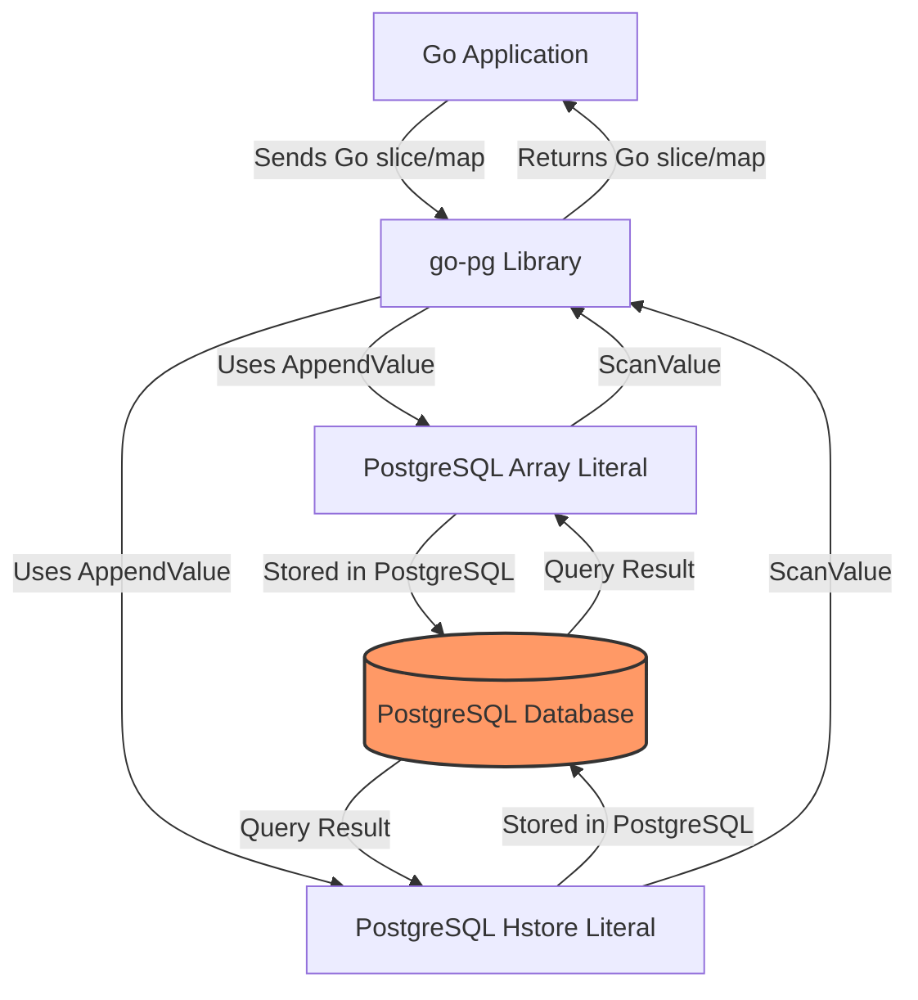

# Arrays, JSONB, and Hstore Support

This page explains how to work with advanced PostgreSQL data types—specifically arrays, JSONB, and hstore—using the go-pg ORM and database client. You will learn how to map these PostgreSQL types to Go types, how to scan and write values correctly using go-pg wrappers, and how to handle common scenarios and pitfalls with these data formats.

---

## Overview

PostgreSQL offers powerful data types such as arrays, JSONB, and hstore that allow flexible and efficient representation of complex data within your tables. go-pg fully supports these types via Go-native representations, custom wrappers, and struct field tags to enable smooth serialization and deserialization.

This documentation focuses on:
- Using the `Array` wrapper and `pg:",array"` struct tag for PostgreSQL array columns
- Handling JSONB with native Go types and the `pgjson` package
- Working with Hstore using the `Hstore` type wrapper
- Conversion examples and testing tips

By following these instructions, you can seamlessly integrate these advanced Postgres types in your Go applications with reliable type safety and database compatibility.

---

## PostgreSQL Arrays in go-pg

### Mapping and Tags

PostgreSQL arrays map naturally to Go slices or arrays. go-pg treats a struct field as an array if you use either:

- The `pg:",array"` tag on a slice or array field
- The `types.Array` wrapper for finer control

For example:

```go
type Item struct {
    Id      int64
    Emails  []string `pg:",array"`  // marshaled as PostgreSQL text[]
    Numbers [][]int  `pg:",array"`  // marshaled as int[][]
}
```

Your database column should be declared using the matching PostgreSQL array type, e.g., `text[]` or `int[][]`.

### Using the Array Wrapper

When you need explicit control, you can use the `types.Array` wrapper:

```go
import "github.com/go-pg/pg/v10/types"

emails := []string{"one@example.com", "two@example.com"}
arr := types.NewArray(emails)

// Use in query
_, err := db.QueryOne(pg.Scan(arr), `SELECT ?`, arr)
```

Internally, go-pg converts the Go slice or array to a PostgreSQL array literal string and vice versa when scanning.

### Supported Element Types

Supported PostgreSQL array element types include:
- `text[]` (mapped to `[]string`)
- `int[]`, `int4[]`, `bigint[]` (mapped to `[]int`, `[]int32`, `[]int64`)
- `float8[]` (mapped to `[]float64`)
- Multi-dimensional arrays like `text[][]`, `int[][]`

### Scan and Append Behavior

The `Array` type implements the `AppendValue` and `ScanValue` interfaces, invoking the appropriate internal appender and scanner functions based on the underlying type.

It supports complex cases, including custom implementations of the `ArrayValueScanner` interface, allowing you to scan array elements using custom logic.

---

## JSONB Handling

### Native Go Types and pgjson

go-pg supports reading and writing Postgres JSON or JSONB columns into native Go types like `map[string]interface{}`, structs, slices, or `json.RawMessage`. It leverages the `pgjson` package internally for efficient marshalling/unmarshalling.

For example:

```go
import "github.com/go-pg/pg/v10/pgjson"

// Custom map type for JSONB

type JSONMap map[string]interface{}

func (m *JSONMap) Scan(b interface{}) error {
    if b == nil {
        *m = nil
        return nil
    }
    return pgjson.Unmarshal(b.([]byte), m)
}

func (m JSONMap) Value() (driver.Value, error) {
    b, err := pgjson.Marshal(m)
    if err != nil {
        return nil, err
    }
    return string(b), nil
}
```

You can also scan JSONB columns directly into Go structs without wrappers, provided their fields match the JSON schema.

### Scan and Write Support

Internally, go-pg treats JSON/JSONB types by scanning data as strings and unmarshalling them into Go objects. Marshaling to the database is handled via JSON serialization.

Use standard Go types or custom implementations of `sql.Scanner` and `driver.Valuer`.

---

## Hstore Support

Hstore is a PostgreSQL key-value string storage type. go-pg represents hstore columns using the `types.Hstore` wrapper.

### Using the Hstore Type

```go
import "github.com/go-pg/pg/v10/types"

// Create a new Hstore with a map[string]string
myMap := map[string]string{"key1": "value1", "key2": "value2"}
hs := types.NewHstore(myMap)

// Use for query value or scan destination
```

To define a struct field for hstore:

```go
type Record struct {
    Properties map[string]string `pg:"properties,hstore"`
}
```

Alternatively, use `types.Hstore` as the field type:

```go
import "github.com/go-pg/pg/v10/types"

type Record struct {
    Properties *types.Hstore
}
```

### Hstore Internals

- It must wrap a `map[string]string` or pointer to it.
- Implements `ValueAppender` and `ValueScanner` interfaces to marshal and unmarshal data.
- Uses internal streaming parsers to parse hstore text representation efficiently.

### Serialization and Scanning

The `AppendValue` method converts the Go map into a valid hstore literal, properly escaping keys and values.

The `ScanValue` method parses the hstore text from the database into the Go map.

### Limitations

- Only supports string-to-string maps.
- Keys and values are always strings; if you need to store other types, marshal them to JSON or text first.

---

## Conversion Examples

### Struct Example with Array Fields

```go
func ExampleDB_Model_postgresArrayStructTag() {
    type Item struct {
        Id      int64
        Emails  []string `pg:",array"` // marshalled as PostgreSQL array
        Numbers [][]int  `pg:",array"` // marshalled as PostgreSQL array
    }

    _, err := pgdb.Exec(`CREATE TEMP TABLE items (id serial, emails text[], numbers int[][])`)
    panicIf(err)
    defer pgdb.Exec("DROP TABLE items")

    item1 := &Item{
        Id:      1,
        Emails:  []string{"one@example.com", "two@example.com"},
        Numbers: [][]int{{1, 2}, {3, 4}},
    }
    _, err = pgdb.Model(item1).Insert()
    panicIf(err)

    item := new(Item)
    err = pgdb.Model(item).Where("id = ?", 1).Select()
    panicIf(err)
    fmt.Println(item)
    // Output: &{1 [one@example.com two@example.com] [[1 2] [3 4]]}
}
```

### Raw Array Query Example

```go
func ExampleArray() {
    src := []string{"one@example.com", "two@example.com"}
    var dst []string
    _, err := pgdb.QueryOne(pg.Scan(pg.Array(&dst)), `SELECT ?`, pg.Array(src))
    panicIf(err)
    fmt.Println(dst)
    // Output: [one@example.com two@example.com]
}
```

### Custom ArrayValueScanner Example

You can implement the `ArrayValueScanner` interface for custom scanning logic:

```go
type MyArrayValueScanner struct {
    sum int
}

var _ types.ArrayValueScanner = (*MyArrayValueScanner)(nil)

func (s *MyArrayValueScanner) BeforeScanArrayValue(rd types.Reader, n int) error {
    return nil
}

func (s *MyArrayValueScanner) ScanArrayValue(rd types.Reader, n int) error {
    num, err := types.ScanInt(rd, n)
    if err != nil {
        return err
    }
    s.sum += num
    return nil
}

func (s *MyArrayValueScanner) AfterScanArrayValue() error {
    return nil
}

func ExampleDB_arrayValueScanner() {
    var dst MyArrayValueScanner
    _, err := pgdb.QueryOne(pg.Scan(pg.Array(&dst)),
        `SELECT array_agg(id) from generate_series(0, 10) AS id`)
    panicIf(err)
    fmt.Println(dst.sum)
    // Output: 55
}
```

---

## Practical Tips & Best Practices

- **Use `pg:",array"` tag** to easily marshal Go slices/arrays as PostgreSQL arrays.
- **Always use pointers** to arrays or maps when scanning with `types.Array` or `types.Hstore` wrappers.
- **Validate PostgreSQL array element types** to match Go slice element types to avoid runtime errors.
- **Use `types.Hstore` strictly with map[string]string** types; for other key/value types consider JSONB.
- **Handling nil slices/maps:** go-pg correctly serializes nil slices/maps as SQL NULL, while empty slices/maps become empty array/hstore literals.
- **Custom scanners** can be used for complex array element processing by implementing the `ArrayValueScanner` interface.
- **Be mindful of multi-dimensional arrays:** `[][]T` in Go works for PostgreSQL multidimensional arrays.

---

## Troubleshooting Common Issues

### Unsupported Types
- If `Array` or `Hstore` panic with `unsupported` type errors, verify the Go type and ensure it matches the expected slice/array or map types exactly.

### Non-Pointer Scan Targets
- Scanning into non-pointer values causes errors. Always pass pointers when scanning to ensure the data can be set.

### Nil vs Empty
- A nil slice or map scans to SQL NULL.
- An empty slice or map scans to empty PostgreSQL array (`{}`) or empty hstore (`''`).

### Escaping in Hstore
- Keys and values with special characters must be properly escaped. Use the provided `types.Hstore` wrapper to avoid manual mistakes.

---

## Summary

By leveraging go-pg's array, JSONB, and hstore support, you unlock powerful, native handling of PostgreSQL's advanced data types. Use struct tags and wrappers wisely for seamless integration, and rely on custom scanning when necessary for advanced workflows. Refer to conversion examples and tips here to avoid common pitfalls and write reliable database code with rich data types.

---

## See Also

- [Defining and Using Models](/api-reference/orm-model-workflows/defining-and-using-models) for field mapping and tag usage
- [Advanced Queries and Model Relationships](/guides/working-with-data/advanced-queries-relations) for more on querying complex data
- [Working with Composite Types](/guides/working-with-data/composite-types) for nested structs
- [Schema Migrations and Table Creation](/api-reference/orm-model-workflows/schema-migrations-and-table-creation) for managing database schemas
- [Arrays, JSONB, and Hstore Guide](/guides/working-with-data/arrays-jsonb-hstore) for more in-depth examples

---

## Code References & Source

Explore the source and code examples related to arrays and hstore data types:

<Source url="https://github.com/go-pg/pg" branch="main" paths='[{"path":"types/array.go","range":"1-70"},{"path":"types/hstore.go","range":"1-44"},{"path":"example_array_test.go","range":"1-101"}]' />

---

## Example Mermaid Diagram: Data Flow for Arrays and Hstore

