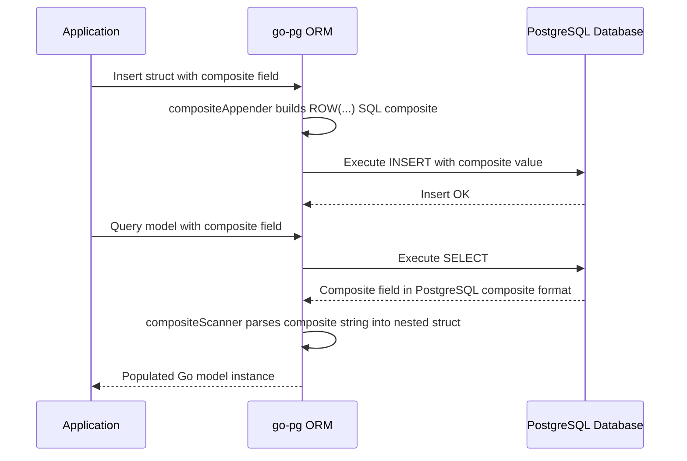

# Composite and Custom Types

This documentation explains how to work with PostgreSQL composite types using go-pg, including appending and scanning nested Go structs mapped to composite columns. It also covers integrating custom scanner and valuer implementations for specialized field types. Best practices for struct mapping and handling these advanced data mappings are included to help you leverage the full power of PostgreSQL’s type system through go-pg.

---

## Overview

PostgreSQL composite types allow you to group multiple fields into a single structured type, which can then be used as a column in tables. go-pg provides native support for these composites by mapping them to nested Go structs. This page guides you on how to append composite type values for queries, scan composite fields on retrieval, and register custom scanners and valuers to handle specialized PostgreSQL types.

You will learn how to:

- Define Go structs that represent PostgreSQL composite types
- Create and drop composite types using go-pg ORM methods
- Insert and query models with nested composite fields transparently
- Implement custom Scanner and Valuer interfaces for specialized PostgreSQL types
- Follow recommended best practices when mapping composite and custom types

---

## 1. Composite Types: Mapping and Usage

### 1.1 Defining Composite Structs

Create Go structs representing PostgreSQL composites. Nested structs in your model correspond to composite type columns.

Example:
```go
// InventoryItem is a PostgreSQL composite type.
type InventoryItem struct {
    Name       string
    SupplierID int
    Price      float64
}

// OnHand contains a composite InventoryItem field.
type OnHand struct {
    tableName struct{} `pg:"on_hand"` // Table name for ORM

    Item  InventoryItem `pg:"composite:inventory_item"`
    Count int
}
```

The tag `pg:"composite:inventory_item"` marks the field as a composite type referencing `inventory_item` PostgreSQL type.


### 1.2 Creating Composite Types in the Database

go-pg allows creating the PostgreSQL composite type directly from your Go struct:

```go
err := db.Model((*InventoryItem)(nil)).CreateComposite(nil)
if err != nil {
    panic(err)
}
```

You can also drop a composite type using:
```go
err := db.Model((*InventoryItem)(nil)).DropComposite(&orm.DropCompositeOptions{IfExists: true})
if err != nil {
    panic(err)
}
```

### 1.3 Creating Tables with Composite Columns

Tables referencing composite types as columns can be created with:
```go
err := db.Model((*OnHand)(nil)).CreateTable(nil)
if err != nil {
    panic(err)
}
```

This creates a table with a column of your composite type.

### 1.4 Inserting and Selecting Composite Models

go-pg handles composite structs seamlessly during inserts and selects:

```go
_, err := db.Model(&OnHand{
    Item: InventoryItem{
        Name: "fuzzy dice",
        SupplierID: 42,
        Price: 1.99,
    },
    Count: 1000,
}).Insert()
if err != nil {
    panic(err)
}

onHand := new(OnHand)
err = db.Model(onHand).Select()
if err != nil {
    panic(err)
}

fmt.Println(onHand.Item.Name, onHand.Item.Price, onHand.Count)
// Output: fuzzy dice 1.99 1000
```

The ORM manages composite appending and scanning internally ensuring you can focus on your application logic.

---

## 2. Under the Hood: Composite Appender and Scanner

The ORM uses specialized functions internally to append composite values to SQL queries and to scan composite data into structs. These are transparent to the user but important for advanced use cases.

### 2.1 Composite Appender

The `compositeAppender` function constructs SQL composite values:

- Converts a Go struct into the PostgreSQL composite syntax, wrapping fields in a `ROW()` construct.
- Escapes and quotes each field properly for insertion.


### 2.2 Composite Scanner

The `compositeScanner` function parses PostgreSQL composite data:

- Reads returned composite string data from PostgreSQL.
- Splits the composite into individual elements.
- Assigns each element to the corresponding nested struct field.

These functions rely on internal table metadata and field definitions.

---

## 3. Integrating Custom Scanners and Valuers

Beyond composite types, go-pg lets you implement custom scanning and appending logic for specific Go types that map to PostgreSQL fields.

### 3.1 Implementing ValueAppender and ValueScanner

Create Go types that implement the following interfaces from the `types` package:

- `ValueAppender` with method `AppendValue(b []byte, flags int) ([]byte, error)` to marshal a Go value into a PostgreSQL representation.
- `ValueScanner` with method `ScanValue(rd types.Reader, n int) error` to unmarshal PostgreSQL data into a Go type.

### 3.2 Example: Custom Time Type

A `Time` type handling PostgreSQL `time` column with custom formatting:

```go
const pgTimeFormat = "15:04:05.999999999"

type Time struct {
    time.Time
}

func (tm Time) AppendValue(b []byte, flags int) ([]byte, error) {
    if flags == 1 { // quoting
        b = append(b, '\'')
    }
    b = tm.UTC().AppendFormat(b, pgTimeFormat)
    if flags == 1 {
        b = append(b, '\'')
    }
    return b, nil
}

func (tm *Time) ScanValue(rd types.Reader, n int) error {
    if n <= 0 {
        tm.Time = time.Time{}
        return nil
    }

    tmp, err := rd.ReadFullTemp()
    if err != nil {
        return err
    }

    tm.Time, err = time.ParseInLocation(pgTimeFormat, string(tmp), time.UTC)
    return err
}

// Usage in model
//
type Event struct {
    Id   int
    Time Time `pg:"type:time"`
}
```

This example shows how to customize serialization and deserialization of fields beyond default Go types.

---

## 4. Best Practices for Composite and Custom Types

- **Define structs that mirror PostgreSQL composite fields precisely**, including field order and types.
- Use `pg:"composite:typename"` struct tag to specify the PostgreSQL composite name explicitly.
- Create and drop composite types via ORM methods (`CreateComposite`, `DropComposite`) to maintain schema consistency.
- For nested composites, ensure inner structs are non-pointer when possible to avoid nullability surprises.
- Implement the `ValueAppender` and `ValueScanner` interfaces for any custom type requiring special marshaling logic.
- Use detailed and consistent formatting for custom types to maintain query correctness.
- When mapping composites, remember zero or null values in nested structs will be marshaled according to nullability rules (`use_zero` tag).
- Test inserting and selecting composite and custom types with representative data to catch edge cases.

---

## 5. Troubleshooting Common Issues

<AccordionGroup title="Troubleshooting Composite and Custom Types">
<Accordion title="Incorrect field mapping or missing fields during scan">
Ensure your Go struct fields exactly match the PostgreSQL composite fields in count, order, and type. Mismatches lead to errors during scanning or incomplete data.
</Accordion>
<Accordion title="Composite type does not exist in database">
Create the PostgreSQL composite type explicitly or via `CreateComposite` before inserting or selecting data using it.
</Accordion>
<Accordion title="Nil pointer panics during insertion or scanning">
Declare composite structs as pointer types cautiously. Initialize pointer fields before inserts, or use non-pointer structs when feasible.
</Accordion>
<Accordion title="Custom scanner not invoked">
Verify that your type implements `types.ValueScanner` and `types.ValueAppender` interfaces correctly and that the Go field uses the custom type.
</Accordion>
<Accordion title="Query syntax errors with composite values">
Check that composite values are rendered using `ROW()` syntax (e.g., ROW(field1, field2)) by your custom `AppendValue` or the ORM composite appender.
</Accordion>
</AccordionGroup>

---

## 6. Complete Example

```go
package pg_test

import (
    "fmt"

    "github.com/go-pg/pg/v10/orm"
)

type InventoryItem struct {
    Name       string
    SupplierID int
    Price      float64
}

type OnHand struct {
    tableName struct{} `pg:"on_hand"`

    Item  InventoryItem `pg:"composite:inventory_item"`
    Count int
}

func ExampleDB_Model_compositeType() {
    db := connect()
    defer db.Close()

    // Drop existing tables and composite types if present.
    err := db.Model((*OnHand)(nil)).DropTable(&orm.DropTableOptions{
        IfExists: true,
        Cascade: true,
    })
    panicIf(err)

    err = db.Model((*InventoryItem)(nil)).DropComposite(&orm.DropCompositeOptions{
        IfExists: true,
    })
    panicIf(err)

    // Create composite type inventory_item
    err = db.Model((*InventoryItem)(nil)).CreateComposite(nil)
    panicIf(err)

    // Create on_hand table referencing the composite
    err = db.Model((*OnHand)(nil)).CreateTable(nil)
    panicIf(err)

    // Insert data
    _, err = db.Model(&OnHand{
        Item: InventoryItem{
            Name: "fuzzy dice",
            SupplierID: 42,
            Price: 1.99,
        },
        Count: 1000,
    }).Insert()
    panicIf(err)

    // Select and print data
    onHand := new(OnHand)
    err = db.Model(onHand).Select()
    panicIf(err)

    fmt.Println(onHand.Item.Name, onHand.Item.Price, onHand.Count)
    // Output: fuzzy dice 1.99 1000
}
```

---

## 7. Internal Diagram: Composite Type Handling Workflow



---

## See Also

- [Working with Composite Types Guide](/guides/working-with-data/composite-types)
- [Defining and Using Models](/api-reference/orm-model-workflows/defining-and-using-models)
- [Arrays, JSONB, and Hstore Support](/api-reference/advanced-types-and-query-features/array-jsonb-and-hstore-support)
- [Schema Migrations & Table Creation](/api-reference/orm-model-workflows/schema-migrations-and-table-creation)
- [Custom Type Scanning and Value Interface Concepts](https://golang.org/pkg/database/sql/#Scanner)


---

This page is part of the go-pg v10 API reference about advanced PostgreSQL type support.


-----

## References

### Source code files involved:
- [orm/composite.go](https://github.com/go-pg/pg/blob/main/orm/composite.go)
- [orm/composite_parser.go](https://github.com/go-pg/pg/blob/main/orm/composite_parser.go)
- [example_composite_test.go](https://github.com/go-pg/pg/blob/main/example_composite_test.go)
- [example_custom_test.go](https://github.com/go-pg/pg/blob/main/example_custom_test.go)
- [orm/composite_create.go](https://github.com/go-pg/pg/blob/main/orm/composite_create.go)
- [orm/field.go](https://github.com/go-pg/pg/blob/main/orm/field.go)

<Source url="https://github.com/go-pg/pg" branch="main" paths={[{"path": "orm/composite.go", "range": "1-52"},{"path": "orm/composite_parser.go", "range": "1-105"},{"path": "example_composite_test.go", "range": "1-52"},{"path": "example_custom_test.go", "range": "1-51"},{"path": "orm/composite_create.go", "range": "1-71"},{"path": "orm/field.go", "range": "1-119"}]} />