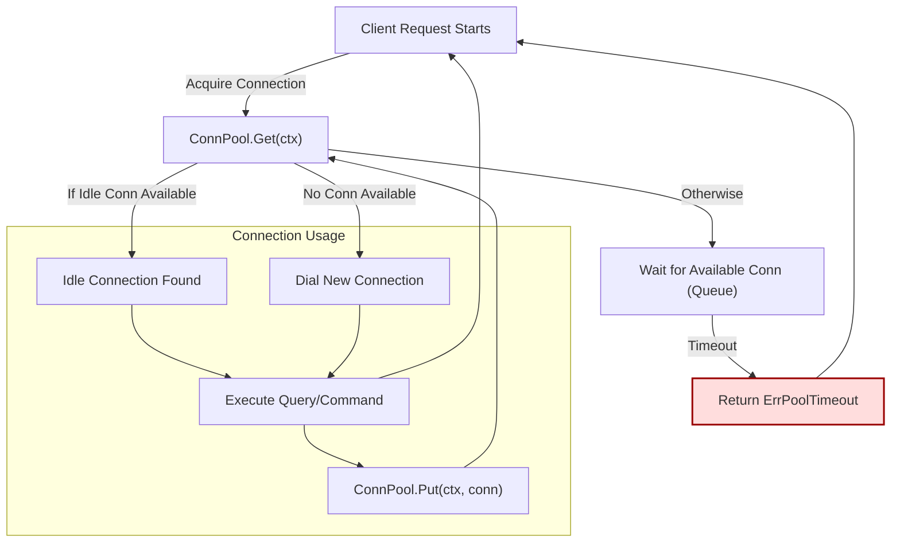

# Request/Response Patterns & Rate Limiting

This documentation page focuses on practical examples of how go-pg handles request and response structures across the most common database operations, including querying, inserting, and updating data. Additionally, it provides insights into go-pg's automatic connection pooling mechanisms, and how built-in queueing and retry behaviors support rate limiting and robust performance in concurrent environments.

---

## 1. Overview of Request/Response Flows

When working with go-pg, every interaction with the PostgreSQL database follows a predictable pattern that revolves around connection usage and operation execution. Modern Go applications benefit from go-pg's transparent connection pooling and resinient retry mechanisms, enabling developers to write clean, blocking style code without manually managing connections or worrying about throttling.

**Value for developers:**
- Automatic connection reuse reduces latency and resource consumption.
- Built-in queuing mechanisms handle bursts gracefully, avoiding overwhelming the database.
- Transparent retry on certain failure modes ensures higher reliability.

### Key User Outcome
You simply issue queries or commands through go-pg interfaces; the library efficiently manages connection acquisition, request submission, and response parsing behind the scenes.

---

## 2. Connection Pooling: Seamless and Efficient

### How It Works
- go-pg maintains a configurable pool of active connections to the PostgreSQL server.
- When a request needs a database connection, it tries to obtain an idle connection from the pool.
- If no idle connection is available, the request waits up to a configured timeout (`PoolTimeout`) for one to become free.
- When a connection is released, it is returned to the pool for reuse.

### Benefits
- Reduces connection creation overhead, which is expensive in PostgreSQL.
- Controls maximum concurrency (`PoolSize`) to prevent resource exhaustion.
- Maintains a minimum number of idle connections (`MinIdleConns`) to serve requests promptly.

### Example Configuration Parameters
```go
opt := &pool.Options{
    PoolSize:       10,
    MinIdleConns:   2,
    PoolTimeout:    5 * time.Second,
    IdleTimeout:    time.Minute,
}
pool := pool.NewConnPool(opt)
```

---

## 3. Typical User Workflows with Request/Response

### 3.1 Query Execution Flow

**User Intent:** Run a query and receive results.

**Behind the Scenes:**
1. Request a connection via `Get(ctx)`.
2. If an idle connection is available, it is returned immediately; otherwise, the request waits up to the timeout.
3. Execute the PostgreSQL query over the connection.
4. Obtain and decode the response.
5. Return the connection to the pool using `Put(ctx, conn)`.

**Example in code:**
```go
ctx := context.Background()
c, err := pool.Get(ctx)
if err != nil {
    log.Fatal(err)
}
defer pool.Put(ctx, c)

// Use c with ORM/query interface
```

### 3.2 Insert/Update Operations

**User Intent:** Add or modify records efficiently.

Specific to go-pg, batch and bulk operations reduce round trips. The underlying connection pool manages connection reuse and concurrency, while query builders prepare SQL statements.

**Example:**
```go
user := &User{Name: "Alice", Age: 30}
err := db.Insert(user)
if err != nil {
    log.Fatal(err)
}
```

### 3.3 Handling Request Blocking & Timeouts

If the connection pool is exhausted (all connections busy), requests block up to `PoolTimeout`. If no connection becomes available, a `ErrPoolTimeout` error is returned.

**Best Practice:**
- Use reasonable `PoolTimeout` values to avoid indefinite blocking.
- Set appropriate context deadlines to handle cancellation.

---

## 4. Rate Limiting Behaviors via Connection Pool

### Automatic Request Queuing
- The connection pool enforces a maximum number of active connections (`PoolSize`).
- Excess requests wait in a queue, ensuring the database is never overwhelmed.
- This implicit rate limiting promotes graceful degradation under load.

### Example Scenario
If you configure:
```go
PoolSize: 10,
PoolTimeout: 1 * time.Second,
```
And issue 20 concurrent queries:
- The first 10 queries will acquire connections.
- The next 10 will wait up to 1 second for a connection to free.
- If no connection becomes available in that time, those waiting queries receive a timeout error.

### Handling Blocking in Application
```go
c, err := pool.Get(ctxWithTimeout)
if err == pool.ErrPoolTimeout {
    // Handle rate limiting gracefully
}
```

### Practical Tips
- Monitor connection pool statistics via `Stats()` to adjust pool size.
- Use `MinIdleConns` to keep some spare connections ready.
- Avoid extremely high concurrency without adjusting pool size accordingly.

---

## 5. Examples Demonstrating Request/Response and Pooling

### Example 1: Query with Automatic Connection Handling
```go
func GetUserByID(ctx context.Context, db *pg.DB, userID int) (*User, error) {
    user := &User{ID: userID}
    err := db.Model(user).WherePK().Select()
    return user, err
}
```
**What happens:** The DB internally acquires a connection from the pool, executes the SELECT, then returns the conn automatically.

### Example 2: Manual Connection Get/Put
```go
ctx := context.Background()
c, err := db.ConnPool().Get(ctx)
if err != nil {
    return err
}
defer db.ConnPool().Put(ctx, c)

// Use c to perform multiple operations under the same connection
```
Useful for transaction operations or custom low-level control.

### Example 3: Handling PoolTimeout Error
```go
ctx, cancel := context.WithTimeout(context.Background(), 500*time.Millisecond)
defer cancel()
c, err := db.ConnPool().Get(ctx)
if err == pool.ErrPoolTimeout {
    fmt.Println("Too many concurrent requests - try again later")
    return
}
// proceed with c
```

---

## 6. Troubleshooting Common Issues

### Problem: Requests block indefinitely or return timeout errors
- **Cause:** Connection pool exhausted, `PoolTimeout` too low, or connections leaked.
- **Solution:**
  - Verify that every acquired connection is returned with `Put()`.
  - Increase `PoolSize` and/or `PoolTimeout` if necessary.
  - Use pool statistics (`Stats()`) to monitor active and idle connections.

### Problem: Connection drops or errors during query execution
- **Cause:** Connection in bad state, network issues, or stale connections.
- **Solution:**
  - go-pg automatically removes bad/stale connections.
  - Use context timeouts to cancel stalled operations.
  - Check database logs for connection limits or resource exhaustion.

### Problem: Unexpected high latency under load
- **Cause:** Pool size too small relative to load, causing queuing delays.
- **Solution:**
  - Increase `PoolSize`.
  - Introduce application-level throttling or retries.

---

## 7. Best Practices & Recommendations

- Always use context-aware methods to control timeouts and cancellations.
- Balance `PoolSize` with expected concurrency and database capacity.
- Use `MinIdleConns` to prepare connections ahead of load spikes.
- Monitor pool stats programmatically or via logging.
- Handle `ErrPoolTimeout` gracefully in your application logic.
- For long-running operations, consider isolating them in separate pools.

---

## 8. Visualization of Connection Pool Request/Response Flow



This diagram depicts how requests interact with the connection pool to acquire connections, handle wait queues, and execute queries, including the error path when timeouts occur.

---

## 9. Additional Resources

Refer to the following documentation for deeper insights:

- [Connection Pooling and Reliability](https://pg.uptrace.dev/guides/performance-best-practices/connection-pooling)
- [Managing Transactions](https://pg.uptrace.dev/guides/application-patterns/transactions)
- [Query Interface Examples](https://pg.uptrace.dev/api-reference/core-db-interfaces/query-interface-examples)
- [Error Handling & Status Codes](https://pg.uptrace.dev/api-reference/api-fundamentals-and-best-practices/error-handling-and-status-codes)

Exploring these will provide comprehensive understanding of go-pg's data operations, connection management, and error resilience techniques.

---

# Appendix: Key Constants and Errors

| Constant / Error     | Description                                |
|---------------------|--------------------------------------------|
| `pool.ErrClosed`    | Indicates that the pool is closed          |
| `pool.ErrPoolTimeout`| Indicates that the request timed out waiting for a connection |


# Conclusion

By understanding go-pg's transparent request/response patterns powered by a robust connection pool, you can build highly concurrent, reliable applications while focusing on your business logic rather than database connection details. The design ensures smooth rate limiting and efficient resource use, empowering you to scale confidently.

---

<Info>
For practical examples and sample code usage, explore the official go-pg GitHub repository and the guides under the Performance & Best Practices and API Reference sections.
</Info>
