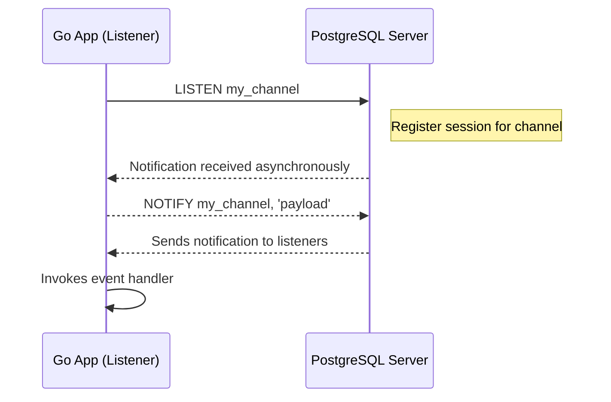

# Notifications: LISTEN & NOTIFY

Leverage PostgreSQL's powerful Pub/Sub capabilities directly from Go using go-pg's `Listener` to subscribe to database channels with `LISTEN` and react to notifications sent with `NOTIFY`. This enables real-time event-driven workflows such as cache invalidation, live updates, or async messaging within your applications.

---

## Overview

PostgreSQL supports asynchronous notifications via the `NOTIFY` and `LISTEN` commands, allowing clients to subscribe to named channels and receive messages when events occur in the database. go-pg exposes this functionality through the `Listener` type, which manages channel subscriptions and connection lifecycle to simplify your event-driven integration.

Using `Listener`, you can:

- Subscribe to one or more notification channels.
- Receive payloads attached to notifications asynchronously.
- Monitor connection health and automatically reconnect when issues occur.
- Use either simple blocking APIs (`Receive`) or buffered Go channels (`Channel`) for concurrent notification consumption.

---

## Getting Started with Listener

### Creating and Using a Listener

Start by creating a `Listener` on your `DB` instance, specifying one or more channels to listen to. Here's a basic pattern to get started:

```go
ln := db.Listen(ctx, "my_channel")
defer ln.Close()

for {
    channel, payload, err := ln.Receive(ctx)
    if err != nil {
        // Handle error or break loop if listener closed
        break
    }
    fmt.Printf("Received notification on channel %s: %s\n", channel, payload)
}
```

This blocks waiting for notifications. The `Receive` method internally uses PostgreSQL's `LISTEN` command and waits for any `NOTIFY` events.

### Using the `Channel` API for Concurrent Receive

For more idiomatic Go usage, `Listener` supports receiving notifications via a buffered Go channel that you can select on concurrently.

```go
notifyCh := ln.Channel()            // defaults to buffer size 100
// or ln.ChannelSize(500) for custom buffer

for notification := range notifyCh {
    fmt.Printf("Channel %s got payload '%s'\n", notification.Channel, notification.Payload)
}
```

The `Channel` API automatically handles connection health checks and internal reconnects, including periodic pinging of PostgreSQL.

---

## Listener API Reference

### Type: `Listener`

Manages listening for database notifications.

### Core Methods

#### `Listen(ctx context.Context, channels ...string) error`

Subscribes to one or more channels. If already listening on some channels, adds the new ones.

- **Parameters**:
  - `channels`: List of channel names to listen on.

- **Returns**: `error` if subscription fails.

Example:

```go
err := ln.Listen(ctx, "channel1", "channel2")
if err != nil {
    log.Fatalf("Listen failed: %v", err)
}
```

---

#### `Unlisten(ctx context.Context, channels ...string) error`

Unsubscribes from specified channels.

- **Parameters**:
  - `channels`: List of channels to stop listening on.

- **Returns**: `error` if unsubscription fails.

Example:

```go
err := ln.Unlisten(ctx, "channel1")
if err != nil {
    log.Printf("Unlisten failed: %v", err)
}
```

---

#### `Receive(ctx context.Context) (channel string, payload string, err error)`

Blocks indefinitely waiting for a notification from any subscribed channel.

- Returns the channel name and payload received.
- Recommended for simple use but **not** safe for concurrent use with the `Channel` API.

Example:

```go
channel, payload, err := ln.Receive(ctx)
if err != nil {
    // handle error
}
fmt.Printf("Received on %s: %s", channel, payload)
```

---

#### `ReceiveTimeout(ctx context.Context, timeout time.Duration) (channel string, payload string, err error)`

Same as `Receive` but returns with a timeout error if no notification received in specified duration.

Example:

```go
channel, payload, err := ln.ReceiveTimeout(ctx, 5*time.Second)
if err != nil {
    if errors.Is(err, context.DeadlineExceeded) {
        fmt.Println("Timeout waiting for notification")
    } else {
        // handle other errors
    }
}
```

---

#### `Channel() <-chan Notification`

Returns a buffered Go channel of `Notification` structs allowing concurrent consumption of notifications.

- Automatically maintains connection health with internal pinging.
- The notification channel is closed when the listener is closed.
- Once this channel is created, do **not** use `Receive` methods.

Example:

```go
notifications := ln.Channel()
for n := range notifications {
    fmt.Printf("Notification on %s: %s\n", n.Channel, n.Payload)
}
```

---

#### `ChannelSize(size int) <-chan Notification`

Same as `Channel()` but allows you to specify buffer size.

---

#### `Close() error`

Closes the listener and underlying connection.

- Releases all related resources.
- After closure, all calls to `Receive` or other methods return errors.

Example:

```go
err := ln.Close()
if err != nil {
    log.Printf("Listener close error: %v", err)
}
```

---

### Type: `Notification`

Represents a notification received via a LISTEN channel.

```go
type Notification struct {
    Channel string // Channel name the notification was sent on
    Payload string // Optional message payload
}
```

---

## Practical Usage Patterns

### Listening to Multiple Channels

You can listen to multiple channels simultaneously by specifying them all at once or calling `Listen` multiple times:

```go
ln := db.Listen(ctx, "channelA", "channelB")
// or
ln.Listen(ctx, "channelC")
```

`Listener` internally manages multiple subscriptions, avoiding duplicates on repeated `Listen` calls.

### Receiving Notifications Concurrently

When you want to process notifications asynchronously, use the `Channel` API:

```go
notifications := ln.ChannelSize(200)

go func() {
    for n := range notifications {
        fmt.Printf("Got notification on %s with payload: %s\n", n.Channel, n.Payload)
        // Trigger event handlers, refresh cache, etc.
    }
}()

// Continue application logic...
```

### Handling Connection Interruptions

`Listener` automatically detects bad connections, attempts reconnects, and reconfirms channel subscriptions under the hood. This ensures you rarely miss any notifications. Still, it's prudent to handle errors from `Receive` or monitor the `Channel` for closure.

### Key Points & Best Practices

- **Thread Safety:** The `Listener` is not safe for concurrent use by multiple goroutines except for using the `Channel` API.
- **Payloads:** Notifications can carry payload strings, which you can specify in your `NOTIFY` SQL commands.
- **Command Synchronization:** Use `Listen` and `Unlisten` appropriately to manage your subscriptions.
- **Ping Channel:** Internally, go-pg uses a hidden channel `gopg:ping` for connection health checks.
- **Buffer Overflow:** When using `Channel`, ensure buffer size is adequate to avoid dropped notifications; the listener logs when the buffer is full.

---

## Sending Notifications

Sending notifications uses the standard SQL `NOTIFY` command. With go-pg, use the `Exec` method.

Example:

```go
_, err := db.Exec("NOTIFY my_channel, 'my_payload'")
if err != nil {
    log.Fatalf("Failed to send notification: %v", err)
}
```

This sends a notification on `my_channel` which all listeners will receive.

---

## Troubleshooting

<AccordionGroup title="Common Issues and Solutions">
<Accordion title="Listener Locked or Stuck Receiving">
This usually occurs if you simultaneously use `Receive` methods and create a notification channel via `Channel`. The `Listener` is not safe to use both concurrently. Use one approach exclusively.
</Accordion>
<Accordion title="Notifications Are Not Received">
- Confirm that channels in `LISTEN` exactly match those in your `NOTIFY` clauses.
- Check network connectivity.
- Ensure that the listener connection is open and not closed prematurely.
- Check database permissions for `LISTEN` and `NOTIFY` commands.
</Accordion>
<Accordion title="High Latency or Timeouts Waiting for Notifications">
- Use `ReceiveTimeout` to avoid indefinite blocking.
- Verify your PostgreSQL server stability.
- Adjust `ChannelSize` buffer to handle bursts.
</Accordion>
<Accordion title="Buffer Overflow and Dropped Notifications in `Channel` API">
- Increase the buffered channel size via `ChannelSize(size)`.
- Consume notifications promptly to avoid backpressure.
</Accordion>
<Accordion title="Listener Connection Not Reconnecting Automatically">
- Verify your application context and cancellation usage.
- `Listener` reconnects automatically if internal pings fail consecutively.
- Look for logs with warnings indicating reconnect attempts.
</Accordion>
</AccordionGroup>

---

## Internal Behavior & Connection Pooling

The `Listener` uses a dedicated PostgreSQL connection from the connection pool to listen for notifications. It bypasses connection reuse to avoid contention and relies on an internal ping mechanism (`gopg:ping` channel) to keep the listener connection alive and detect connectivity problems early.

When an unhealthy connection is detected, `Listener` automatically closes and reconnects, resubscribing to all channels seamlessly.

---

## Advanced Usage

### Manual Receive with Timeout

For applications requiring explicit timeout control:

```go
channel, payload, err := ln.ReceiveTimeout(ctx, 10*time.Second)
if err != nil {
    if errors.Is(err, context.DeadlineExceeded) {
        // timeout - no notification received
    } else {
        // other error handling
    }
} else {
    // process notification
}
```

### Explicit Manage Listen/Unlisten

You may manage subscriptions dynamically:

```go
// Add new channels
ln.Listen(ctx, "new_channel")

// Remove existing channels
ln.Unlisten(ctx, "old_channel")
```

---

## Example: Full Notification Listener

```go
package main

import (
    "context"
    "fmt"
    "log"
    "time"

    "github.com/go-pg/pg/v10"
)

func main() {
    ctx := context.Background()

    db := pg.Connect(&pg.Options{
        Addr:     "localhost:5432",
        User:     "postgres",
        Password: "secret",
        Database: "mydb",
    })
    defer db.Close()

    ln := db.Listen(ctx, "events")
    defer ln.Close()

    notifications := ln.Channel()

    for n := range notifications {
        fmt.Printf("Received on %s: %s\n", n.Channel, n.Payload)
        // React to event, update cache, trigger actions...
    }
}
```

---

## Visualizing the Notification Flow



---

## Tips & Best Practices

- Use the buffered `Channel` API for concurrency and better resource management.
- Always call `Close()` on Listener to avoid leaking connections.
- Handle `ReceiveTimeout` errors to prevent blocked goroutines.
- Ensure the buffer size aligns with expected notification load to prevent drops.
- Use `Unlisten` to clean up unused channels and reduce resource use.
- Monitor logs for automatic reconnect events to understand connection health.

---

## Related Documentation

- [Connection Pooling and Performance Tuning Guide](../guides/real-world-integration-patterns/performance-pooling) – for underlying connection handling.
- [Realtime Integration with PostgreSQL Notifications](../guides/real-world-integration-patterns/notifications-copy) – detailed usage and common scenarios.
- [Database Client and Connections](../api-reference/core-orm-database/client-connection) – connection management within go-pg.
- [Error Handling & Status Codes](../api-reference/common-operations-examples/error-handling-status-codes) – best practices for robust error handling.

---

Harness the full power of PostgreSQL's asynchronous notifications in your Go applications with go-pg's Listener, building reactive, efficient, and scalable realtime systems with minimal overhead.