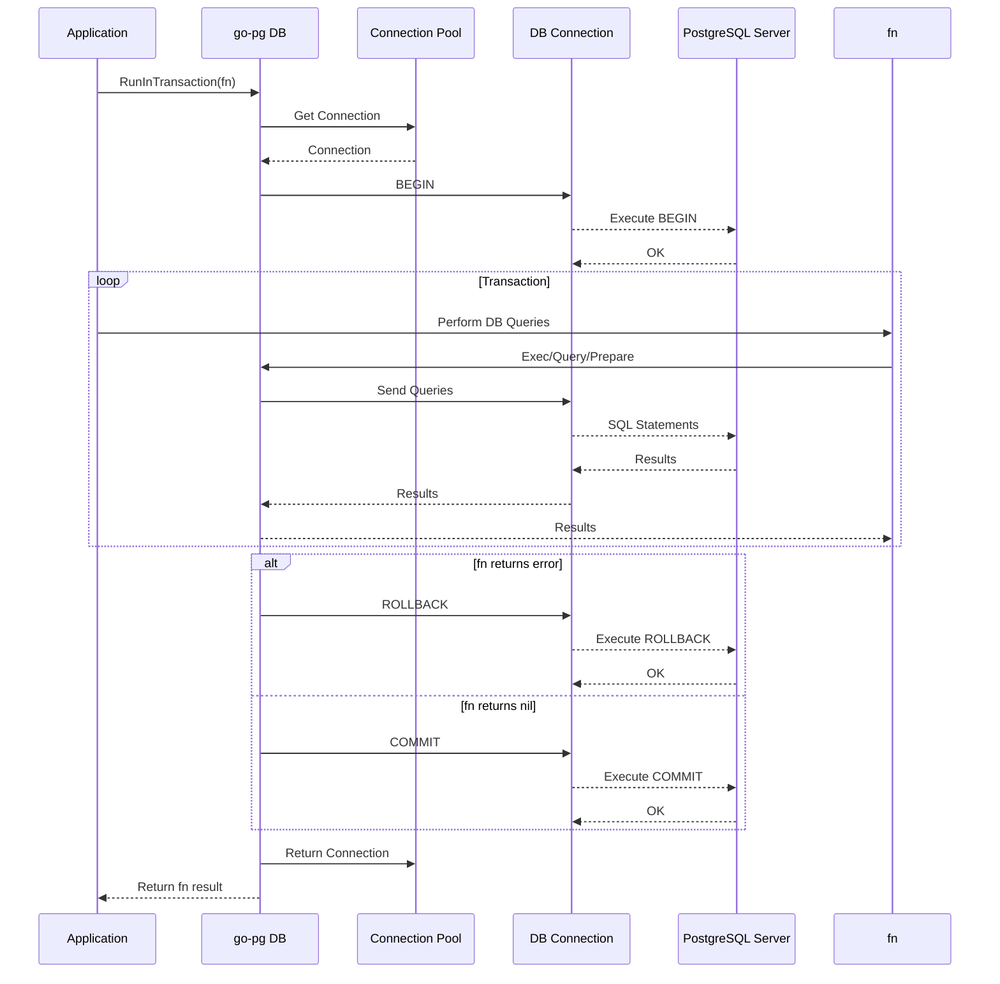

# Transactions and Prepared Statements

Manage transactions and prepared statements efficiently and safely to ensure data integrity, improve performance, and reduce repetitive query overhead in your Go applications with go-pg.

---

## Overview

This page guides you through the essential workflows of managing PostgreSQL transactions and prepared statements using go-pg. You'll learn how to:

- Begin, commit, and rollback transactions
- Run functions within transactions with automatic rollback or commit handling
- Handle nested transactions safely
- Create, use, and close prepared statements scoped to transactions
- Use prepared statements for improved performance and security

These features are designed to empower you to build robust database operations that handle errors gracefully, manage resources efficiently, and optimize query execution.

---

## Transaction Management

### Starting a Transaction

To initiate a transaction, use the `Begin` or `BeginContext` method on your database connection. However, the recommended approach is to use `RunInTransaction` to run your logic inside a transactional context for safer and cleaner error handling.

```go
// Using RunInTransaction
err := db.RunInTransaction(ctx, func(tx *pg.Tx) error {
    // Your transactional code here
    return nil // Commit if no error
})

if err != nil {
    // Handle transaction error
}
```

If you prefer manual control, you can begin a transaction and commit or rollback explicitly:

```go
tx, err := db.Begin()
if err != nil {
    // handle error
}

// perform db operations with tx

err = tx.Commit()
if err != nil {
    // handle commit error
}
```

### Running Code in a Transaction

`RunInTransaction` automates rollback on error and commit on success, reducing boilerplate and error-prone manual handling.

```go
er := db.RunInTransaction(ctx, func(tx *pg.Tx) error {
    // transactional work
    if err := tx.Exec("UPDATE accounts SET balance = balance - 100 WHERE id = ?", fromID); err != nil {
        return err
    }
    if err := tx.Exec("UPDATE accounts SET balance = balance + 100 WHERE id = ?", toID); err != nil {
        return err
    }
    return nil // commit
})

if er != nil {
    // transaction rolled back
}
```

### Nested Transactions

go-pg supports nested transactions at the application level by returning the same transaction instance if you call `Begin` on a transaction.

```go
// Inside an existing tx
nestedTx, err := tx.Begin()
// nestedTx is the same as tx
```

This approach helps keep nested transaction logic consistent without starting multiple PostgreSQL transactions, which are not directly supported.

### Committing and Rolling Back

- `Commit` or `CommitContext` commits and finalizes the transaction.
- `Rollback` or `RollbackContext` aborts the transaction.
- Transactions are marked closed after commit or rollback, and further operations return `ErrTxDone`.

```go
err := tx.Rollback()
if err != nil {
    // handle rollback error
}

// using Close ensures rollback if tx is still open
err = tx.Close()
```


<Tip>
Always ensure transactions are committed or rolled back to free resources. Using `RunInTransaction` or deferring a `Close` call helps prevent leaks.
</Tip>

---

## Working with Prepared Statements

Prepared statements provide a way to optimize frequently executed SQL queries by compiling them once per session or transaction.

### Creating Prepared Statements Within Transactions

Use `Prepare` on a transaction to create a prepared statement bound to that transaction's connection. This statement is valid only within the lifecycle of the transaction.

```go
stmt, err := tx.Prepare("SELECT * FROM users WHERE id = ?")
if err != nil {
    // handle error
}

res, err := stmt.Query(pg.Scan(&user))
if err != nil {
    // handle query error
}

err = stmt.Close()
if err != nil {
    // handle close error
}
```

### Using Existing Prepared Statements in Transactions

You can rebind an existing prepared statement to a transaction using `Tx.Stmt`:

```go
stmt := db.Prepare("SELECT * FROM products WHERE category = ?")
txStmt := tx.Stmt(stmt)
res, err := txStmt.Query(...)
```

### Closing Prepared Statements

Statements should be closed explicitly when no longer needed. Closing a statement frees associated server resources.

```go
err := stmt.Close()
```

### Benefits

- Prepared statements reduce parsing and planning overhead.
- SQL injection risk is minimized when using parameters instead of string concatenation.
- They improve performance in high-throughput scenarios.

---

## Transaction API Details

| Method                        | Description |
|------------------------------|-------------|
| `Begin()`                    | Starts a new transaction (or returns current if called on Tx). Use `RunInTransaction` when possible.
| `RunInTransaction(fn)`         | Runs a user function inside a transaction, with automatic rollback on error.
| `Commit()`                   | Commits the transaction.
| `Rollback()`                 | Rolls back the transaction.
| `Prepare(query)`             | Prepares a statement within the transaction.
| `Stmt(stmt)`                 | Binds an existing statement to the transaction.
| `Exec(query, params...)`     | Executes a SQL statement inside the transaction.
| `Query(model, query, params...)` | Executes a query and scans results into model.
| `CopyFrom(reader, query)`   | Bulk copy data into a table inside the transaction.
| `CopyTo(writer, query)`     | Bulk copy data from a table inside the transaction.


---

## Common Patterns & Best Practices

### Ensuring Safe Transaction Closure

To prevent transactions from hanging open, defer a `Close` call:

```go
tx, err := db.Begin()
if err != nil {
    // handle error
}
defer tx.Close()

// transaction work
if err := tx.Exec(...); err != nil {
    return err // transaction will rollback due to Close
}

return tx.Commit()
```

### Error Handling Inside Transactions

Use `RunInTransaction` for clear, idiomatic transaction handling that automatically rolls back on any error or panic.

### Handling Copy Operations

Use `CopyFrom` and `CopyTo` when dealing with bulk data loads or exports within transactions. If a copy operation fails, the transaction is marked for rollback.

### Multiple Prepared Statements

Transactions support multiple concurrently prepared statements. Be sure to close them to release resources.

---

## Troubleshooting

### Common Errors

- `pg: transaction has already been committed or rolled back` — occurs when operating on a closed transaction. Ensure transaction is open before usage.
- Errors during `CopyFrom` may leave the transaction in an error state:
  - Transactions with errors cannot continue and must be rolled back.

### Connection Issues Within Transactions

Bad connections encountered inside a transaction cause the transaction to fail. go-pg automatically removes bad connections and recovers where possible.

---

## Example: Safe Transaction with Prepared Statement

```go
err := db.RunInTransaction(ctx, func(tx *pg.Tx) error {
    stmt, err := tx.Prepare("INSERT INTO users(name, age) VALUES (?, ?)")
    if err != nil {
        return err
    }
    defer stmt.Close()

    _, err = stmt.Exec("Alice", 30)
    return err
})

if err != nil {
    log.Fatalf("transaction failed: %v", err)
}
```

This example safely prepares a statement inside a transaction, executes it, and defers the statement's closure. The transaction commits if the function returns nil, or rolls back otherwise.

---

## Under the Hood Diagram



This illustrates the lifecycle of a transaction and connection usage involving your app, the go-pg library, connection pool, and PostgreSQL server.

---

## Additional Resources

- [Connection Pooling and Performance Tuning](../real-world-integration-patterns/performance-pooling)
- [Bulk and Batch Operations](../../guides/advanced-orm-patterns/bulk-operations)
- [Copy Commands and Notification Handling](../real-world-integration-patterns/notifications-copy)
- [Error Handling & Status Codes](../../common-operations-examples/error-handling-status-codes)

Explore these for deeper insights into performance optimization, concurrency handling, and resiliency patterns with go-pg.

---

## References & Source Code

For the primary transaction management implementation, see `tx.go` in the core repository:

<Source url="https://github.com/go-pg/pg" paths={[{"path":"tx.go","range":"1-278"}]} />

Prepared statements are implemented in `stmt.go`:

<Source url="https://github.com/go-pg/pg" paths={[{"path":"stmt.go","range":"1-210"}]} />

Connection pooling mechanisms are described in `pool.go` and `pool_sticky.go`:

<Source url="https://github.com/go-pg/pg" paths={[{"path":"internal/pool/pool.go","range":"1-300"},{"path":"internal/pool/pool_sticky.go","range":"1-123"}]} />
