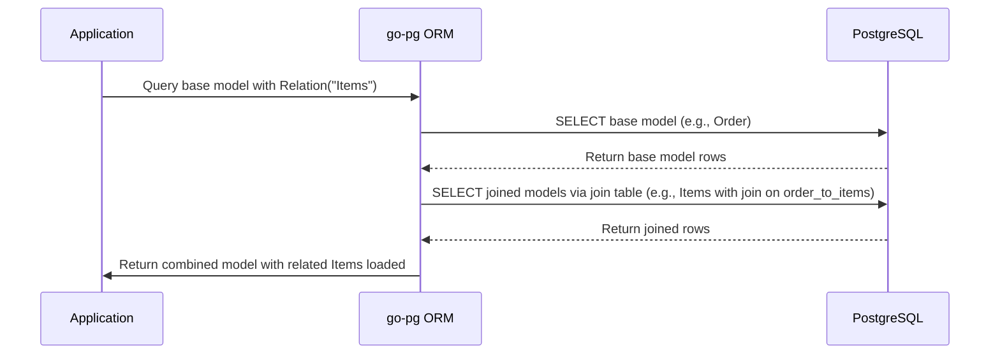

# Model Relations and Joins

This guide explains how to leverage go-pg's ORM capabilities to work with model relations and their underlying SQL joins. It covers the four primary relationship types supported—has-one, belongs-to, has-many, and many-to-many—including customizations, eager loading, composable queries, and how to manage nested relationships effectively.

---

## Understanding Model Relations in go-pg

In go-pg, defining relationships between models allows you to seamlessly query related data using intuitive Go struct tags and query modifiers. These relationships correspond to SQL join operations, enabling efficient data retrieval in a single or multiple database queries.

The primary relation types are:

| Relation Type      | Description                                   |
|--------------------|-----------------------------------------------|
| Has-One            | One-to-one relationship where the parent owns the foreign key |
| Belongs-To         | Similar to has-one but the foreign key resides on the child model |
| Has-Many           | One-to-many relationship where parent links to multiple children |
| Many-to-Many (M2M) | Many-to-many relationship with a join table connecting both sides|

Each relation type supports eager loading with `Relation` method calls, allowing preloading of associated records during queries.

---

## Defining Relations in Models

You define relations by tagging struct fields using the `pg` struct tag with `rel`:

```go
// Has-One example
type Story struct {
    Id       int64
    AuthorId int64
    Author   *User `pg:"rel:has-one"`
}

// Has-Many example
type User struct {
    Id      int64
    Stories []Story `pg:"rel:has-many"`
}

// Many-to-Many example
type Order struct {
    Id    int
    Items []Item `pg:"many2many:order_to_items"`
}
```

Tags like `many2many` specify the join table for many-to-many relations. go-pg supports composite primary keys and multi-column foreign keys for all relation types.

### Common Relation Tag Options

- `rel:has-one` — defines a has-one relation
- `rel:belongs-to` — defines a belongs-to relation
- `rel:has-many` — defines a has-many relation
- `many2many:<join_table>` — defines many-to-many with a join table

---

## Using Relation Queries

To load related models, chain `.Relation("FieldName")` calls on your query. For example:

```go
story := new(Story)
err := db.Model(story).
    Relation("Author").
    Where("story.id = ?", storyID).
    Select()
if err != nil {
    // handle error
}
fmt.Println("Author:", story.Author)
```

This constructs a SQL query with a LEFT JOIN to fetch the related `Author` one-to-one record alongside the `Story`.

You can load nested relations by chaining dotted paths:

```go
err := db.Model(story).
    Relation("Author.Address").
    Select()
```

### Customizing Relation Queries & Callbacks

Customize the query for related models with callbacks:

```go
err := db.Model(&orders).
    Relation("Items", func(q *pg.Query) (*pg.Query, error) {
        return q.OrderExpr("item.id DESC"), nil
    }).
    Select()
```

Here, the `Items` relation query is modified to sort results.

---

## How Joins Work Internally

go-pg builds join operations based on relation types dynamically:

### Has-One and Belongs-To

- Use `LEFT JOIN` between base and join tables
- Join conditions equate foreign key(s) from one table to primary key(s) of the other
- Support additional conditions via `JoinOn` callbacks
- Soft delete filtering is applied if configured

### Has-Many

- Uses separate queries fetching children whose foreign keys match parents
- Build queries with `IN` condition on foreign key columns for batching
- Applies custom columns or query modifications if specified

### Many-to-Many

- Compose `JOIN` queries joining base table, join (intermediate) table, and target table
- Use the join table aliases and foreign keys to map between entities
- Support nested query modifications for sorting, filtering, or limits

---

## Practical User Flows

### 1. Loading Related Data with `Relation`

```go
var users []User
err := db.Model(&users).
    Relation("Stories").
    Relation("Profile").
    Select()
```

This loads `Stories` and `Profile` for each user efficiently leveraging SQL joins and batch fetching.

### 2. Overriding Columns Selected in Relations

Exclude all columns in a join with underscore:

```go
err := db.Model(&users).
    Relation("Stories._").
    Select()
```

Or specify specific columns:

```go
err := db.Model(&users).
    Relation("Stories.id").
    Select()
```

### 3. Defining Many-to-Many Relationships

After defining a join table model:

```go
order := new(Order)
err := db.Model(order).
    Relation("Items", func(q *pg.Query) (*pg.Query, error) {
        return q.OrderExpr("item.id DESC"), nil
    }).
    First()
```

go-pg performs two queries:

1. Fetch the base `Order` by ID
2. Fetch related `Items` using the join table with proper `IN` join conditions

---

## Best Practices and Common Pitfalls

- Always register many-to-many join table models before usage to improve join detection.
- When eager loading many-to-many or has-many relations with large datasets, watch query performance and consider adding limits or filters.
- Utilize relation query customization via callbacks for complex filtering and ordering on joined models.
- To omit loading joined columns, use underscore `_` to improve performance when related data is not needed.
- Make sure your struct field names and the relation names on models match exactly to avoid silent failures in joins.

---

## Troubleshooting Relation Queries

### Issue: Related records not loading

- Verify the foreign key tags and relation definitions on structs.
- Check that many-to-many join tables are registered properly.
- Confirm the relation names used in `.Relation()` calls match the struct field and relation definitions.
- Inspect generated SQL via logging/logger for incorrect join clauses or missing filters.

### Issue: Duplicate or incorrect records when using has-many or many-to-many

- Confirm the query applies the proper join conditions.
- Consider applying `.Distinct()` or `.Group()` in your query if duplicates occur.
- For large has-many data, consider limiting the number with query callbacks.

---

## Example: Many-to-Many Relation Query

```go
// Models
type Order struct {
    Id    int
    Items []Item `pg:"many2many:order_to_items"`
}

type Item struct {
    Id int
}

type OrderToItem struct {
    OrderId int
    ItemId  int
}

// Usage
order := new(Order)
err := db.Model(order).
    Relation("Items", func(q *pg.Query) (*pg.Query, error) {
        return q.OrderExpr("item.id DESC"), nil
    }).
    First()
if err != nil {
    panic(err)
}

fmt.Printf("Order: %d, Items: %v\n", order.Id, order.Items)
```

This runs queries that fetch the order and its items sorted by item ID descending using joins through the `order_to_items` join table.

---

## Mermaid Diagram: Relation Query Flow


---

## Related Documentation

- [Defining and Using Models](https://pg.uptrace.dev/api-reference/orm-model-workflows/defining-and-using-models)
- [Advanced Queries and Model Relationships](https://pg.uptrace.dev/guides/working-with-data/advanced-queries-relations)
- [Quickstart: Building Your First App](https://pg.uptrace.dev/guides/getting-started/quickstart-example)

---

For more details on internals, see the source code for [orm/join.go](https://github.com/go-pg/pg/blob/main/orm/join.go) and related model table implementations.


---

# Appendix: Key Methods and Types

The following internal concepts underpin relation and join handling in go-pg:

- **join struct**: Represents a join between base and joining models.
- **ApplyQuery func**: Allows injecting custom query logic for relations.
- **Select and manyQuery**: Methods to execute fetching for `has-many` relations.
- **m2mQuery**: Method to construct many-to-many join queries.
- **TableModel interface**: Represents an ORM model with relation and join capabilities.

---

# Quick Tips

- Use `.Relation("Field")` to eager load.
- Use callbacks in `.Relation` to customize relation queries.
- Use `.Relation("Field._")` to exclude columns from join results.
- Register join tables for many-to-many relations for best behavior.

Make relational queries the backbone of your structured data access with go-pg ORM.
