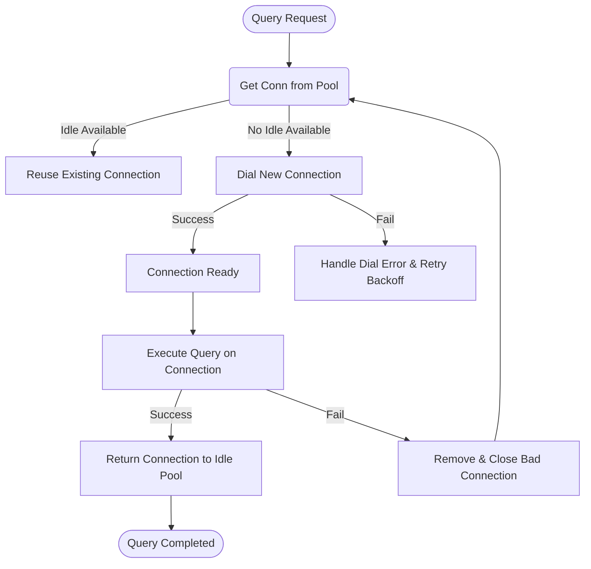

# Connection Pooling and Query Execution

Understand how go-pg manages database connections for high throughput and resilience, including how connection pooling, context management, and circuit breaker support work to optimize resource usage and reliability.

---

## Introduction to Connection Pooling in go-pg

In high-performance Go applications interacting with PostgreSQL, managing database connections efficiently is critical. The **Connection Pooling and Query Execution** system in go-pg ensures your application can handle a large volume of queries reliably by reusing existing connections rather than opening new ones for every request. This guide takes you through how go-pg handles connection pooling, manages contexts to enable cancellations and timeouts, and uses resilient patterns to maintain high throughput and reliability.

---

## Connection Pooling Fundamentals

At its core, go-pg uses a **connection pool** to maintain a set of reusable connections to your PostgreSQL database. This avoids the costly overhead of establishing new TCP connections repeatedly and allows query execution to happen concurrently without waiting for new connections.

### Key Elements of go-pg's Connection Pool:

- **PoolSize**: Maximum number of connections in the pool, balancing throughput and resource consumption.
- **MinIdleConns**: Minimum number of idle connections maintained to reduce latency for initial requests.
- **IdleTimeout** & **MaxConnAge**: Mechanisms to identify and close stale connections for freshness and stability.
- **PoolTimeout**: Defines how long a request waits for an available connection before timing out.

### How Connections Are Managed

- When a query is executed, go-pg requests a connection from the pool.
- If an idle connection is available, it is given instantly, minimizing wait time.
- If no idle connections are free but the pool hasn’t reached `PoolSize`, a new connection is established asynchronously.
- If the pool is exhausted, go-pg efficiently waits (up to `PoolTimeout`) for a connection to be released back to the pool.
- Idle or aged connections exceeding configured timeouts are reaped from the pool to maintain optimal resource usage.

This ensures an ideal balance between request latency and resource consumption.

### Example Scenario

> Suppose your API service has high traffic spikes. Without connection pooling, each spike could exhaust server resources opening new connections, slowing down all queries. go-pg’s pool hands out idle connections rapidly or creates new connections up to the configured maximum. Excess queries wait in a queue briefly but fail fast if waited too long, preventing overload.

---

## User Workflow: Query Execution with Connection Pooling

### Step 1: Initiate Query Execution

When your application code calls a query method (e.g., `db.ExecContext(ctx, query)`), go-pg begins by obtaining a connection from its connection pool.

### Step 2: Acquiring a Connection

- The connection pool checks if there is an idle connection immediately ready.
- If none are idle and the pool permits, it dials a new connection.
- If the maximum number of connections is active, the request waits on a queue until a connection is freed.
- If the wait times out based on `PoolTimeout`, the query is canceled immediately with a pool timeout error.

### Step 3: Context Management

- The connection is tied to the query’s `context.Context` allowing cancellation or timeout enforcement.
- If the context is canceled during an operation, the connection will detect and handle it gracefully, freeing resources.

### Step 4: Query Execution

- With an assigned connection, the query is sent to PostgreSQL.
- go-pg uses optimized read and write buffers for efficient data transfer.

### Step 5: Returning the Connection

- When the query completes successfully, the connection is returned to the idle pool.
- If the connection is detected as bad or stale (e.g., network problems or timeout), it is removed and closed rather than reused.

### Step 6: Handling Circuit Breaker Scenarios

Although not explicitly named "circuit breaker" in code, the connection pooling system implements similar retry and backoff patterns:

- If repeated dialing errors occur, go-pg refrains from further attempts for a short cooldown period.
- This prevents overwhelming the database or network with repeated connection attempts.
- After cooldown, dialing retries resume, restoring normal pool operation.

---

## Connection Pool Types in go-pg

go-pg supports different pooled connection types customized for various use cases:

| Pool Type           | Purpose                                            | Description                                                                                      |
|---------------------|----------------------------------------------------|------------------------------------------------------------------------------------------------|
| **ConnPool**        | Standard multidimensional pool                      | Manages multiple connections with configurable pool sizes, idle connections, and reaping logic. |
| **StickyConnPool**  | Single-connection pool with sticky behavior        | Keeps one connection “sticky” to the client, used in scenarios like database notifications where persistent connections matter.
|
| **SingleConnPool**  | Single connection without pooling                   | Holds exactly one connection, typically for lightweight or test scenarios.
|

<Accordion title="When to use which pool type?">

- Use the default `ConnPool` for most high-throughput applications.
- Choose `StickyConnPool` when you need to maintain a persistent connection state, such as LISTEN/NOTIFY.
- Use `SingleConnPool` for simple or single-query workflows.

</Accordion>

---

## Configuration Parameters and Best Practices

### PoolSize
Defines how many connections can exist simultaneously. Increasing this improves concurrency but raises resource costs. Tune this based on your workload and database capacity.

### MinIdleConns
Maintains a minimum number of idle connections ready for immediate use, reducing latency for initial or bursty queries.

### IdleTimeout & MaxConnAge
Close connections that have been idle for too long or are older than a set maximum age to avoid issues with network timeouts or server restarts.

### PoolTimeout
Controls the maximum wait time for an available connection before the query fails to avoid indefinite blocking.

<Warning>
Setting timeouts too low may cause frequent query failures during high load. Too high can cause excessive wait times, masking throughput bottlenecks.
</Warning>

### Recommended Usage

- Start with a moderate `PoolSize` (e.g., 10 or 20) and adjust based on app metrics.
- Use `MinIdleConns` to keep a small buffer of ready connections (~1-5).
- Configure `IdleTimeout` to a few minutes, depending on traffic patterns.
- Watch `Stats()` of your pool to monitor hits, misses, and timeouts.

---

## Inspecting Pool Health and Statistics

go-pg exposes a `Stats()` interface reporting:

- **Hits**: How often a connection was immediately available (high is good).
- **Misses**: How often a new connection was dialed (higher means more dialing overhead).
- **Timeouts**: How often connection requests timed out waiting.
- **TotalConns**: Total connections currently in use.
- **IdleConns**: How many are currently free.
- **StaleConns**: How many stale connections have been reaped.

Monitoring these helps identify connection exhaustion, resource leaks, or under-utilization.

---

## Troubleshooting Common Connection Pool Issues

### Pool Exhaustion
Caused when your configured `PoolSize` is smaller than the concurrent demand.

**Symptoms:** Query errors caused by pool timeout, pending requests queued.

**Solution:** Increase `PoolSize` or optimize query concurrency.

### Stale or Broken Connections
Connections may appear broken due to network issues or server reboots.

**Symptoms:** Queries fail unexpectedly, reconnect latency increases.

**Solution:** Use `IdleTimeout` and `MaxConnAge` to automatically close stale connections.

### Context Cancellations
Queries cancelled via context may cause connection removal.

**Tip:** Always use `context.Context` with timeout/deadline for reliable cancellation handling.

### Dialing Errors
Transient errors on connection creation cause dialing backoff.

**Tip:** Monitor dial error counts and logs to detect database availability issues.

---

## Internal Connection Lifecycle (Simplified Flow)

---

## Summary

go-pg’s **Connection Pooling and Query Execution** system seamlessly manages PostgreSQL connections to deliver high throughput and reliability. By tuning pool size, idle connections, and timeouts, applications gain fast, resilient query execution with minimal latency and controlled resource usage. Context integration ensures adaptive cancellation, while stale connection reaping maintains pool health. Use the pool stats and monitoring hooks to fine-tune performance and detect issues early.

---

## Additional Resources

For deeper understanding and complementary topics, see:

- [Connection Pooling and Reliability Guide](https://pg.uptrace.dev/guides/performance-best-practices/connection-pooling)
- [Configuration & Connecting to PostgreSQL](https://pg.uptrace.dev/getting-started/setup/configuration-setup)
- [Error Handling & Context Usage](https://pg.uptrace.dev/guides/performance-best-practices/error-handling-ctx)
- [System Components and Data Flow](https://pg.uptrace.dev/concepts/architecture-overview/system-components)
- [Managing Transactions](https://pg.uptrace.dev/guides/application-patterns/transactions)

Explore these guides to extend connection pool mastery into transaction and query performance tuning.

---

## Next Steps

- Tune your pool parameters based on workload and monitor using built-in stats.
- Embrace context-aware APIs to better handle cancellations and timeouts.
- Leverage `StickyConnPool` for scenarios requiring long-lived connections (e.g., listeners).
- Read related manuals on transactions and query optimization for holistic database interaction management.
- Always test your connection configurations under expected peak load to identify bottlenecks early.

---

This documentation empowers you to control and optimize the connection layer that underpins all querying in go-pg, enabling you to deliver fast, scalable, and resilient Go applications with PostgreSQL.

---