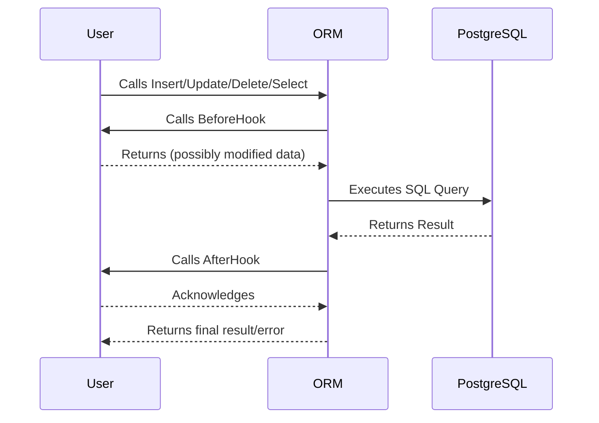

# Extensibility and Hooks in go-pg

In go-pg, flexibility and customization are paramount. This page introduces you to the design patterns that empower go-pg’s extensibility — chiefly hooks, adapters, and type interfaces. By understanding and applying these mechanisms, you can seamlessly customize lifecycle actions of your models, influence query formation, and control data conversion processes tailored to your unique application logic.

---

## Why Extensibility Matters

As your application evolves, the need to customize database interactions grows. Whether you want to audit modifications, automatically update timestamps, enrich logging with detailed query data, or support advanced type conversions, go-pg’s extensibility system gives you precise control without sacrificing simplicity.

Extensibility in go-pg revolves around *hooks* — predefined interception points in the ORM’s lifecycle — and *interfaces* that your models and types can implement to alter behavior.

## Overview of Hooks

Hooks in go-pg let you insert your own logic before or after key database operations at multiple stages:

- **Scanning** (row data loading)
- **Query execution** (before and after sending SQL to PostgreSQL)
- **CRUD operations** (insert, update, delete, select)

By implementing hook interfaces on your models or adding QueryHooks on the database client, you gain full control over how data is fetched, modified, or logged.

### Model Lifecycle Hook Interfaces

go-pg recognizes a set of interfaces that your model structs can implement to participate in lifecycle events. Each hook corresponds to a specific moment around database operations:

| Hook Interface         | When It Runs                    | Purpose / Use Case                                          |
| ---------------------- | ------------------------------ | ----------------------------------------------------------- |
| `BeforeScanHook`       | Before scanning a database row | Prepare model for scanning or control data interpretation   |
| `AfterScanHook`        | After scanning a row           | Post-processing scanned data                                 |
| `AfterSelectHook`      | After selecting row(s)         | Modify model after full select, e.g., computed fields       |
| `BeforeInsertHook`     | Before inserting record        | Modify or validate data before insert                        |
| `AfterInsertHook`      | After insert completes         | Post-insert actions, e.g., logging or cache refresh         |
| `BeforeUpdateHook`     | Before updating                | Validate or change data before update                        |
| `AfterUpdateHook`      | After update completes         | Post-update triggers, notifications                          |
| `BeforeDeleteHook`     | Before deletion                | Cleanup or permission checks before delete                   |
| `AfterDeleteHook`      | After delete completes         | Cascade actions or auditing                                  |

#### Implementing Hooks on Models

Your model struct can implement any combination of these interfaces simply by defining the required methods. For example, to log insertion events:

```go
func (m *MyModel) AfterInsert(ctx context.Context) error {
    log.Printf("Inserted model with ID %v", m.ID)
    return nil
}
```

When go-pg performs the insert, this method will be called automatically.

### Query-Level Hooks (QueryHook Interface)

Beyond model-level lifecycle hooks, go-pg supports query hooks that operate at the database query level. This lets you intercept **any SQL query** before it is sent and after a response is received.

- These hooks implement the interface:

```go
type QueryHook interface {
    BeforeQuery(context.Context, *QueryEvent) (context.Context, error)
    AfterQuery(context.Context, *QueryEvent) error
}
```

- They receive a `QueryEvent` containing details about the query, parameters, result, and errors.

- Add hooks to your database instance:

```go
db.AddQueryHook(myHook)
```

- Typical uses include:
  - Logging full SQL queries with parameters
  - Tracing execution time and performance analytics
  - Appending session variables or custom SQL hints

### Built-in Query Hooks

go-pg includes some predefined hooks you can use:

- **DebugHook** (from `pgext`): Logs queries and errors to the console.
- **TracingHook** (from `pgotel`): Adds OpenTelemetry instrumentation for distributed tracing.

Using these requires only a simple setup:

```go
import "github.com/go-pg/pg/extra/pgotel/v10"
db.AddQueryHook(pgotel.NewTracingHook())
```

## Hook Execution Order and Behavior

Hooks run in a predictable manner, ensuring safe and logical extension:

- **Before hooks** run sequentially before the main operation.
- **After hooks** run sequentially after the operation completes.

For collections (slices of models), hooks run on each item individually, allowing batch processing scenarios to benefit from hooks.

If a hook returns an error, the operation aborts immediately, and subsequent hooks or ORM actions do not execute. This gives you control for validation or security controls.

## Customizing Data Conversion through Interfaces

Extensibility extends further to data mapping and types:

- **Custom scan/valuer interfaces** allow types to define how to convert database values to Go structs and vice versa.
- Examples include implementing [`sql.Scanner`](https://pkg.go.dev/database/sql#Scanner) and [`driver.Valuer`](https://pkg.go.dev/database/sql/driver#Valuer) interfaces.
- go-pg smartly integrates with these interfaces to provide automatic conversion for your custom types, making it seamless to work with complex PostgreSQL types or third-party data structures.

## Practical Hook Implementation Example

Below is a scenario where a model automatically updates `UpdatedAt` timestamp before each update:

```go
type User struct {
    ID        int64
    Name      string
    UpdatedAt time.Time
}

func (u *User) BeforeUpdate(ctx context.Context) (context.Context, error) {
    u.UpdatedAt = time.Now()
    return ctx, nil
}
```

Whenever you call `db.Model(user).WherePK().Update()`, the `BeforeUpdate` hook updates the timestamp automatically.

## Troubleshooting and Best Practices

<AccordionGroup title="Hook Usage Tips and Common Pitfalls">
<Accordion title="Hook Not Being Called">
Ensure your struct implements the exact hook method signatures defined by go-pg. Method receivers must be pointer receivers (`*MyStruct`). Also check your model is passed as a pointer when querying or updating.
</Accordion>
<Accordion title="Errors in Hooks Prevent Operation">
Hooks can return errors to halt operations. Use this power for validation but provide clear error messages. Unintended errors will cause transaction rollbacks.
</Accordion>
<Accordion title="Batch Model Hooks on Slices">
Hooks run on each item in slices. If you need batch logic, consider wrapping with separate interfaces or implement logic outside hooks.
</Accordion>
<Accordion title="Avoid Heavy Computation in Hooks">
Hooks affect query performance as they execute synchronously. Keep hook logic efficient to prevent latency.
</Accordion>
</AccordionGroup>

## Visualizing Hook Interaction Flow



This shows how hooks wrap around the core query execution in a transparent manner.

## Related Concepts and Next Steps

- Explore the [Model Relations and Joins](/api-reference/orm-model-workflows/model-relations-and-joins) guide to understand how hooks interact with relational queries.
- Learn about [Query Formatting and Parameters](/api-reference/advanced-types-and-query-features/query-formatting-and-parameters) for dynamic SQL customization.
- For enhanced observability, refer to the [OpenTelemetry instrumentation](extra/pgotel/README.md) explained in the ecosystem.

---

Extensibility via hooks unlocks go-pg’s full potential, giving you control at every critical stage of your application's data lifecycle. Implement hooks thoughtfully to improve maintainability, observability, and business logic separation.


---

### Example: Using a QueryHook for Logging

```go
import (
    "context"
    "log"

    "github.com/go-pg/pg/v10"
)

type LoggingHook struct{}

func (h LoggingHook) BeforeQuery(ctx context.Context, evt *pg.QueryEvent) (context.Context, error) {
    query, _ := evt.FormattedQuery()
    log.Printf("Executing: %s", query)
    return ctx, nil
}

func (h LoggingHook) AfterQuery(ctx context.Context, evt *pg.QueryEvent) error {
    if evt.Err != nil {
        log.Printf("Error: %v", evt.Err)
    } else {
        log.Printf("Success: %d rows affected", evt.Result.RowsAffected())
    }
    return nil
}

func main() {
    db := pg.Connect(&pg.Options{User: "postgres"})
    defer db.Close()

    db.AddQueryHook(LoggingHook{})

    // Your queries here...
}
```

This simple hook logs every query executed with success or error status, aiding debugging and monitoring.

---

## Summary

Exploring and mastering hooks lets you build robust, easy-to-maintain applications with clear data flow oversight and custom behavior insertion at scale.

---

###### Navigation Links
- [Model Relations and Joins Guide](/api-reference/orm-model-workflows/model-relations-and-joins)
- [Query Formatting and Parameters](/api-reference/advanced-types-and-query-features/query-formatting-and-parameters)
- [OpenTelemetry Integration Guide](extra/pgotel/README.md)

---