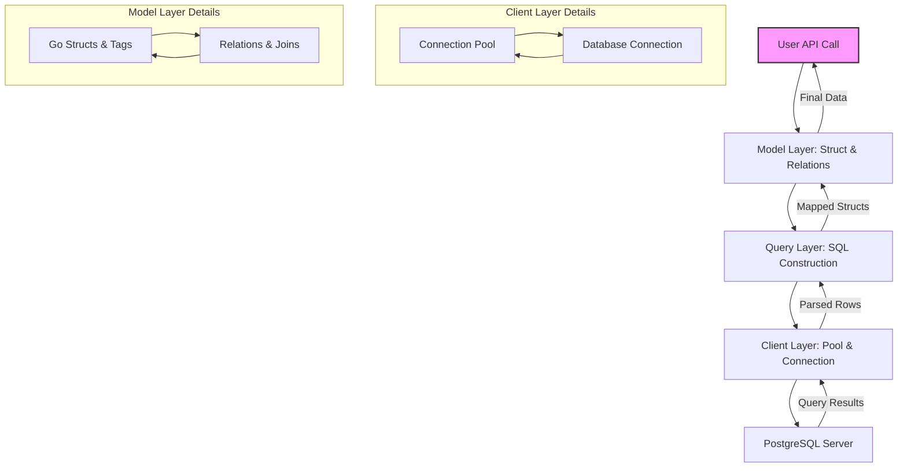

# System Components and Data Flow

Understanding the fundamental architectural building blocks of go-pg empowers you to efficiently integrate, extend, and troubleshoot your database interactions. This guide unpacks how the primary components—the client, model layer, and query layer—collaborate to transform your Go API calls into PostgreSQL queries and map the responses back into Go structures. By mastering this flow, you gain clarity on where to intervene for custom behaviors, optimizations, or configuration tweaks.

---

## 1. Overview of go-pg Architectural Layers

At its core, go-pg organizes its internal processes into three major layers that directly shape how your Go application interacts with PostgreSQL:

- **Client Layer (DB Connection & Pooling):** Manages connection lifecycle, pooling, retries, and query execution.
- **Model Layer (ORM & Struct Mapping):** Handles Go struct definitions, relations, field tagging, and schema mapping.
- **Query Layer (Builder & Execution):** Constructs SQL queries, binds parameters, executes commands, and scans results.

These layers logically map to the various user interactions you perform—from calling `db.Model(&user).Select()` to receiving mapped results.

<Info>
This layered design abstracts complex database protocols behind intuitive Go methods, enabling declarative query building with full control when needed.
</Info>

---

## 2. Client Layer: Connection and Request Management

### 2.1 Role and Purpose
The client layer in go-pg is your application's direct gateway to PostgreSQL. It:

- Establishes and manages pooled connections to the database.
- Handles context-aware query lifecycles (timeouts, cancellations).
- Orchestrates retries on transient network errors.
- Supports prepared statement caching and resource cleanup.

### 2.2 Connection Pooling
go-pg uses an efficient connection pool internally to maximize performance and minimize latency. Connections are reused with safeguards around stale or faulty connections.

- **StickyConnPool:** Maintains session affinity for stateful query sequences.
- **ConnPool:** Controls concurrent connections sized by `PoolSize` and idle connections by `MinIdleConns`.

When your application queries, the pool provides a ready connection or blocks until one becomes available. Appropriate timeouts and error handling protect against pool exhaustion.

### 2.3 Query Execution Flow
When you call any operation like `Query`, `Exec`, or ORM methods:

- The client layer fetches a database connection from the pool.
- It writes the serialized SQL query and parameters onto the connection’s buffer.
- The request is sent to the PostgreSQL backend.
- Responses are asynchronously read, parsed, and dispatched to the query layer for processing.

### 2.4 Practical Tip
Always perform `db.Close()` to release connections cleanly and prevent resource leaks. Tune pool parameters (`PoolSize`, `PoolTimeout`) based on your application's concurrency needs.

---

## 3. Model Layer: Structs, Relations, and Schema Mapping

### 3.1 Mapping Go Structs to Tables
At the heart of go-pg's ORM is the model layer, which governs how Go structs correspond to database tables and columns:

- Struct fields map to columns by naming convention or explicit tags (e.g., `pg:"column_name"`).
- Primary keys, indexes, nullable flags, and default values are inferred or specified with tags.
- Supported PostgreSQL-specific types include arrays, JSONB, hstore, and composites, mapped through wrappers and tags.

### 3.2 Handling Relationships
go-pg supports common ORM relationships directly in structs, enabling rich joined queries:

- `has one` and `belongs to` for one-to-one and parent-child relations.
- `has many` for one-to-many links.
- `many-to-many` powered by join tables, managed seamlessly.

Using these relations, your queries can automatically fetch related records, minimizing boilerplate and optimizing SQL joins.

### 3.3 Model Layer Workflow
When you invoke `db.Model(model)`:

- go-pg inspects struct fields and tags to build a model representation.
- It generates the SQL query skeleton tailored to the model’s schema and relations.
- Scanning and mapping logic is prepared to translate query results back into Go structs.

<Note>
Modifying or customizing model behavior (e.g., hooks or custom types) fits into this layer, allowing flexible data transformations during query execution.
</Note>

---

## 4. Query Layer: Building, Executing, and Scanning Queries

### 4.1 Query Formation
The query layer translates ORM calls and raw SQL into PostgreSQL-ready commands:

- Carefully crafted SQL queries are constructed using query builder methods.
- Parameter binding uses placeholders and safe escaping to avoid injection.
- Supports advanced SQL features like CTEs, Common Table Expressions, `ON CONFLICT` clauses, and batch operations.

### 4.2 Executing Queries
Once built, the query is passed down to the client layer for execution:

- Query commands are serialized into protocol-compliant packets.
- Execution respects contexts for timeout and cancellation.
- Network errors trigger automated retries when appropriate.

### 4.3 Result Mapping and Parsing
As results return:

- The query layer uses scanners to map column values into Go variables or struct fields.
- It handles complex types, arrays, JSONB, and custom scanners seamlessly.
- Relation data from joined queries is mapped according to model relations.

### 4.4 Error Handling
The query layer surfaces errors such as:

- No rows found or multiple rows where not expected.
- Constraint violations and PostgreSQL-specific error codes.
- Network or timeout-induced failures.

Providing clear feedback at this stage helps users handle runtime issues gracefully.

---

## 5. Flow: From API Call to PostgreSQL Query and Back

Here’s a typical flow illustrating how a user action travels through go-pg’s key layers:

1. **User Request**: Calls `db.Model(&user).Select()`.
2. **Model Layer**: Inspects the `User` struct, preparing the SQL with columns and relations.
3. **Query Layer**: Builds the corresponding SQL `SELECT` and binds placeholders.
4. **Client Layer**: Acquires a pooled connection and sends the query.
5. **PostgreSQL Server**: Executes the query and streams results.
6. **Client Layer**: Reads response packets asynchronously.
7. **Query Layer**: Parses row data and populates Go structs.
8. **User Code**: Receives fully mapped structs for processing.

<Tip>
This layered flow ensures each responsibility is cleanly separated, making it easier to troubleshoot, extend, and optimize each stage independently.
</Tip>

---

## 6. Where to Customize or Extend

Understanding where behaviors fit allows strategic customization:

- **Connection Pool Settings and Hooks:** Tweak client pooling behavior (timeouts, retries).
- **Model Definitions and Tags:** Control table/column mappings, null handling, and relations.
- **Query Building Modifiers:** Use query builder methods or raw SQL for non-standard queries.
- **Scanning and Type Wrappers:** Implement custom scanners/valuers for specialized types.

Combined, these afford great power while preserving elegant API simplicity.

---

## 7. Troubleshooting Common Pain Points

| Symptom                      | Typical Cause                         | Recommendation                         |
|------------------------------|-------------------------------------|-------------------------------------|
| Connection timeouts or pool exhaustion | Pool size too small or query blocking | Increase PoolSize, add timeouts, monitor pool stats |
| Incorrect struct mapping      | Missing or incorrect `pg` tags       | Check struct tags for column names and nullability  |
| Query failures with SQL errors| Bad SQL from query builder or tags   | Enable query debug logging, validate raw SQL       |
| Stale connections or errors   | Faulty network or connection drops   | Use pool Reset, set idle timeout, monitor connections|

<Check>
Keep connection pooling in mind when performance issues arise; many errors trace back to resource exhaustion.
</Check>

---

## 8. Visual Diagram of Core Components and Data Flow

---

## 9. Summary

This guide lays out go-pg’s key system components and their roles in converting your Go requests into efficient PostgreSQL commands and back. Understanding how the client, model, and query layers interact sharpens your ability to harness go-pg's full power, optimize performance, and customize behaviour where needed.

For hands-on application, refer to guides on defining models, configuring connection pools, and crafting complex queries.

---