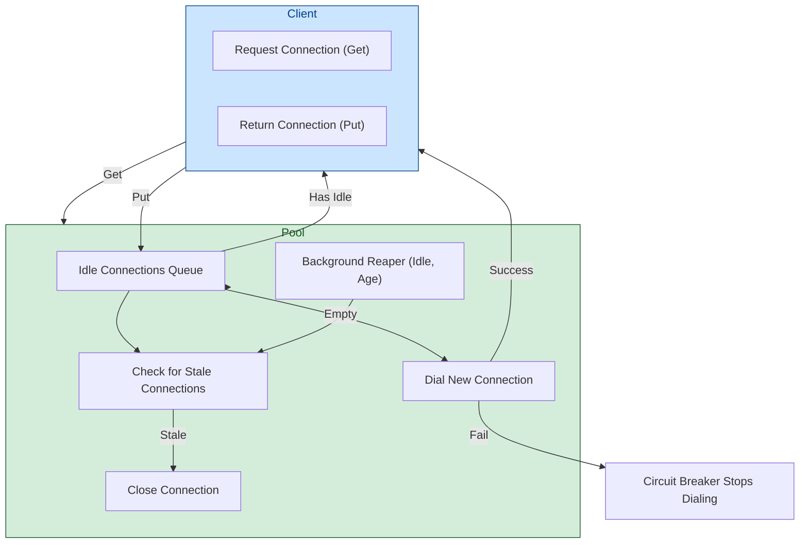

# Connection Pooling and Lifecycle

Efficient management of database connections is critical for building robust, high-performance Go applications using go-pg. This page guides you through how go-pg handles connection pooling and lifecycle management internally, empowering you to better understand, configure, and troubleshoot connection behavior in your applications.

---

## Why Connection Pooling Matters

Imagine your application as a busy office where employees frequently enter and exit conference rooms. Opening and closing these rooms every time a meeting starts is costly and inefficient. Similarly, opening and tearing down database connections for every query wastes resources and slows down your application.

Connection pooling tackles this by maintaining a pool of ready-to-use connections. When your application needs a connection, it borrows one from the pool instead of creating a new one. When finished, it returns the connection. This reuse drastically reduces latency and server load, enabling your application to scale gracefully.

---

## Overview of go-pg Connection Pool Implementation

At the core, go-pg provides several connection pool implementations tailored to different usage scenarios but centered on the fundamental `Pooler` interface:

- `ConnPool`: The general-purpose connection pool managing multiple connections with options to control pool sizing, idle timeouts, and lifecycle.
- `StickyConnPool`: Builds on a base pool to provide a "sticky" single connection behavior.
- `SingleConnPool`: Wraps a single connection, useful for isolated use cases.

These implementations coordinate connection creation, reuse, and cleanup while transparently handling edge cases and failures.

### Key Pool Options

You can tune the pooling behavior through options:

| Option                 | Description                                                                                     |
|------------------------|-------------------------------------------------------------------------------------------------|
| `PoolSize`             | Maximum total connections allowed in the pool                                                 |
| `MinIdleConns`         | Minimum number of idle connections to maintain in the pool                                     |
| `PoolTimeout`          | Maximum duration to wait for a connection from the pool before timing out                      |
| `IdleTimeout`          | Time after which idle connections are considered stale and closed                             |
| `MaxConnAge`           | Maximum age of a connection before it is closed and recycled                                  |
| `IdleCheckFrequency`   | How often the pool checks for and reaps stale (idle or aged) connections                      |

---

## How the Pool Works: User Interaction and Lifecycle Flow

### Acquiring a Connection

1. When your application requests a connection (`Get`):
   - The pool tries to provide an already idle connection.
   - If no idle connections are available, and the pool is under capacity, it creates a new connection asynchronously.
   - If the pool is at capacity, your request blocks until one is returned or until the pool timeout expires.

2. The connection’s freshness is checked:
   - Connections older than `MaxConnAge` or idle longer than `IdleTimeout` are considered stale and closed.

3. On success, you get a live connection ready for queries.

### Returning a Connection

- When done, your application calls `Put`, returning the connection to the pool's idle list.
- If the connection was marked as unsuitable for pooling (e.g., failed health check), it's removed and closed instead.

### Removing a Connection

- Connections can be explicitly removed with `Remove` due to errors or bad states.
- The pool promptly frees the slot and optionally creates a replacement to maintain `MinIdleConns`.

### Idle Connection Reaping

- A background goroutine periodically runs (`reaper`), closing connections that exceed idle or max-age thresholds.
- This automatic pruning ensures resource freshness and prevents leakages.

---

## Connection Pool Stats

The pool maintains real-time statistics reflecting its state and usage:

| Stat           | Meaning                                              |
|----------------|------------------------------------------------------|
| `Hits`         | Number of times a connection was served from idle   |
| `Misses`       | Number of times no idle connection was available     |
| `Timeouts`     | Number of times waiting for connection timed out     |
| `TotalConns`   | Total connections currently tracked                   |
| `IdleConns`    | Number of idle connections available                  |
| `StaleConns`   | Number of stale connections reaped over time         |

You can query these stats via `Pooler.Stats()` and use them to monitor connection health and tuning effectiveness.

---

## Automatic Circuit Breaker on Dial Failures

If the pool detects repeated dial failures (connection attempts failing to establish), it temporarily halts creating new connections until a background retry confirms connectivity restoration. This circuit breaker:

- Prevents your application from overwhelming the database or network during outages.
- Ensures errors are promptly surfaced rather than silently queued.

This behavior protects app stability during transient network or database failures.

---

## Practical Tips & Best Practices

- **Set `PoolSize` wisely**: Match your typical concurrent database usage while considering PostgreSQL resource limits.
- **Use `MinIdleConns`**: Keep a minimum ready pool to reduce latency spikes on sudden load increases.
- **Tune `PoolTimeout`**: Balance between responsiveness and allowing queued requests some wait time.
- **Set appropriate `IdleTimeout` and `MaxConnAge`**: Recycle stale connections to maintain pool health.
- **Monitor connection stats**: Regularly log or expose stats for proactive performance tuning.

---

## Common Pitfalls and Troubleshooting

### Connection Requests Blocking Indefinitely

- Likely caused by setting a very low `PoolSize` or many connections stuck/held.
- Use pool stats to identify saturation.
- Increase pool size or reduce connection hold time.

### Frequent Connection Dial Failures

- Check network connectivity and database availability.
- Verify dialer function correctness.
- Validate credentials and firewall rules.

### Idle Connections Not Being Reaped

- Confirm `IdleTimeout` and `IdleCheckFrequency` are set to positive durations.
- Ensure the application is running long enough for the reaper to trigger.

### Unexpected Connection Closures or Errors

- Investigate if max connection age (`MaxConnAge`) is too low.
- Check for connection health in application code and Remove bad connections promptly.

---

## Behind The Scenes: Simplified Diagram of Connection Pool Flow

---

## Integration with go-pg

The connection pool is seamlessly integrated within go-pg's database client (`baseDB`). When you perform queries or operations:

- go-pg requests connections from the pool.
- Connections are initialized on first use with authentication and optional SSL/TLS setup.
- Connections are automatically released or removed based on success or error states.

This abstraction shields you from pool management complexity, letting you focus on database logic.

---

## Summary

Connection pooling in go-pg is an intelligent, configurable system designed to maximize database efficiency and reliability. Leveraging automatic connection reuse, idle management, failure circuit breaking, and integration with go-pg's database client enables your application to operate smoothly at scale with minimal connection overhead.

Understanding the core pooling concepts and their configurations empowers you to optimize performance, troubleshoot effectively, and build applications that connect to PostgreSQL databases seamlessly.

---

## More Resources

- [Architecture Overview](https://yourdocs/overview/architecture-and-core-concepts/architecture-overview) — Understand go-pg's overall system design.
- [Connection Pooling and Performance Tuning Guide](https://yourdocs/guides/real-world-integration-patterns/performance-pooling) — Deep dive into configuring and tuning the pool.
- [Error Handling & Status Codes](https://yourdocs/api-reference/common-operations-examples/error-handling-status-codes) — Handle connection and query errors.
- [Transaction Management](https://yourdocs/guides/real-world-integration-patterns/transaction-management) — Learn how pooling integrates with transactions.

---

If you encounter specific connection issues, refer to [Connection Errors Troubleshooting](https://yourdocs/getting-started/troubleshooting/connection-errors).

Experience automatic connection reuse throughout your database queries to boost performance without extra effort—connection pooling is the bridge between your Go application and scalable, resilient PostgreSQL access.
