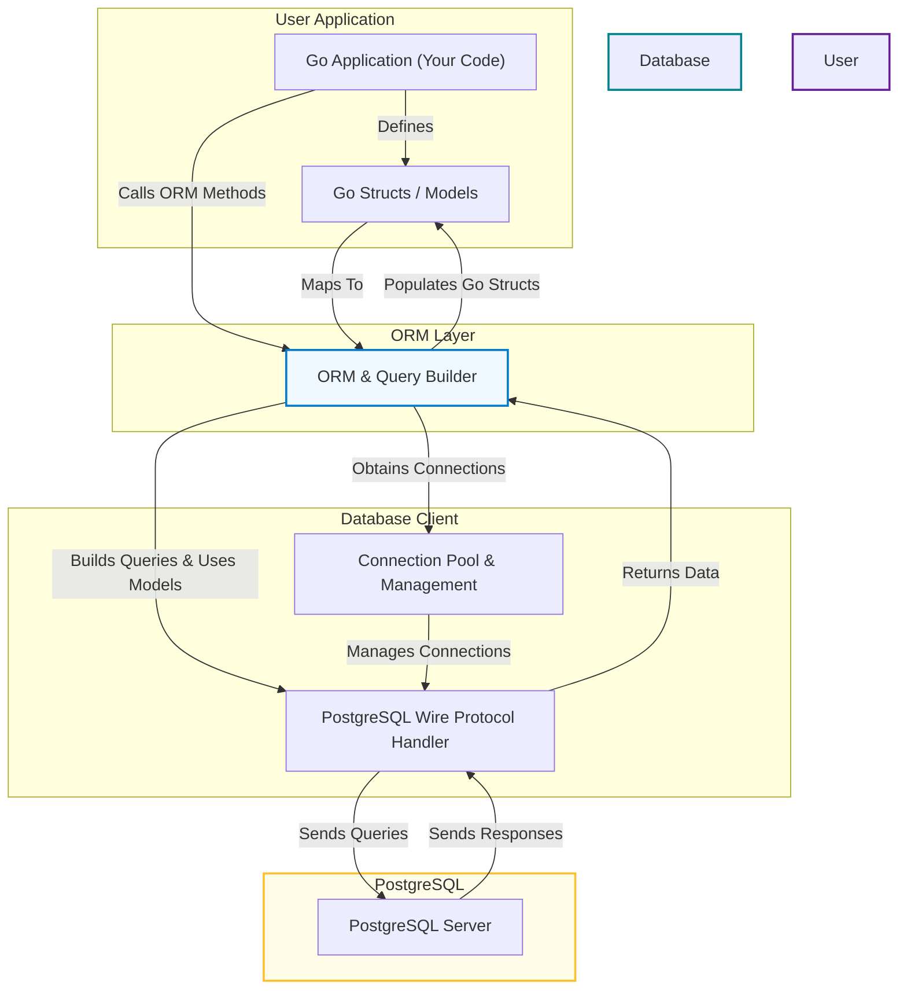

# System Architecture Overview

Understanding how go-pg is architected empowers you to use it efficiently and troubleshoot effectively. This guide details the core components of go-pg as a PostgreSQL driver and ORM, outlining its layered design, how your Go code interacts with the database through each layer, and the typical flow from data modeling to query execution and result handling.

---

## Architecture Layers

The go-pg system is composed of several critical layers, each responsible for distinct parts of the PostgreSQL integration and ORM experience in Go:

### 1. Database Client Layer

- **Role:** Handles low-level PostgreSQL protocol communication including authentication, query messaging, and response parsing.
- **Responsibilities:** Manages connection establishment, SSL handshake, sending protocol messages (startup, queries), reading server responses, error handling, and notifications.
- **Connection Pool:** Also manages pools of reusable connections, optimizing resource usage and throughput.

### 2. Query Builder / ORM Layer

- **Role:** Bridges Go structs with SQL by building queries, mapping results to Go types, and simplifying data manipulation.
- **Responsibilities:** Constructs SQL SELECT/INSERT/UPDATE/DELETE statements from Go model definitions, applies filters and relations, manages transactions and prepared statements, and handles advanced ORM features like associations, bulk operations, and soft deletes.

### 3. Go Structs and Data Models

- **Role:** Represents your domain data in Go using structs that map directly to PostgreSQL tables and columns.
- **Responsibilities:** Define field tags for column mapping, manage primary keys, nullability, custom types, and relationships.

## Typical User Flow

The typical journey for a user interacting with go-pg follows a clear progression through these layers.

### Step 1: Define Your Models

- Create Go structs with field tags specifying how each maps to PostgreSQL columns.
- Utilize tags for nullability control, composite keys, and custom PostgreSQL types like arrays, JSON, or hstore.

### Step 2: Establish Database Connection

- Configure `pg.Options` with connection details, including host, user, password, and pool settings.
- Call `pg.Connect()` to acquire a DB client that manages the underlying connection pool.

### Step 3: Construct and Execute Queries

- Use the ORM methods `Model()`, `Select()`, `Insert()`, etc., to compose queries in Go.
- Optionally, include relations with `Relation()` to eager load associations.
- Leverage prepared statements or transactions for performance and reliability.

### Step 4: Data Flow and Response Handling

- go-pg converts the query into a raw SQL string using query builders.
- The database client layer sends messages following the PostgreSQL wire protocol.
- Responses are parsed, mapped back onto Go structs, handling nullability and type conversions.

### Step 5: Resource and Error Management

- Connections are returned to the pool with health checks.
- Errors are wrapped with PostgreSQL error details for user-level handling.

## Visualizing the Architecture



## Detailed Insights into Key Components

### Connection Pool & Lifecycle

The connection pool abstracts the management of physical TCP connections to the PostgreSQL server:

- It reuses connections to minimize overhead.
- Supports pool sizing, timeouts, and circuit breakers for resilience.
- Handles SSL negotiation and authentication transparently.
- Monitors connection health and reconnects on failure.

### Query Building with Models

When you initiate `db.Model(&Struct{})`, go-pg:

- Reflects on your struct fields, respecting tags like `pg:",pk"`, `pg:",notnull"`, or `pg:",many2many"`.
- Builds the SQL dynamically with WHERE, JOINs, and clauses based on your query calls.
- Converts Go types (e.g., slices, time.Time) into PostgreSQL-compatible representations.

### Result Scanning and Mapping

- After execution, the raw PostgreSQL data rows are scanned back into your Go structs.
- Null and zero values are handled to reflect SQL null semantics.
- Hooks allow for custom unmarshalling logic when needed.

## Practical Example Illustrating the Flow

```go
// Define models with relations
type User struct {
    Id     int64
    Name   string
    Emails []string
}

type Story struct {
    Id       int64
    Title    string
    AuthorId int64
    Author   *User `pg:"rel:has-one"`
}

func example(db *pg.DB) error {
    // Insert a user
    user := &User{Name: "Alice", Emails: []string{"alice@example.com"}}
    if _, err := db.Model(user).Insert(); err != nil {
        return err
    }

    // Insert a story linked to the user
    story := &Story{Title: "Go-pg Story", AuthorId: user.Id}
    if _, err := db.Model(story).Insert(); err != nil {
        return err
    }

    // Query story with eager loading of author
    result := &Story{Id: story.Id}
    err := db.Model(result).Relation("Author").Select()
    if err != nil {
        return err
    }

    fmt.Printf("Story: %s by %s\n", result.Title, result.Author.Name)
    return nil
}
```

This exemplifies how data flows from Go models → ORM query construction → PostgreSQL driver → query execution → data mapping → back to Go structs.

## Best Practices & Tips

- **Initialize models thoughtfully:** Clearly define primary keys and relationships with appropriate struct tags.
- **Reuse connections:** Leverage the automatic connection pooling; adjust pool settings in production for optimized throughput.
- **Use transactions when modifying multiple tables:** To maintain data integrity, especially when performing bulk or batch operations.
- **Catch and handle errors:** PostgreSQL errors are wrapped with detailed information in go-pg errors.
- **Enable query debugging:** For complex queries, enable logging/hooks to trace the generated SQL.

## Common Pitfalls

- Omitting `v10` suffix in import path causes installation issues.
- Ignoring primary key annotations can cause unexpected ORM behavior.
- Not tuning connection pool for high concurrency environments.
- Misunderstanding null value mapping could lead to unexpected zero values in structs.

---

## Further Reading and Related Documentation

- [Architecture Overview](/overview/architecture-and-core-concepts/architecture-overview): Visual context for system components and query lifecycle.
- [Defining Models and Mapping](/guides/getting-started/modeling-data-structs): Foundational for creating Go structs aligned with tables.
- [Connection Pooling and Performance Tuning](/guides/real-world-integration-patterns/performance-pooling): Optimize your connection lifecycle.
- [Transaction Management](/guides/real-world-integration-patterns/transaction-management): Best practices for transactional workflows.
- [Quickstart & Examples](/overview/feature-preview-quickstart/quickstart-examples): Practical code snippets for getting started.

With this architecture insight, you’ll navigate go-pg with confidence, building efficient, robust database-backed applications in Go.
