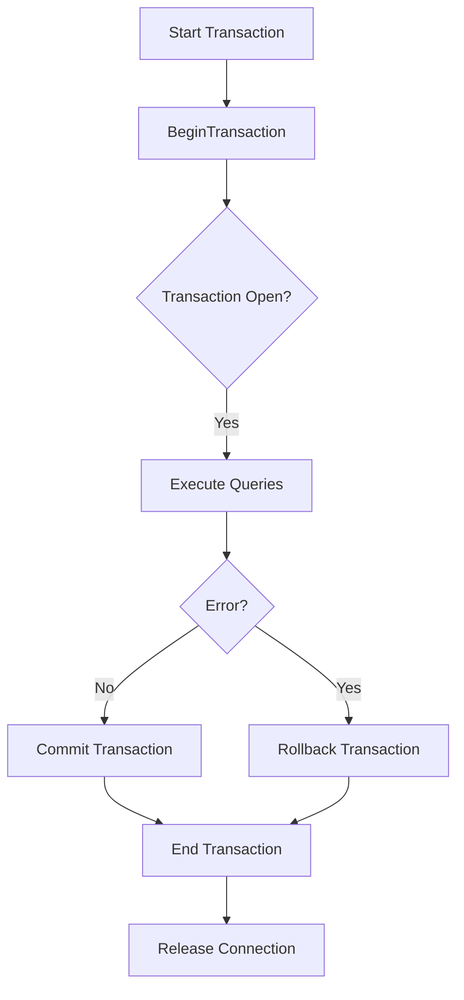

# Transaction Model in go-pg

Explore go-pg's transaction handling model to understand how transactions are initiated, managed, and finalized within PostgreSQL interactions. This guide focuses on ensuring consistency, controlling transaction lifecycles explicitly, and leveraging context for safe and reliable transaction execution.

---

## Introduction to Transactions in go-pg

gp-pg models transactions explicitly through its `Tx` type, representing an active database transaction. Transactions allow executing a sequence of database operations atomically, ensuring all operations succeed or none take effect — vital for maintaining data integrity.

The `Tx` type in go-pg supports concurrent use by multiple goroutines but mandates a clear lifecycle boundary: each transaction must be explicitly ended by either a commit or rollback.

### Key Points:

- A transaction begins with a call to `Begin` or `BeginContext` on a `DB` instance.
- Operations within the transaction (`Exec`, `Query`, `Prepare`, etc.) use the `Tx` object to ensure isolation.
- Once committed or rolled back, the transaction cannot be reused; further operations return an error.
- Transactions use a sticky connection pool internally to maintain a dedicated connection during their lifetime.

---

## Starting a Transaction

To start a transaction, use:

```go
// Basic start using DB
tx, err := db.Begin()

// Starting with context
ctx := context.Background()
tx, err := db.BeginContext(ctx)
```

This creates a `Tx` object wrapping the database session and allocates a dedicated connection from the pool for transaction control. The underlying connection is "sticky" during the transaction to maintain state.

#### Recommendation:

For safer transaction handling and to avoid forgetting to commit or rollback, use `RunInTransaction`. This method runs a function inside a transaction, automatically rolling back on errors, and committing otherwise.

```go
err := db.RunInTransaction(ctx, func(tx *pg.Tx) error {
    // transaction logic
    return nil // commit
})
```

This reduces boilerplate and improves error safety.

---

## Transaction Lifecycle

### Commit

Commit saves changes permanently into the database:

```go
err := tx.Commit()
```

Calling `Commit` finalizes the transaction and releases the reserved connection back to the pool.

### Rollback

Rollback aborts the transaction, discarding all changes:

```go
err := tx.Rollback()
```

Rollback is safe to call multiple times; subsequent calls after completion are no-ops.

### Close

Calling `Close` or `CloseContext` rolls back if the transaction was not ended explicitly. This protects against leaks when users forget to finalize transactions.

### Behavior After Closure

Operations on a committed or rolled back transaction return:

```go
var ErrTxDone = errors.New("pg: transaction has already been committed or rolled back")
```

Use this to detect and handle misuse programmatically.

---

## Executing Queries Inside a Transaction

The `Tx` type provides the same query execution methods as `DB`, ensuring all operations happen within the isolated transactional context using the sticky connection.

Operations include:

- `Exec` / `ExecContext`
- `ExecOne` / `ExecOneContext`
- `Query` / `QueryContext`
- `QueryOne` / `QueryOneContext`
- ORM-based querying via `Model` / `ModelContext`
- Bulk copy commands with `CopyFrom` and `CopyTo`

Example:
```go
_, err := tx.Exec("UPDATE accounts SET balance = balance - 100 WHERE id = ?", accountID)
```

After executing operations, remember to either commit or rollback.

---

## Prepared Statements Within Transactions

Prepared statements tied to a transaction are scoped to that transaction's connection, improving performance and isolation.

Use:

```go
stmt, err := tx.Prepare("SELECT * FROM users WHERE id = ?")
```

- Prepared statements created this way are automatically closed when committing or rolling back the transaction.
- To wrap an existing prepared statement for transaction use, use `Tx.Stmt(stmt)`.

### Benefits:

- Reduced overhead by reusing query plans within transactions
- Scoped to transaction lifecycle to avoid leakage or incorrect usage

---

## Context-Driven Transaction Management

All major transaction methods accept context parameters, enabling cancellation and deadlines propagation.

Example using `BeginContext` and `CommitContext`:

```go
ctx, cancel := context.WithTimeout(context.Background(), time.Second*10)
defer cancel()

tx, err := db.BeginContext(ctx)
// perform operations
err = tx.CommitContext(ctx)
```

Context ensures transactions do not hang indefinitely and resources are freed timely.

---

## Handling Errors and Automatic Rollback

`RunInTransaction` provides robust error handling:

- If the passed function returns an error, the transaction is automatically rolled back.
- If the function panics, the transaction is rolled back and the panic is re-raised.

Example:

```go
err := db.RunInTransaction(ctx, func(tx *pg.Tx) error {
    // Execute multiple statements
    if _, err := tx.Exec("INSERT INTO... "); err != nil {
        return err
    }
    return nil // commit
})
```

This pattern encourages safe and clear transactional code.

---

## Connection Pool and Sticky Connections in Transactions

Transactions require a consistent connection throughout their lifespan. go-pg achieves this via a **sticky connection pool** which:

- Allocates a dedicated database connection for the transaction
- Prevents connection switching during transaction
- Manages connection reusability post-transaction

This is transparent to users but critical for transactional consistency.

---

## Common Pitfalls and Best Practices

- Always commit or rollback your transactions explicitly:

  ```go
defer tx.Rollback() // safe rollback if not already committed
err := tx.Commit()
  ```

- Use `RunInTransaction` for simpler error-safe transaction management.
- Handle `ErrTxDone` when accessing a closed transaction.
- Avoid long-running transactions that may hold onto connections.
- Prepared statements inside transactions are scoped and auto-closed on commit/rollback.

---

## Example: Transaction Workflow

```go
func transferMoney(db *pg.DB, fromID, toID int64, amount float64) error {
    return db.RunInTransaction(context.Background(), func(tx *pg.Tx) error {
        var fromBalance, toBalance float64

        _, err := tx.QueryOne(pg.Scan(&fromBalance), "SELECT balance FROM accounts WHERE id = ? FOR UPDATE", fromID)
        if err != nil {
            return err
        }
        if fromBalance < amount {
            return errors.New("insufficient funds")
        }

        _, err = tx.Exec("UPDATE accounts SET balance = balance - ? WHERE id = ?", amount, fromID)
        if err != nil {
            return err
        }

        _, err = tx.Exec("UPDATE accounts SET balance = balance + ? WHERE id = ?", amount, toID)
        return err
    })
}
```

This ensures atomicity and database consistency during monetary transfers.

---

## Summary Diagram of Transaction Flow



---

## Troubleshooting Transaction Issues

<PageLinks>Refer to the [Connection Pooling and Lifecycle guide](/concepts/core-architecture/connection-pooling-and-lifecycle) for diagnostics on connection handling within transactions.</PageLinks>

Common issues and resolutions:

- **ErrTxDone** occurs if a transaction is reused after commit/rollback; track lifecycle carefully.
- Hanging transactions often indicate missing commit/rollback — use context timeouts.
- Connection errors inside transactions may trigger automatic rollbacks; retry in outer logic as needed.

---

## Related Documentation

- [Managing Transactions and Prepared Statements](https://pg.uptrace.dev/guides/real-world-integration-patterns/transaction-management)
- [Connection Pooling and Performance Tuning](https://pg.uptrace.dev/guides/real-world-integration-patterns/performance-pooling)
- [Quickstart and Common Workflows](https://pg.uptrace.dev/api-reference/common-operations-examples/quickstart-scenarios)
- [Error Handling & Status Codes](https://pg.uptrace.dev/api-reference/common-operations-examples/error-handling-status-codes)

---

This page provides the foundational understanding to efficiently handle transactional interactions using go-pg, balancing explicit control with convenience utilities to maintain data integrity and application robustness.
