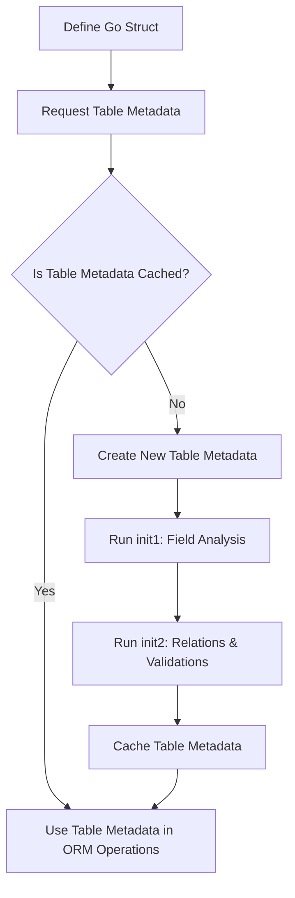

# Struct-to-Table Mapping

Go-pg simplifies mapping Go structs to PostgreSQL relational tables, allowing you to work with databases naturally using Go’s type system. This page explores how go-pg interprets your structs, infers table names, maps fields, handles primary keys, and manages table registration behind the scenes.

---

## Introduction: From Structs to Tables

When you define a Go struct, go-pg treats it as a model representing a table in PostgreSQL. The library automatically infers the table name based on your struct type and maps each struct field to a table column. This seamless model-to-table mapping lets you focus on your application logic rather than manual schema definitions.

Here's what you can expect to learn:

- How go-pg infers PostgreSQL table names from struct types
- How struct fields correspond to table columns and how to customize these mappings
- How primary keys are identified and handled
- The internal process of registering and caching table metadata

---

## Table Name Inference

By default, go-pg derives the SQL table name from the Go struct type by converting it to snake_case and pluralizing it. For example:

```go
// Go struct
type UserProfile struct {
    ID int
    Name string
}
```

The corresponding table name inferred would be `user_profiles`.

You can override the default table name with struct tags or by implementing specific interfaces (covered in detail in the model definition guides).

### Why Table Naming Matters

Choosing or overriding table names ensures compatibility with existing database schemas or naming conventions. go-pg’s convention is sensible out of the box, but customization offers full flexibility.

---

## Field Mapping and Tags

Each exported Go struct field becomes a column in the mapped table. The field name is transformed to snake_case to form the default column name.

You can customize how fields map to columns using struct tags like `pg:"column_name"` or by controlling options such as primary key status, ignoring fields, or specifying data types.

Example:

```go
type User struct {
    ID        int    `pg:"id,pk"`
    FirstName string `pg:"first_name"`
    password  string // unexported, ignored
    Age       int    `pg:"-"` // explicitly ignored
}
```

Key points:

- Only exported fields are mapped by default.
- The `pk` tag marks a field as part of the primary key.
- Fields tagged with `-` are excluded from mapping.

---

## Handling Primary Keys

Identifying primary keys is crucial for update, delete, and association operations.

- go-pg detects fields tagged with `pk` as primary keys.
- If no fields are tagged, it looks for `ID` or `Id` fields as defaults.
- Composite primary keys (multiple `pk` tags) are supported.

Best practice:

```go
type OrderItem struct {
    OrderID int `pg:"order_id,pk"`
    ItemID  int `pg:"item_id,pk"`
    Qty     int
}
```

This struct maps to a table with a composite primary key (`order_id`, `item_id`).

---

## Behind the Scenes: Table Registration and Caching

When go-pg interacts with your struct type for the first time, it "registers" the table metadata internally for efficient reuse.

### Key Processes:

- **Registration**: The `RegisterTable` function or implicit usage triggers go-pg to analyze the struct and build a *Table* representation.
- **Caching**: The *Table* metadata, including field info, tags, and relations, is cached in thread-safe maps to prevent redundant reflection.
- **Initialization Steps**: Two initialization passes (`init1` and `init2`) occur to fully resolve nested relations and field metadata.

This process ensures thread-safe, efficient operations even in concurrent environments.

---

## User Workflow Example: Registering a Table

Although explicit registration isn't usually required, registering intermediate tables in many-to-many relations or custom tables is done as follows:

```go
user := User{}
gopgorm.RegisterTable(user) // Registers the User struct as a table
```

Subsequent queries and operations automatically reuse this cached metadata.

---

## Best Practices and Tips

- **Define explicit primary keys** using the `pk` tag for clarity and to avoid surprises.
- **Keep struct fields exported** to ensure they can be mapped properly.
- **Use struct tags** to customize column names if the default snake_case doesn't fit your schema.
- **Call `RegisterTable` only when necessary,** e.g., for join or intermediate tables in many-to-many relationships.
- **Avoid unintentional nil pointer dereferencing** by ensuring struct pointers are properly initialized before use.

---

## Troubleshooting Common Issues

### Struct Not Treated as a Table

- Check that your value passed to go-pg is either a struct or a pointer to a struct.
- Ensure the struct is exported and fields are exported.
- Use `RegisterTable` if you want to manually register intermediate tables.

### Primary Key Not Detected

- Confirm the `pk` tag is present on primary key fields.
- If no `pk` tag, verify if your struct uses a field named `ID` or `Id`.

### Reflection or Race Condition Errors

Though go-pg uses locks and atomic operations internally, ensure your initialization code does not prematurely call uninitialized table metadata.

---

## Diagram: Struct-to-Table Metadata Lifecycle



This workflow highlights how go-pg dynamically builds and caches the metadata needed to map your structs efficiently.

---

## Additional Resources

- [Defining Models and Mapping to Tables Guide](/guides/getting-started/modeling-data-structs) — Practical instructions on model definition and customization.
- [Core Concepts & Terminology Overview](/overview/architecture-and-core-concepts/core-concepts-and-terminology) — Understand fundamental ORM concepts including models and relations.
- [Managing Transactions and Prepared Statements Guide](/guides/real-world-integration-patterns/transaction-management) — Learn how tables and models interact within transactions.

---

## Summary

Understanding how go-pg translates Go structs into PostgreSQL tables empowers you to design models that align well with your database schema and application needs. By mastering struct-to-table mapping, field tagging, and table registration, you create a solid foundation for all database interactions using go-pg.

Use this knowledge to define data models confidently, optimize query generation, and troubleshoot mapping issues efficiently.

---

*For further details and advanced customization, refer to the related guides and API references linked above.*
