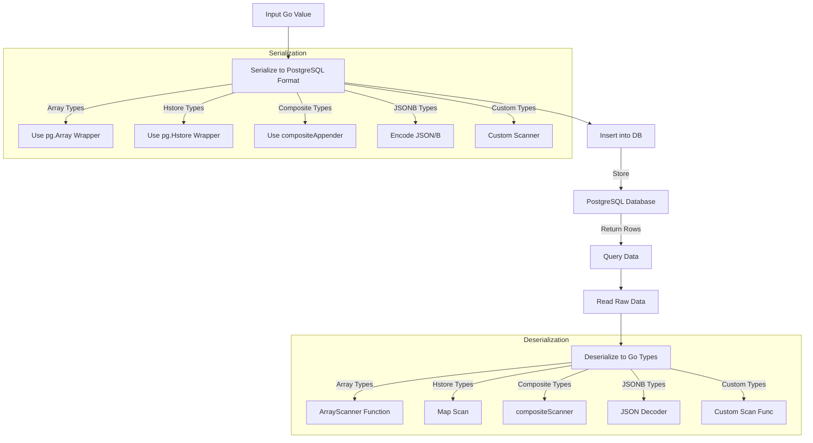

# Working with Advanced and Custom Types

Explore how go-pg supports advanced PostgreSQL data types such as arrays, JSONB, hstore, composite types, and custom types. This guide explains how these constructs are parsed, serialized, and extended within go-pg, enabling you to work effectively with complex data in your Go applications.

---

## Overview

PostgreSQL offers powerful data types beyond basic primitives, including multidimensional arrays, JSONB, hstore key-value stores, and composite (nested) types. These enable sophisticated data modeling that can simplify applications and improve performance. go-pg embraces this richness by providing built-in support for these types, seamless ORM integration, and extensibility points for custom behavior.

This page focuses specifically on the data type handling aspects of go-pg, showing how to:

- Map PostgreSQL arrays to Go slices and back
- Work with JSONB and hstore fields using Go native types and wrappers
- Define composite types as nested structs
- Extend the scanning and serialization process with custom interfaces

Understanding these constructs empowers you to maximize data expressiveness in your PostgreSQL-backed Go applications.

---

## Working with PostgreSQL Arrays

PostgreSQL arrays allow storing multiple discrete values within a single column. go-pg supports both single-dimensional and multidimensional arrays and maps them to native Go slices.

### Using the Array Wrapper

To work with arrays in queries and models, go-pg provides the `pg.Array` wrapper. This tells go-pg to treat a Go slice as a PostgreSQL array when serializing or scanning.

```go
emails := []string{"alice@example.com", "bob@example.com"}
_, err := db.Model().Set("emails = ?", pg.Array(emails)).Update()
```

For struct fields, you can use the `pg:",array"` struct tag to indicate array mapping:

```go
type User struct {
    Emails []string `pg:",array"`
}
```

### Scanning and Serialization

Internally, go-pg uses dynamic scanners to parse array elements. `types.ArrayScanner` detects the element type of the slice and converts accordingly (e.g., strings, ints, floats). For unsupported element types, custom scanners can be registered.

### Custom Array Scanners

If your array elements are complex types, implement the `ArrayValueScanner` interface:

```go
type ArrayValueScanner interface {
    BeforeScanArrayValue(rd types.Reader, n int) error
    ScanArrayValue(rd types.Reader, n int) error
    AfterScanArrayValue() error
}
```

This interface allows full control over scanning process, enabling support for composite arrays or nested custom types.

---

## JSONB Support

PostgreSQL's JSONB type stores JSON data efficiently and supports indexing. go-pg maps JSONB columns to Go types such as `json.RawMessage`, `map[string]interface{}`, or native structs.

### Using Native Go Types

You can use `json.RawMessage` or Go structs directly in your models:

```go
type Event struct {
    Data json.RawMessage `pg:"data, type:jsonb"`
}
```

go-pg handles parsing and serialization automatically via the `encoding/json` package.

### Using pgjson Package

For more advanced JSON decoding/encoding that better integrates with go-pg internals and performance optimizations, use the `pgjson` package:

```go
import "github.com/go-pg/pg/v10/pgjson"

var jsonData pgjson.RawMessage
```

The `pgjson.Decoder` is used internally for decoding JSONB data streams from the database.

---

## Hstore Support

Hstore is PostgreSQL's key-value store datatype. go-pg supports `map[string]string` with the `pg.Hstore` wrapper.

### Creating and Using Hstore Fields

```go
type Settings struct {
    Options map[string]string `pg:",hstore"`
}

// Usage
settings := Settings{
    Options: map[string]string{"theme": "dark", "lang": "en"},
}
```

Functionally, `pg.Hstore` returns a wrapper around the native Go map enabling correct serialization and scanning.

---

## Composite Types

Composite types allow you to model nested structures as PostgreSQL types composed of multiple fields. go-pg maps these to nested Go structs.

### Defining Composite Structs

Define a Go struct matching the PostgreSQL composite type field order and names.

```go
type Address struct {
    Street string
    City   string
    Zip    string
}

type User struct {
    Name    string
    Address Address `pg:",type:address"`
}
```

The `pg:",type:address"` tag links the Go field to the PostgreSQL composite type `address`.

### Scanning Composite Types

When go-pg reads composite columns, it invokes `compositeScanner`, which:

- Parses the composite field elements
- Matches each element to corresponding struct fields
- Recursively scans elements if they are composite themselves

This process respects null values and incomplete data gracefully.

### Serializing Composite Types

go-pg uses `compositeAppender` to serialize nested structs into PostgreSQL ROW(...) syntax automatically, handling field delimiters and escaping.

---

## Custom Types and Extensions

go-pg's extensible design enables you to implement custom parsing or serialization for specific PostgreSQL or Go types.

### Scanner Interfaces

- `ValueScanner` handles scanning of database column values into Go types.
- `ArrayValueScanner` allows granular control over scanning array elements.

Implement these interfaces on your types to integrate custom behavior seamlessly.

### Registering Custom Scanners

Use `types.RegisterScanner` in your application initialization to register a scanner function for your custom types.

```go
func init() {
    types.RegisterScanner(MyCustomType{}, myCustomScannerFunc)
}
```

Scanner functions must respect the `ScannerFunc` signature, handling element reading and conversion.

### Wrappers for Common Types

go-pg provides wrappers for convenience. For example:

- `pg.Array(v interface{})` wraps slices as PostgreSQL arrays.
- `pg.Hstore(v interface{})` wraps maps for hstore support.

Utilize these wrappers in your queries and model field declarations to ensure correct serialization behavior.

---

## Practical Tips and Best Practices

- **Use struct tags smartly:** Add `pg:",array"` for arrays, and `pg:",hstore"` for hstore maps.
- **Compose nested structs:** Use composite types to mirror PostgreSQL composites for clean, maintainable code.
- **Validate nullability:** Leverage pointers or `sql.Null*` types when fields can be NULL.
- **Avoid overly complex custom scanners:** Extend only if truly needed to maintain code clarity.
- **Test edge cases:** Verify scanning and serialization with empty arrays, null values, and nested structures.

---

## Common Pitfalls and Troubleshooting

- **Mismatch in composite field order or names:** Ensure Go struct fields match PostgreSQL composite definitions precisely.
- **Unregistered custom scanners:** If you see "unsupported type" errors, confirm your scanner is registered correctly.
- **Nil slice vs zero-length slice:** PostgreSQL treats these differently; manage initialization in Go carefully.
- **Incorrect tags on struct fields:** Missing `pg:"array"` causes data to serialize as JSON, not arrays.

Use logging during development to trace scanning and serialization errors.

---

## Summary Diagram of Type Handling Flow



---

## References and Next Steps

- For implementing composite types in real applications, see the [Composite Types guide](/guides/working-with-data/composite-types).
- To deepen array, JSONB, and hstore usage, refer to the [Arrays, JSONB, and Hstore guide](/guides/working-with-data/arrays-jsonb-hstore).
- Learn about custom model mapping and field definitions in [Defining and Using Models](/api-reference/orm-model-workflows/defining-and-using-models).
- For advanced query patterns using these types, see [Advanced Queries and Relations](/guides/working-with-data/advanced-queries-relations).

Harnessing these advanced and custom types unlocks the full power of PostgreSQL within go-pg, enabling richer, more efficient, and more expressive database applications.
