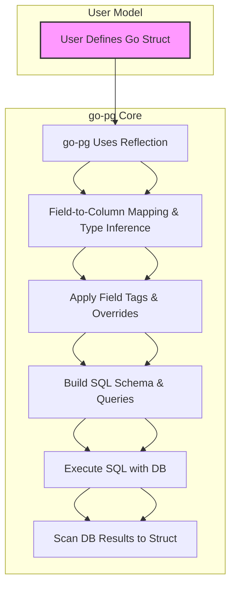

# Mapping Go Types to PostgreSQL with go-pg

Mapping your Go structs and data types accurately to PostgreSQL columns is the foundation of leveraging go-pg's ORM to its fullest. This guide unpacks the essential rules, conventions, and configurations governing how go-pg translates Go primitive types, structs, slices, and maps into PostgreSQL database schemas and query behavior.

---

## Overview

When you define Go structs as models in go-pg, the library automatically inspects and maps fields to PostgreSQL columns. Understanding this mapping empowers you to design models that behave predictably, optimize query performance, and avoid common pitfalls related to nullability, default values, and advanced data structures.

This page focuses specifically on how go-pg interprets Go data types, how it infers PostgreSQL column types, and the impact of struct tags and annotations on ORM schema generation and runtime behavior.


## How go-pg Maps Go Types to PostgreSQL Columns

### Basic Primitive Type Mapping

go-pg provides built-in mappings from core Go types to PostgreSQL column types based on common correspondence conventions:

| Go Type              | PostgreSQL Column Type            |
|----------------------|----------------------------------|
| `int`, `int32`       | `integer`                        |
| `int64`              | `bigint`                        |
| `float32`            | `real`                          |
| `float64`            | `double precision`              |
| `bool`               | `boolean`                       |
| `string`             | `text` (default) or `varchar` if limited |
| `time.Time`          | `timestamp` or `timestamptz` if tagged |
| `[]byte`             | `bytea`                        |

These mappings come from internal constants representing PostgreSQL types (see [pgType constants](#pgtype-constants)). When go-pg encounters one of these Go types as a struct field, it infers the most suitable PostgreSQL type.

### Composite Types and Nested Structs

If a struct field itself is another struct, go-pg treats it as a composite type or uses embedded structs to flatten the schema based on tag annotations and visibility rules. Embedded structs (anonymous fields) behave as if their fields belong to the parent struct unless explicitly ignored.

Nested structs become joined models when part of relations (see Advanced Guides for relation mapping). In certain cases, they map to user-defined PostgreSQL composite types if integrated properly.

### Slices and Arrays

Slices (`[]Type`) are typically mapped to PostgreSQL array types if the inner type supports it. For example, `[]int` maps to `integer[]`. go-pg uses the `pg:",array"` struct tag to indicate arrays explicitly and provides wrappers to handle arrays, JSONB, or hstore fields.

Slices of structs or pointers to structs represent one-to-many relationships and are handled through joins rather than simple column mapping.

### Maps

Maps, particularly `map[string]interface{}`, have specialized treatment. They can be mapped to PostgreSQL JSONB or hstore types, offering schema-less, flexible data storage. go-pg provides built-in support and wrappers to serialize these maps during inserts and to deserialize on selects.


## Nullability and Zero Values

By default, go-pg treats Go zero values as valid data for insertion and query filtering. However, Go's primitives like `int`, `bool`, and `string` cannot represent SQL NULL intrinsically.

For nullable columns, you should:
- Use pointer types (`*int`, `*string`) to allow NULL values in the database.
- Use `sql.Null*` types for robust scanning and marshaling.

This setup ensures that 
- A `nil` pointer maps to SQL NULL.
- Non-nil pointers take corresponding values.

Incorrect handling can cause unintended query results or database errors.


## Controlling Mapping with Field Tags

### Overview of `pg` Struct Tags

Struct tags provide fine control over mapping behaviors via the `pg` key. The tag syntax is comma-separated options, for example:

```go
FieldName string `pg:"column_name,pk,array,soft_delete"`
```

- **column_name**: Overrides the default snake_case PostgreSQL column name.
- **pk**: Marks this field as part of the primary key, replacing auto-detection.
- **array**: Declares the field as a PostgreSQL array.
- **soft_delete**: Marks the field used for soft delete semantics.
- **ignore (`-`)**: Excludes the field from mapping.

### Primary Key Annotation

Instead of relying on naming conventions (fields named `ID`, `UUID`), specify the primary key(s) explicitly using `pg:",pk"`. This is crucial for composite keys or fields with unconventional names.

Example:

```go
type User struct {
  UserID int `pg:",pk"`
  Name   string
}
```

This overrides default behavior and ensures ORM queries respect your key.

### Embedding and Ignoring Fields

- Embedded structs are included by default, their fields merged.
- Use `pg:"-"` to ignore fields or anonymous structs.

Example:

```go
type Base struct {
 ID int
}

type Child struct {
 Base
 Secret string `pg:"-"`
}
```

`Secret` is ignored from ORM mapping.

### Table Name Customization

A unique tag on an anonymous field named `tableName` controls the SQL table name used:

```go
var model struct {
  tableName struct{} `pg:"custom_table"`

  ID int
}
```

This sets the table name explicitly.


## Internal Mapping Mechanics and Usage Flow

When you invoke ORM operations such as Insert, Update, or Select, go-pg internally:

1. **Inspects Model Type**: Uses reflection to analyze the struct, its fields, tags, and embedded relations.
2. **Derives Table Schema**: Maps fields to columns, identifying primary keys, relations, and data types.
3. **Builds Query**: Constructs SQL statements using the resolved columns and types.
4. **Scans Results**: On select, scans returned columns back into struct fields respecting pointers and nullables.

This process is transparent but customizable through model hooks and struct tags.


## Practical Examples

### Defining a Model with Explicit Types and Tagging

```go
type Product struct {
  ID        int       `pg:",pk"`
  Name      string    // maps to text column
  Price     float64   // maps to double precision
  Tags      []string  `pg:",array"`           // maps to varchar[] array
  CreatedAt time.Time `pg:"timestamptz"`      // maps to timestamptz
  DeletedAt *time.Time `pg:",soft_delete"`    // nullable soft delete
}
```

### Handling Nulls with Pointers

```go
type User struct {
  ID   int
  Age  *int    // nil means NULL in DB
  Note *string // nil means NULL in DB
}
```

Insert with `nil` pointers inserts SQL NULL.

### Ignoring a Field From DB

```go
type Session struct {
  ID         string
  Token      string `pg:"-"`  // ignored by ORM
  ExpiryTime time.Time
}
```

`Token` is available in Go code but not persisted.


## Troubleshooting Common Mapping Issues

**Issue:** Fields not mapped or ignored unexpectedly.

- _Cause:_ Missing visibility (`exported` fields only) or `pg:"-"` tag.
- _Solution:_ Ensure fields are exported and tags are set correctly.

**Issue:** Primary key detection incorrect.

- _Cause:_ Missing `pg:",pk"` tag when using composite keys or unusual names.
- _Solution:_ Explicitly annotate primary keys.

**Issue:** Null pointer when scanning into non-pointer fields.

- _Cause:_ DB column NULL but struct field type cannot represent null.
- _Solution:_ Use pointers or `sql.Null*` types for nullable columns.

**Issue:** Unexpected column names in queries.

- _Cause:_ Incorrect or missing column name overrides in tags.
- _Solution:_ Use `pg:"custom_column_name"` to specify exact DB column.


## Core PostgreSQL Type Constants Used Internally

These constants represent PostgreSQL column types assumed during schema inference:

- `timestamp` (no timezone)
- `timestamptz` (with timezone)
- `date`
- `time` (no timezone)
- `boolean`
- `real`, `double precision`
- `smallint`, `integer`, `bigint`
- `smallserial`, `serial`, `bigserial`
- `varchar`, `char`, `text`
- `json`, `jsonb`
- `bytea`

Mapping respects these to maximize compatibility and performance.


## Best Practices

- Always explicitly tag primary key fields if deviating from convention.
- Use pointer types or nullable wrappers to represent SQL NULLs.
- Override table names for anonymous structs or when default naming is unsuitable.
- Utilize struct tags to declare array types or specify JSONB fields clearly.
- Test model reflection early by calling `orm.GetTable()` and inspecting mappings.
- Be mindful of embedded structs and ignored fields to avoid confusion.


---

## Related Documentation

- [Defining Models and Basic CRUD](/guides/getting-started/define-models-crud): Learn how to define structs as models and perform CRUD operations.
- [Advanced Queries and Model Relationships](/guides/working-with-data/advanced-queries-relations): Explore how complex relations influence mapping.
- [Arrays, JSONB, and Hstore Support](https://pg.uptrace.dev/guides/working-with-data/arrays-jsonb-hstore): Detailed guide on advanced types mapping.
- [Working with Composite Types](https://pg.uptrace.dev/guides/working-with-data/composite-types): Handling nested structs and Postgres composite types.


---

## Summary Diagram of Mapping Workflow



This flow shows how model definitions move through go-pg’s internals toward actual database interaction.

---

By mastering how go-pg maps Go types to PostgreSQL columns and controlling this mapping with tags and nullability, you unlock the full power of go-pg's ORM, gaining precision and efficiency in your database interactions.