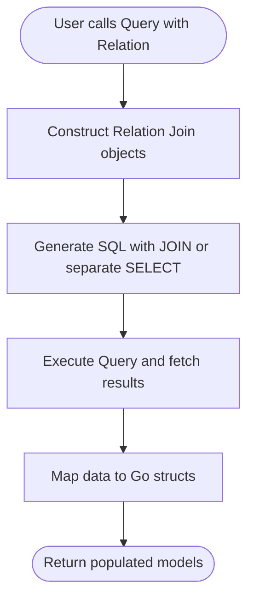

# Defining Relationships (ORM Concepts)

Understanding and managing relationships between data models is a cornerstone of effective database interaction with go-pg's ORM. This guide explores how to model one-to-one, one-to-many, and many-to-many associations between Go structs and PostgreSQL tables, focusing on foreign keys, join tables, relation tags, query behaviors, and preloading related data.

---

## Overview of ORM Relationships

In relational databases, data is stored across multiple tables linked with keys. go-pg's ORM allows you to express these links directly in your Go struct models, facilitating intuitive, type-safe access to related records.

There are three primary relationship types supported:

- **One-to-One (Has One, Belongs To)**: A record in one table is associated with exactly one record in another.
- **One-to-Many (Has Many)**: A record in one table references multiple records in another.
- **Many-to-Many (Many2Many)**: Records in two tables relate through a join table that maps their associations.

The ORM automatically handles foreign keys, join conditions, and generates efficient SQL queries to load and save related data.

---

## Relationship Types and Concepts

### One-to-One Relationships

**One-to-One** relationships are modeled primarily with `has-one` and `belongs-to` tags.

- **`has-one`**: Implies the parent struct owns exactly one related struct. The foreign key resides in the related struct pointing back to the parent.
- **`belongs-to`**: Typically means the current struct holds the foreign key referencing another struct.

#### Example:

```go
// User has one Profile
type User struct {
    ID      int
    Profile *Profile `pg:"rel:has-one"`
}

// Profile belongs to User
type Profile struct {
    ID     int
    UserID int
}
```

This setup allows selecting a user along with their profile with a single joined query.

---

### One-to-Many Relationships

**One-to-Many** relationships represent a parent record linked to multiple child records.

- Declared using `has-many` relation tags.
- The child records contain foreign keys pointing to the parent.

#### Example:

```go
// Author has many Books
type Author struct {
    ID    int
    Books []Book `pg:"rel:has-many"`
}

// Book belongs to Author
type Book struct {
    ID       int
    AuthorID int
}
```

Loading an author and all their books is commonly done with the `Relation("Books")` method.

---

### Many-to-Many Relationships

**Many-to-Many** relations involve two tables related through a join table that stores pairs of foreign keys.

- Declared using the `many2many` tag indicating the join table name.
- The join table typically holds the IDs mapping two entities.

#### Example:

```go
// Order has many Items through order_to_items join table
type Order struct {
    ID    int
    Items []Item `pg:"many2many:order_to_items"`
}

// Item represents a purchasable item
type Item struct {
    ID int
}

// Join table
type OrderToItem struct {
    OrderID int
    ItemID  int
}
```

The ORM generates SQL that loads the related records with appropriate JOINs and WHERE conditions to efficiently fetch many-to-many associations.

---

## Defining Relationship Tags

Relationship tags are struct field tags in Go that inform the ORM how to interpret and join related models.

| Tag Attribute               | Description                                               |
|----------------------------|-----------------------------------------------------------|
| `rel`                      | Defines relation type: `has-one`, `belongs-to`, `has-many`, or `many2many` |
| `many2many`                | Specifies the join table name for many-to-many relations   |
| `join_fk`                  | Customizes foreign key field names in join tables (for self-joins) |

### Example with tags:

```go
type Project struct {
    ID        string
    Documents []Document `pg:",many2many:project_documents"`
}

// Join table for many-to-many
type ProjectDocument struct {
    ProjectID  string
    DocumentID string
}
```

---

## How go-pg ORM Handles Relations in Queries

go-pg manages relations by building JOIN queries or subsequent SELECT statements to load related data efficiently.

### Joining Related Data

- **Single join for `has-one` / `belongs-to`**: Uses LEFT JOIN with foreign keys to fetch related record in one query.
- **Separate queries for `has-many` / `many2many`**: Loads parent records first, then issues additional SELECT queries to fetch related slices.

This avoids Cartesian explosion when loading large collections.

### Callback Support to Customize Queries

For relations, you can specify callbacks to customize the query on the related model.

```go
err := db.Model(&orders).
    Relation("Items", func(q *pg.Query) (*pg.Query, error) {
        return q.OrderExpr("item.id DESC"), nil
    }).
    Select()
```

This allows adding filters, orderings, or scopes on the related records.

---

## Preloading Related Data

Preloading is the process of eagerly fetching related data alongside the main query.

- Use the `Relation()` method on a Query to specify related models to load.
- Supports nested relations for deeply nested data fetching.

### Example:

```go
story := new(Story)
err := db.Model(story).
    Relation("Author").
    Where("story.id = ?", 1).
    Select()
```

This fetches a story along with its associated author in a single, efficient query.

---

## Advanced Usage and Custom Join Queries

- You can define custom join behavior by providing a function that modifies the related query during `.Relation()` calls.
- Internally, go-pg creates `join` objects holding models and relation metadata to precisely construct SQL conditions and select columns.

This flexibility enables fine-tuning performance and query structure.

---

## Common Pitfalls and Best Practices

- **Explicitly define foreign keys when conventions do not match:** Use struct tags or join key specifications.
- **Use relation callbacks to limit loaded data:** Apply filters and ordering to keep related queries efficient.
- **Avoid deep nested joins if large result sets:** Prefer separate queries or pagination for `has-many` relations.
- **Register many-to-many join tables with `RegisterTable`** if using custom join structs to improve ORM recognition.

---

## Real-World Scenario: Loading Many-to-Many Relations

Consider an e-commerce Order and Item relationship through an OrderToItem join table.

1. Load the order:

```go
order := new(Order)
err := db.Model(order).WherePK().First()
```

2. Load related items using the many-to-many relation:

```go
err = db.Model(order).Relation("Items").Select()
```

The ORM will:
- Query the order table first
- Then query the items table joined with order_to_items with matching foreign keys

This separates concerns, avoids large JOINs, and maintains clear association logic.

---

## Diagram: Relation Query Workflow



This flow ensures that user queries seamlessly translate into efficient multi-table SQL queries and structured result mapping.

---

## Summary

Defining relationships with go-pg's ORM enables you to model your database schema directly in Go structs and query related data transparently. By understanding the types of relationships, using tags correctly, and leveraging the provided query customization hooks, you gain powerful control over how associated data is loaded and manipulated. Whether loading a single related record or batching many-to-many associations, go-pg ORM facilitates a clean, expressive API backed by performant SQL execution.

---

## Related Documentation

- [Defining and Using Models](/api-reference/orm-model-workflows/defining-and-using-models) - foundational guide to struct mapping
- [Advanced Queries and Model Relationships](/guides/working-with-data/advanced-queries-relations) - practical query usage with relations
- [Schema Migrations and Table Creation](/api-reference/orm-model-workflows/schema-migrations-and-table-creation) - setup of tables and schema
- [Using Arrays, JSONB, and Hstore](/guides/working-with-data/arrays-jsonb-hstore) - handling complex column types

For many-to-many relationship examples, see the test cases and example code in `example_many2many_test.go` and `example_many2many_self_test.go` included in the project repository.

---

<Callout type="tip">
When implementing relations, start by defining clear struct tags and verifying your foreign key conventions. Use Relation callbacks to filter and order related data, maintaining efficient queries even with complex object graphs.
</Callout>

<Callout type="warning">
Self-referential many-to-many relationships require explicit foreign key configuration (e.g., `join_fk`) to avoid ambiguous join conditions.
</Callout>

---

## Example Code Snippet: Many-to-Many Relationship

```go
// Register join table to let ORM optimize many-to-many recognition
orm.RegisterTable((*OrderToItem)(nil))

type Order struct {
    Id    int
    Items []Item `pg:"many2many:order_to_items"`
}

type Item struct {
    Id int
}

type OrderToItem struct {
    OrderId int
    ItemId  int
}

// Selecting order and preloading items
order := new(Order)
err := db.Model(order).Relation("Items").First()
if err != nil {
    panic(err)
}

fmt.Println("Order", order.Id, "Items", order.Items)
```

Using this pattern, your Go code can elegantly manage and query many-to-many relationships with minimal manual SQL.
