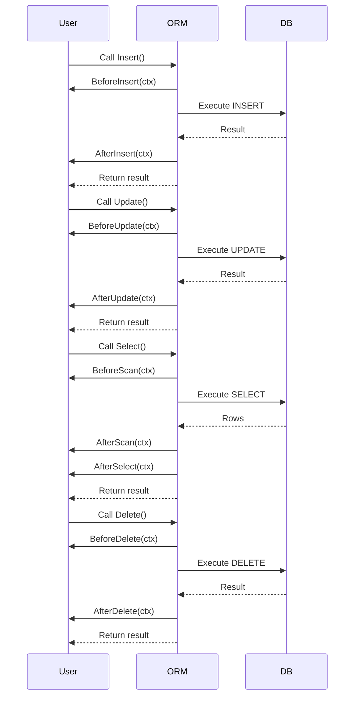

# Hooks and Custom Logic

Enhance your go-pg ORM workflows by integrating lifecycle hooks and model callbacks. These hooks allow you to embed custom business logic, perform validations, trigger side effects, and augment data processing seamlessly during different phases of ORM operations. This guide explains how to leverage hooks to tailor your application behavior precisely at key moments such as before or after insertions, updates, selections, and deletions.

---

## Understanding Hooks and Their Role

Hooks are user-implemented methods that the ORM invokes automatically during certain database operation phases. They help you inject additional logic without cluttering query code. For example, you might want to:

- Validate data or mutate fields before an insert.
- Automatically update timestamps.
- Log audit information after an update.
- Perform cleanup actions after deleting a record.

Hooks transform the ORM from a simple mapper to a powerful state-aware system that respects your application's domain rules.

## When Hooks Are Called

Hooks map closely to CRUD and selection operations on your Go structs used as models:

| Hook Name         | When It Runs                                      | Purpose                       |
|-------------------|--------------------------------------------------|-------------------------------|
| BeforeInsert      | Just before inserting a model into the database  | Validate, mutate data pre-save |
| AfterInsert       | Immediately after insertion completes             | Logging, cache invalidation   |
| BeforeUpdate      | Right before updating the model                   | Validation, version checks    |
| AfterUpdate       | After the update operation finishes               | Post-update side effects      |
| BeforeDelete      | Before removing a record                           | Confirm dependencies, validations |
| AfterDelete       | After deletion                                    | Cleanup, cascade triggers      |
| BeforeScan        | Before scanning data into a struct                | Custom unmarshalling or prep   |
| AfterScan         | After scanning a database row                      | Data wrapping or transformation |
| AfterSelect       | After selecting (retrieving) data                  | Calculated field initialization |


## How to Implement Hooks

Hooks are defined by implementing named interfaces on your Go struct. Each interface corresponds to a hook event and has a defined method signature.

### Example: Implementing Insert Hooks

```go
import "context"

// User struct models a user entity
type User struct {
    Id        int
    Name      string
    CreatedAt time.Time
}

// BeforeInsertHook validates or modifies model before insertion
func (u *User) BeforeInsert(ctx context.Context) (context.Context, error) {
    if u.Name == "" {
        return ctx, fmt.Errorf("name cannot be empty")
    }
    u.CreatedAt = time.Now()
    return ctx, nil
}

// AfterInsertHook runs side effects after inserting a user
func (u *User) AfterInsert(ctx context.Context) error {
    fmt.Printf("User %d inserted successfully\n", u.Id)
    return nil
}
```

Hooks can return errors (except After* hooks), which will cancel the operation and propagate the error.

## Working with Multiple Hooked Models

When working with slices or batches of models (e.g., bulk insert), hooks are called for each element in turn, allowing you to enforce logic individually.

## Query-Level Hooks: Intercepting All Queries

Beyond model-level hooks, go-pg supports query hooks that inspect or modify any database operation globally.

- Use `QueryHook` interface to intercept all queries with `BeforeQuery` and `AfterQuery` methods.
- Common uses include logging queries, metrics instrumentation, and tracing.

### Adding a Query Hook

```go
import "github.com/go-pg/pg/v10"

db := pg.Connect(&pg.Options{...})

db.AddQueryHook(myHook{})

// Implement QueryHook interface
type myHook struct{ }

func (h myHook) BeforeQuery(ctx context.Context, evt *pg.QueryEvent) (context.Context, error) {
    fmt.Println("Starting query:", evt.Query)
    return ctx, nil
}

func (h myHook) AfterQuery(ctx context.Context, evt *pg.QueryEvent) error {
    fmt.Println("Finished query, error:", evt.Err)
    return nil
}
```

Query hooks receive rich query metadata, including unformatted and formatted SQL, parameters, and results when available. They are invaluable for observability and cross-cutting logic.

---

## Detailed Hook Interfaces and Signatures

| Interface         | Method Signature                           | Notes                         |
|-------------------|--------------------------------------------|-------------------------------|
| `BeforeInsertHook`| `BeforeInsert(context.Context) (context.Context, error)` | Return context and error; abort insert on error|
| `AfterInsertHook` | `AfterInsert(context.Context) error`                 | Runs post-insert; errors logged but don’t abort|
| `BeforeUpdateHook`| `BeforeUpdate(context.Context) (context.Context, error)` | Similar to BeforeInsert for updates            |
| `AfterUpdateHook` | `AfterUpdate(context.Context) error`                 | Post-update                           |
| `BeforeDeleteHook`| `BeforeDelete(context.Context) (context.Context, error)` | Before delete operation                   |
| `AfterDeleteHook` | `AfterDelete(context.Context) error`                 | After delete                            |
| `BeforeScanHook`  | `BeforeScan(context.Context) error`                  | Before scanning data into struct             |
| `AfterScanHook`   | `AfterScan(context.Context) error`                   | After scanning row from DB                      |
| `AfterSelectHook` | `AfterSelect(context.Context) error`                 | After .Select finishes                        |

### Notes
- Hooks use `context.Context` to support deadline, cancellation, and metadata propagation.
- `Before*` hooks can mutate the context and cancel the operation by returning a non-nil error.
- `After*` hooks are meant for side effects and should not disrupt normal operation flow.

## Practical Use Cases

### Data Validation
Run integrity checks on fields before database changes.

### Audit Trail
Log changes with timestamps and user info in AfterInsert/AfterUpdate hooks.

### Soft Deletes
Override BeforeDelete to implement soft delete behaviors by toggling flags instead of removing rows.

### Automatic Timestamps
Set `CreatedAt` and `UpdatedAt` automatically within BeforeInsert and BeforeUpdate.

### Caching
Refresh or invalidate caches after mutation operations.

### Complex Model Initialization
Compute or set derived fields after data is loaded (AfterSelect).

---

## Common Scenarios with Hooks

### Example: Auto-updating Timestamps

```go
func (u *User) BeforeUpdate(ctx context.Context) (context.Context, error) {
    u.UpdatedAt = time.Now()
    return ctx, nil
}
```

### Example: Validating Foreign Keys Before Insert

```go
func (a *Article) BeforeInsert(ctx context.Context) (context.Context, error) {
    if a.AuthorID == 0 {
        return ctx, fmt.Errorf("author id is required")
    }
    return ctx, nil
}
```

### Example: Conditional Hook Bypass

You can conditionally skip certain actions by returning early from hooks.

```go
func (e *Entity) BeforeDelete(ctx context.Context) (context.Context, error) {
    if !e.CanBeDeleted {
        return ctx, fmt.Errorf("entity cannot be deleted")
    }
    return ctx, nil
}
```

---

## How Hooks Fit in ORM Operation Flows

The hooks are invoked automatically by go-pg in a predictable order:



This lifecycle ensures hooks are integrated transparently, empowering you to influence behavior precisely.

---

## Tips and Best Practices

- **Always handle errors in Before* hooks** to prevent invalid data from entering the database.
- **Keep After* hooks side-effect safe** to avoid causing operation failures.
- **Avoid heavy or blocking operations inside hooks**; consider asynchronous patterns for non-critical work.
- **Test hooks thoroughly** as bugs here can cause subtle data corruption.
- **Use hooks to centralize business logic** that must run regardless of where ORM calls originate.

---

## Troubleshooting Common Hook Issues

<Warning>
Hooks that return errors will cancel database operations. Ensure error handling logic does not inadvertently block valid operations.
</Warning>

<Note>
Hooks are not called if the model is nil or empty during certain batch operations. Ensure your models are properly initialized.
</Note>

<Tip>
Enable debugging query hooks (see Observability) to see detailed logs of queries and hook activity.
</Tip>

---

## Additional Extensibility with Query Hooks

Besides model lifecycle hooks, go-pg allows adding custom logic on all queries:

- Implement the `pg.QueryHook` interface, with `BeforeQuery` and `AfterQuery` methods.
- Query hooks receive full query context, parameters, and can modify or log queries.
- Useful for:
  - Custom logging solutions.
  - Integrating distributed tracing (see `extra/pgotel` example).
  - Query performance monitoring.

Example:

```go
import "github.com/go-pg/pg/v10"

db.AddQueryHook(myQueryHook{})

type myQueryHook struct{}

func (h myQueryHook) BeforeQuery(ctx context.Context, evt *pg.QueryEvent) (context.Context, error) {
    fmt.Println("Query start:", string(evt.Query.(string)))
    return ctx, nil
}

func (h myQueryHook) AfterQuery(ctx context.Context, evt *pg.QueryEvent) error {
    fmt.Println("Query finished with error:", evt.Err)
    return nil
}
```

Query hooks complement model hooks by covering raw SQL operations and COPY commands.

---

## Summary

Integrating hooks and custom logic is essential for building robust, maintainable data layers with go-pg. They let you enforce invariants, enrich data flows, and insert necessary side effects effortlessly into ORM workflows. By mastering hooks, you turn your models into active participants in the application lifecycle.

---

## See Also

- [Modeling Data Structs](https://pg.uptrace.dev/guides/getting-started/modeling-data-structs) — Learn how to define models and their fields.
- [Transaction Management](https://pg.uptrace.dev/guides/real-world-integration-patterns/transaction-management) — Combine hooks with transactions for atomic workflows.
- [Observability and Debugging](https://pg.uptrace.dev/guides/real-world-integration-patterns/observability-debugging) — Use query hooks for logging and tracing.
- [Notifications and Copy Integration](https://pg.uptrace.dev/guides/real-world-integration-patterns/notifications-copy) — Extend your application with real-time events and bulk operations.

---

## Full Example

```go
package main

import (
    "context"
    "fmt"
    "time"

    "github.com/go-pg/pg/v10"
)

type Product struct {
    Id        int
    Name      string
    Price     float64
    CreatedAt time.Time
    UpdatedAt time.Time
}

func (p *Product) BeforeInsert(ctx context.Context) (context.Context, error) {
    if p.Price < 0 {
        return ctx, fmt.Errorf("price cannot be negative")
    }
    p.CreatedAt = time.Now()
    p.UpdatedAt = p.CreatedAt
    return ctx, nil
}

func (p *Product) BeforeUpdate(ctx context.Context) (context.Context, error) {
    p.UpdatedAt = time.Now()
    return ctx, nil
}

func (p *Product) AfterInsert(ctx context.Context) error {
    fmt.Printf("Inserted product with ID %d\n", p.Id)
    return nil
}

func main() {
    db := pg.Connect(&pg.Options{
        User: "postgres",
        Addr: ":5432",
        Database: "testdb",
    })
    defer db.Close()

    product := &Product{Name: "Book", Price: 20.5}
    _, err := db.Model(product).Insert()
    if err != nil {
        panic(err)
    }

    product.Price = 19.99
    _, err = db.Model(product).WherePK().Update()
    if err != nil {
        panic(err)
    }
}
```

In this example, hooks enforce business rules automatically, set timestamps, and provide useful feedback during persistence events.
