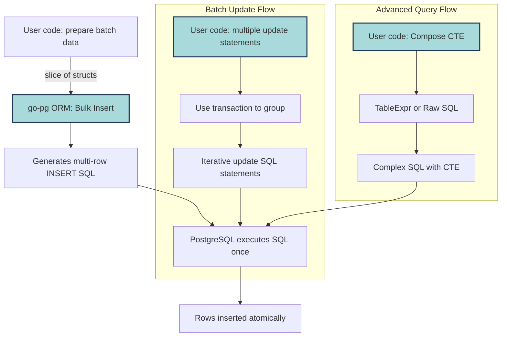

# Query Optimization & Batching

Explore how go-pg crafts efficient SQL queries, manages batch operations, and supports advanced query constructs. This guide equips you with a deep understanding of optimizing database interactions through bulk inserts, updates, deletes, and leveraging features like Common Table Expressions (CTEs). Learn patterns that maximize performance while balancing ORM usability.

---

## Understanding Query Optimization in go-pg

When working with go-pg, your goal is efficient and maintainable interactions with PostgreSQL. The ORM generates SQL queries behind the scenes, but understanding how these queries are produced—and how to influence their shape—empowers you to write performant code and optimize database workload.

### How go-pg Generates SQL

- **Models to Tables**: Structs are mapped to tables and columns with customizable tags.
- **Queries Constructed via ORM Methods**: go-pg builds SQL through seamless ORM methods like `Model()`, `Where()`, `Select()`, and `Insert()`, translating your model operations into SQL statements.
- **Batch Operations**: go-pg supports batch inserts and updates by combining multiple rows or statements into a single SQL command, reducing round-trips.

### Why This Matters

Batching and optimized queries reduce:
- Network overhead between your Go application and PostgreSQL.
- CPU and I/O load on the database by minimizing query parsing and execution steps.

This can be the difference in responsiveness and scalability for your application.

---

## Bulk Inserts with go-pg

Bulk operation support is fundamental for efficiently writing large volumes of data.

### Using `Insert` with Multiple Models

You can insert multiple records in one operation by passing a slice of struct pointers:

```go
books := []*Book{
  {Title: "Go in Action", AuthorID: 1},
  {Title: "Advanced Go", AuthorID: 2},
}

_, err := db.Model(&books).Insert()
if err != nil {
  log.Fatalf("Insert failed: %v", err)
}
```

This generates a single multi-row `INSERT` query, sending all records to PostgreSQL at once.

### Performance Implications
- Reduces the number of database round trips.
- The entire batch is sent in one SQL statement, which PostgreSQL executes atomically.

<Tip>
Batch sizes should be tuned based on payload size and database server capacity. Too large batches may cause performance degradation or exceed query size limits.
</Tip>

---

## Batch Updates & Deletes

Batching also applies to `UPDATE` and `DELETE` operations.

### Batch Update Example
Sometimes you want to update multiple rows with different values efficiently.

While go-pg does not generate a single multi-row `UPDATE` with different values automatically, you can:

- Use transactions to group updates.
- Use `Batch` operations for executing multiple queries in a single transaction.

Example for batching updates:

```go
err := db.RunInTransaction(ctx, func(tx *pg.Tx) error {
  for _, book := range books {
    _, err := tx.Model(book).
      Where("id = ?", book.ID).
      UpdateNotZero()
    if err != nil {
      return err
    }
  }
  return nil
})
```

### Advanced Bulk Updates
For complex cases, raw SQL or Common Table Expressions (CTEs) can be employed.

---

## Common Table Expressions (CTEs) in go-pg

CTEs help build modular, readable, and optimizer-friendly SQL queries.

### Support and Usage

go-pg allows you to compose CTEs by including raw SQL fragments or using `With` clauses in your queries. This supports:

- Recursive queries
- Precomputing subqueries
- Updating or deleting with CTEs for batch operations

Example of a CTE usage pattern:

```go
cte := `WITH recent_books AS (
    SELECT id FROM books WHERE created_at > now() - interval '30 days'
)`

var books []Book
err := db.Model(&books).
  TableExpr(cte).
  Where("books.id IN (SELECT id FROM recent_books)").
  Select()

if err != nil {
  log.Fatalf("CTE query failed: %v", err)
}
```

### Why Use CTEs

- They enable composing complex logic in simpler building blocks.
- The PostgreSQL optimizer can improve query plans when using CTEs correctly.

---

## Batching Patterns and Best Practices

### Use Slice Parameters for Inserts
Passing a slice to `Model(&slice).Insert()` is the simplest and effective way for bulk inserts.

### Use Transactions for Bulk Updates
Wrap multiple updates/deletes in transactions to ensure consistency and performance.

### Monitor Query Size
PostgreSQL has limits on query size; tune batch size accordingly.

### Know When to Use Raw SQL
For very complex batch operations or optimizations, consider using raw queries or exec methods with SQL tailored for your workload.

### Optimizer Friendly Patterns
- Clarity in WHERE conditions
- Proper use of indexes
- Breaking queries into manageable steps with CTEs

---

## ORM Trade-offs in Query Optimization

go-pg’s ORM approach balances developer productivity with performance, but you should be aware of some trade-offs:

### Advantages

- Clear, idiomatic Go code
- Safe query building with parameter binding
- Automatic struct mapping to tables and columns

### Limitations

- Some complex batch operations require raw SQL for peak efficiency
- Advanced query tuning may need deeper SQL understanding

### Best Practice
Use ORM features for standard CRUD and batch inserts. Where performance is critical, supplement with raw SQL or optimized batch patterns.

---

## Troubleshooting Common Query Optimization Pitfalls

<AccordionGroup title="Common Issues and Solutions">
<Accordion title="Batch Insert Too Large or Fails">
- Check batch size and split large slices into smaller batches.
- Verify no fields contain oversized data causing statement limits to be exceeded.
- Ensure database connection has sufficient resources.
</Accordion>
<Accordion title="Batch Update Not Effective">
- Use transactions to group updates.
- Check whether underlying queries generate appropriate SQL.
- Profile queries using PostgreSQL `EXPLAIN ANALYZE`.
</Accordion>
<Accordion title="Complex Queries Run Slowly">
- Use CTEs to simplify logic and help PostgreSQL optimizer.
- Create appropriate database indexes.
- Analyze query plans with `EXPLAIN (ANALYZE, BUFFERS)`.
</Accordion>
</AccordionGroup>

---

## Visualizing Batch and Query Flow



---

## Summary

Understanding how go-pg generates SQL and manages batch operations is key to optimizing your database interactions. By leveraging multi-row inserts, transactions for batch updates/deletes, and CTEs for complex queries, you can achieve significant performance gains. Always monitor batch sizes, query plans, and tune based on real workload observations to balance readability and performance.

For deeper implementation details, explore guides on bulk and batch operations, transaction management, and performance pooling.

---

## See Also

- [Bulk and Batch Operations Guide](/guides/advanced-orm-patterns/bulk-operations)
- [Managing Transactions and Prepared Statements](/guides/real-world-integration-patterns/transaction-management)
- [Connection Pooling and Performance Tuning](/guides/real-world-integration-patterns/performance-pooling)
- [Common Table Expressions in PostgreSQL](https://www.postgresql.org/docs/current/queries-with.html)


