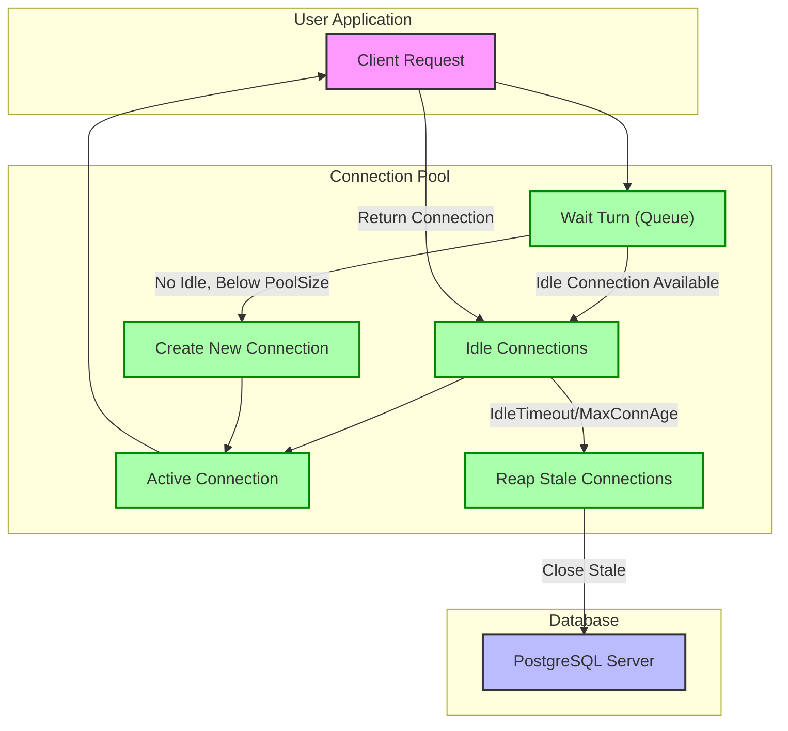

# Connection Pooling and Scalability

Explore how go-pg efficiently manages PostgreSQL connections through a robust and configurable connection pooling system. This page dives into tuning connection pools for both vertical (within a single instance) and horizontal (across multiple instances or services) scaling, elaborating on configuration insights, timeout handling, and concurrency management to optimize performance and reliability.

---

## Why Connection Pooling Matters

Connection pooling is critical in database-driven applications to reuse existing connections and reduce the costly overhead of frequently opening and closing TCP connections. go-pg implements an advanced connection pool that handles concurrent access seamlessly, supports load balancing between available connections, and manages connection lifetime to maximize throughput.

Imagine your application as a busy restaurant kitchen. Opening a new connection to the database is like setting up a new cooking station—expensive and time-consuming. Instead, your connection pool acts as a team of chefs ready at cooking stations (connections). As orders (queries) come in, chefs are assigned efficiently without waiting to set up new stations.

---

## Core Concepts of go-pg Connection Pooling

### Pool Size and Capacity
- **PoolSize**: Defines the maximum number of open connections managed by the pool. It caps resource consumption and controls the concurrency level.
- **MinIdleConns**: Maintains a minimum number of idle (ready-to-use) connections to reduce latency for new requests, especially under bursty workloads.

### Connection Lifecycle
The pool tracks connections in two states:
- **Idle Connections**: Ready and waiting for use.
- **Active Connections**: Checked out by the application for database operations.

When a user requests a connection:
1. The pool allocates a free idle connection if available (a pool hit).
2. If none are idle, it attempts to create a new connection up to PoolSize (a pool miss).
3. If the pool is exhausted, the user waits until a connection is released or a timeout occurs.

### Timeout Mechanisms
- **PoolTimeout**: Maximum wait duration when the pool is exhausted before returning an error.
- **IdleTimeout**: Duration after which idle connections are considered stale and closed to free resources.
- **MaxConnAge**: Maximum lifetime of a connection before being closed and replaced, useful for refreshing connections periodically.

These timeouts balance availability and resource management, preventing stale or overloaded connection scenarios.

---

## How Connection Pooling Works Under the Hood

The connection pool uses a first-in, first-out (FIFO) turn queue to control access when it reaches capacity. This approach ensures fairness by serializing connection acquisition requests, preventing race conditions under high concurrency.

### Workflow:

<Steps>
<Step title="Requesting a Connection">
The application requests a connection from the pool.
The pool waits for its turn using an internal queue and context.
</Step>
<Step title="Allocating or Reusing">
If an idle connection is available, it’s returned immediately.
Otherwise, the pool creates a new connection, respecting the max pool size.
</Step>
<Step title="Using the Connection">
The application uses the allocated connection to execute queries.
</Step>
<Step title="Returning the Connection">
After use, the connection is returned to the pool as idle if healthy, or removed if detected as stale or broken.
</Step>
<Step title="Reaping Stale Connections">
Periodically, the pool's reaper routine closes idle connections exceeding IdleTimeout or MaxConnAge.
This keeps the pool healthy and resource-efficient.
</Step>
</Steps>

---

## Configuration Options

To tailor connection pooling to your application's workload and infrastructure, configure these key options in the `pool.Options` struct:

| Option               | Description                                                                                                 | Recommended Usage                                                            |
|----------------------|-------------------------------------------------------------------------------------------------------------|-------------------------------------------------------------------------------|
| **Dialer**           | Function to establish new network connections                                                              | Provide your database dialer (default TCP Dial)                              |
| **PoolSize**         | Maximum number of connections in the pool                                                                  | Set based on expected concurrency and DB server capacity                     |
| **MinIdleConns**     | Minimum idle connections to maintain                                                                         | Best for fast startup and bursts, default 0                                 |
| **PoolTimeout**      | Maximum wait time for connection acquisition before error                                                    | Use to avoid client hang-ups; tune according to app response expectations    |
| **IdleTimeout**      | Duration to keep idle connections before closing                                                             | Prevents excessive resource usage, set per DB idle connection policies       |
| **MaxConnAge**       | Maximum life span of a connection irrespective of activity                                                   | Useful for refreshing stale or long-lived connections                        |
| **IdleCheckFrequency**| Frequency for the pool to check and reap stale connections                                                  | Helps keep pool in optimal health without excessive check overhead            |
| **OnClose**          | Optional callback triggered when a connection is closed                                                     | For logging, custom cleanup, or instrumentation                             |

### Example: Configuring a Custom Pool

```go
connPool := pool.NewConnPool(&pool.Options{
    Dialer:             yourCustomDialer,
    PoolSize:           50,
    MinIdleConns:       5,
    PoolTimeout:        30 * time.Second,
    IdleTimeout:        5 * time.Minute,
    MaxConnAge:         1 * time.Hour,
    IdleCheckFrequency: 1 * time.Minute,
    OnClose: func(cn *pool.Conn) error {
        log.Println("Connection closed:", cn)
        return nil
    },
})
```

---

## Scaling Connection Pools

### Vertical Scaling (Within a Single Instance)
- Increase **PoolSize** proportional to your hardware and Postgres server limits.
- Use **MinIdleConns** to reduce latency spikes by pre-warming connections.
- Tune **IdleTimeout** and **MaxConnAge** to evict idle or aged connections causing potential server resource leaks or performance degradation.

### Horizontal Scaling (Across Multiple Instances or Services)
- Each instance maintains its own connection pool.
- Coordinate total connection counts among instances to stay within database max connections limit.
- Use connection pooling as a building block in clustered or sharded architectures.

<Note>
Always consider your PostgreSQL server's `max_connections` setting when scaling horizontally to prevent exceeding connection limits.
</Note>

---

## Advanced Pool Types

go-pg also offers specialized pool types to fit unique usage patterns:

- **SingleConnPool:** Maintains a single persistent connection, useful for simple or low-concurrency scenarios.
- **StickyConnPool:** Pins a connection per client/request to improve affinity and transactional consistency.

Explore these options if your workload demands specific connection handling beyond the default pool.

---

## Monitoring and Statistics

The pool reports useful runtime statistics via the `Stats()` method, enabling proactive health monitoring:

| Metric      | Description                                               |
|-------------|-----------------------------------------------------------|
| Hits        | Number of times a free connection was reused              |
| Misses      | Number of times a new connection had to be created        |
| Timeouts    | Number of times connection acquisition timed out          |
| TotalConns  | Current total number of allocated connections             |
| IdleConns   | Number of idle connections currently in the pool           |
| StaleConns  | Connections closed due to being stale                      |

Regular monitoring of these metrics ensures your pool is appropriately sized and tuned.

---

## Troubleshooting Common Scenarios

### 1. Connection Pool Exhaustion
Symptoms:
- Requests block longer than `PoolTimeout`.
- Errors returned: `pg: connection pool timeout`.

Solutions:
- Increase `PoolSize` if hardware and DB allow.
- Use capped query concurrency in your app.
- Adjust `PoolTimeout` to suit app responsiveness demands.

### 2. Stale Connection Errors
Symptoms:
- Operations are failing due to closed or idle timeouts.

Solutions:
- Reduce `IdleTimeout` or `MaxConnAge` to recycle connections more aggressively.
- Use the reaper feature by enabling `IdleCheckFrequency`.

### 3. Dial Errors During Connection Creation
Symptoms:
- Connection attempts fail repeatedly causing overall pool instability.

Solutions:
- Investigate network or database availability.
- The pool automatically backs off on dial errors until connection is possible again.
- Use `OnClose` callback for logging and alerting.

<Check>
Always ensure your PostgreSQL server is properly tuned for max_connections and resource usage to avoid connection failures related to server limits.
</Check>

---

## Connection Pool Lifecycle Diagram



---

## Summary

This page guides you through understanding and mastering connection pooling in go-pg, focusing on configuration for both vertical and horizontal scaling scenarios. By properly tuning pool size, idle connection management, and timeout behaviors, you ensure your application leverages database resources efficiently under concurrent workloads.

Use pool statistics and lifecycle controls to maintain healthy, performant connections and avoid common pitfalls like pool exhaustion and stale connections. Advanced pool types like StickyConnPool and SingleConnPool offer flexibility for specialized use cases.

---

## Related Documentation

- [Connection Pooling and Reliability](https://pg.uptrace.dev/guides/performance-best-practices/connection-pooling) — Practical guides on optimizing connection behavior.
- [Configuration & Connecting to PostgreSQL](https://pg.uptrace.dev/getting-started/setup/configuration-setup) — Setup and connections.
- [Managing Transactions](https://pg.uptrace.dev/guides/application-patterns/transactions) — Interaction of pools and transactions.
- [Error Handling & Context Usage](https://pg.uptrace.dev/guides/performance-best-practices/error-handling-ctx) — Using context with connection pools.
- [Sticky and Single Connection Pools](https://github.com/go-pg/pg/tree/main/internal/pool) — For use cases requiring persistent or request-affine connections.

---

## Practical Tips

- Start with a conservative PoolSize aligned with your Postgres `max_connections` setting considering all your app instances.
- Use MinIdleConns to avoid latency spikes on traffic bursts but balance with resource usage.
- Monitor pool statistics actively in production.
- Adjust PoolTimeout to fail fast in high contention environments.
- Enable IdleCheckFrequency and tune IdleTimeout to prevent resource leaks.
- Consider StickyConnPool when connection affinity is required, for example, in session-based scenarios.

By applying these best practices, your go-pg applications will maintain healthy database connections, scale effectively, and achieve consistent performance under diverse workloads.
