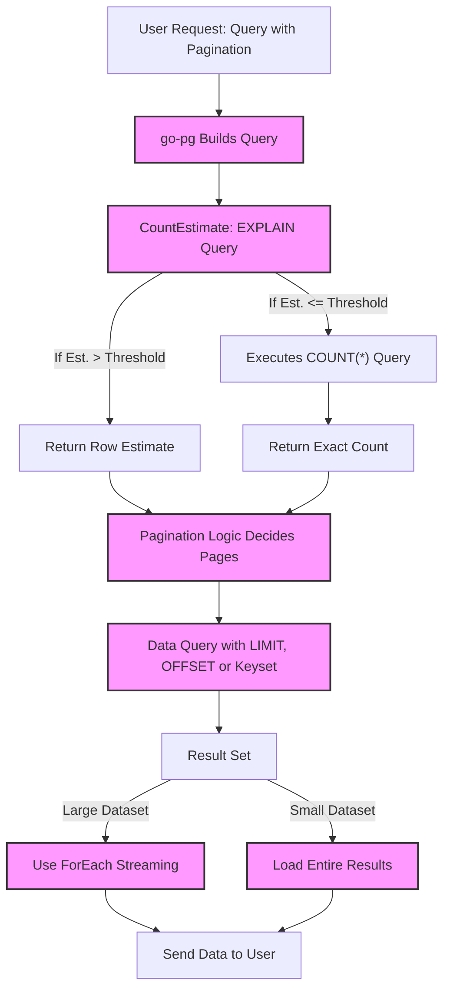

# Count Estimation and Large Dataset Handling

Efficient handling of large datasets and accurate row count estimation are essential for building scalable and performant applications with go-pg. This page guides you through go-pg's approach to estimating row counts using PostgreSQL's `EXPLAIN` command, best practices for pagination, streaming results, and working effectively with large datasets.

---

## Understanding Count Estimation with EXPLAIN

Traditional `COUNT(*)` queries on very large tables can be slow because they require full table scans or index scans. To address this, go-pg leverages PostgreSQL's `EXPLAIN` to obtain an _estimated_ row count quickly without executing the actual count query.

### How CountEstimate Works

- go-pg defines a helper PostgreSQL function `_go_pg_count_estimate_v2` that accepts a SQL query and a threshold value.
- The function runs `EXPLAIN` on the given query to extract the estimated number of rows.
- If the estimate exceeds the threshold, it returns the estimate directly, avoiding a costly exact count.
- If below the threshold, it executes a precise `COUNT(*)` query and returns the accurate count.

This approach combines the speed of estimation for large result sets with the accuracy of exact counts for smaller result sets, optimizing performance and user experience.

### Using CountEstimate in Your Queries

Here is an example of how to use the `CountEstimate` method in a query:

```go
count, err := db.Model(&users).Where("age > ?", 18).CountEstimate(1000)
if err != nil {
    // handle error
}
fmt.Printf("Estimated or exact count: %d\n", count)
```

- The threshold `1000` indicates that if the estimated row count is above 1000, the approximate estimate will be returned immediately.
- For smaller result sets, an exact `COUNT(*)` will be performed.

### Benefits of CountEstimate

- Reduces expensive locking and scanning operations.
- Improves query responsiveness for large tables.
- Enables scalable pagination workflows where total counts aren't critical.

<Callout>
<Info>
CountEstimate is based on common PostgreSQL strategies documented at https://wiki.postgresql.org/wiki/Count_estimate and is implemented safely to retry function creation if missing.
</Info>
</Callout>

---

## Efficient Pagination Strategies

When dealing with large datasets, pagination is a fundamental pattern. However, naive use of `OFFSET` can degrade performance as the page offset grows.

### Key Recommendations

- **Use CountEstimate for pagination controls:** Instead of always performing an exact count to determine total pages, use `CountEstimate` to get a quick approximation, especially for large datasets.
- **Prefer keyset pagination (a.k.a. cursor-based pagination):** Utilize where clauses filtering on indexed columns (e.g., `WHERE id > last_seen_id`) instead of `OFFSET`, to avoid scanning and skipping rows.
- **Limit page sizes:** Keep page sizes reasonable (e.g., 20–100 rows) to ensure fast retrieval.

Here is a typical cursor-based pagination example:

```go
var users []User
err := db.Model(&users).
    Where("id > ?", lastSeenUserID).
    Order("id ASC").
    Limit(50).
    Select()
if err != nil {
    // handle error
}
// Use users and update lastSeenUserID for next page
```

### Integrating CountEstimate with Pagination

Combining estimated counts with cursor pagination gives the best balance between user interface feedback and performance.

---

## Streaming and Processing Large Result Sets

Loading entire large result sets into memory is impractical and inefficient. go-pg offers streaming patterns that process data row-by-row or in manageable chunks.

### Using ForEach for Row-by-Row Processing

The `ForEach` method calls a user-provided function for each row without loading all data into memory at once:

```go
err := db.Model(&events).Where("created_at > ?", lastProcessedTime).
    ForEach(func(e *Event) error {
        // Process each event
        return nil // or error to stop
    })
if err != nil {
    // handle error
}
```

This enables efficient, responsive processing with minimal memory footprint.

### Best Practices

- Use streaming for data migrations, ETL jobs, or background processing.
- Combine streaming with batch size limits and transaction management for robustness.

---

## Handling Queries with Has-One and Has-Many Relations

Large datasets often include related data loaded via ORM relations.

- Use `.Relation()` to load related data selectively.
- Be aware that relations may generate JOINs or additional queries, impacting performance.
- Limit related data loading especially when dealing with large parent result sets.

Optimizing these queries using pagination and count estimation techniques prevents resource exhaustion and slow responses.

---

## Troubleshooting Common Scenarios

<AccordionGroup title="Troubleshooting Count Estimation and Large Dataset Handling">
<Accordion title="CountEstimate function does not exist">
If your PostgreSQL database does not have the helper function installed, go-pg attempts to create it automatically. If permission issues prevent this, you must manually create the function using the SQL source provided in go-pg's internal implementation or seek DBA assistance.
</Accordion>
<Accordion title="CountEstimate returns unexpected counts">
Remember that `CountEstimate` uses an estimate from `EXPLAIN`. It may vary from exact counts especially in the presence of complex queries or outdated PostgreSQL statistics.

To improve accuracy:

- Run `ANALYZE` on your tables periodically.
- Adjust the threshold parameter to tune precision versus performance.
</Accordion>
<Accordion title="Performance degrades after many pages of OFFSET pagination">
Switch to keyset pagination to avoid `OFFSET` performance penalties. If you must use `OFFSET`, keep offsets low and combine with count estimates.
</Accordion>
<Accordion title="Memory issues when handling large result sets">
Use the `ForEach` streaming pattern to avoid loading all rows into memory.

Also consider limiting selection to needed columns only and applying filters to reduce result size.
</Accordion>
</AccordionGroup>

---

## Summary

- go-pg uses PostgreSQL's `EXPLAIN` to efficiently estimate row counts via the `CountEstimate` method.
- Estimated counts accelerate pagination and reduce costly `COUNT(*)` operations on large tables.
- Keyset pagination and streaming (`ForEach`) prevent performance degradation and high memory consumption.
- Manage related data loading carefully to maintain query efficiency.

---

## See Also

- [CountEstimate and Pagination Guide](/guides/performance-best-practices/count-estimate-pagination)
- [Optimizing Queries and Batch Operations](/guides/performance-best-practices/optimizing-queries-batch)
- [Connection Pooling and Reliability](/guides/performance-best-practices/connection-pooling)
- [Model Relations and Joins](/api-reference/orm-model-workflows/model-relations-and-joins)
- [Working with Large Datasets FAQ](/faq/performance-optimization/handling-large-datasets)

---

## Visual Diagram: Data Flow with Count Estimate and Pagination



---

This page empowers you to deliver responsive applications by mastering count estimation and large dataset handling using go-pg's built-in capabilities and recommended patterns.