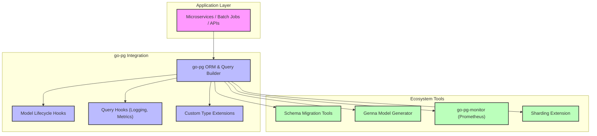

# Common Integration Patterns

Discover practical approaches for integrating go-pg efficiently within distributed systems, monitoring solutions, and schema migration workflows. This guide highlights extension points and ecosystem tools that enable embedding go-pg as a reliable component in your broader application infrastructure.

---

## Embedding go-pg in Distributed Systems

When building modern distributed applications, go-pg plays a central role as a performant and flexible PostgreSQL client and ORM. Successful integration requires thoughtful design across service boundaries and observability layers.

### Key Integration Scenarios

- **Microservices and APIs:** Use go-pg to power data access in microservices with clear model definitions and relations. Coupled with connection pooling and transaction management, go-pg allows scalable and consistent database interactions.

- **Event-driven Architectures:** Integrate go-pg with messaging or event sourcing platforms where transactional state changes reflect seamlessly in PostgreSQL.

- **Background Jobs and Batch Processes:** Leverage go-pg for efficient bulk operations and batch workflows, minimizing query round-trips.

### Best Practices

- Explicitly manage database transactions. Use go-pg's `RunInTransaction` method for atomic operations to maintain data consistency across distributed components.

- Use context-aware queries to propagate cancellation and deadlines, ensuring graceful shutdowns and resource cleanup in distributed environments.

- Tune connection pooling appropriately for your concurrency workloads; avoid connection exhaustion that can cascade failures in distributed systems.

## Extension Points for Customization

go-pg offers multiple hooks and extension mechanisms to tailor its behavior within your ecosystem.

### Model Lifecycle Hooks

go-pg supports hooks such as `BeforeInsert`, `AfterSelect`, etc., enabling integration of business logic during ORM operations. Use these to embed custom validations, audit log triggers, or side effects tied to data mutations.

### Query Hooks

You can add custom query hooks to intercept SQL execution for logging, tracing, metrics, or enforcing policies like tenant-based filtering.

### Custom Type Handling

Extend go-pg’s scanning and valuation capabilities for specialized PostgreSQL types or domain-specific structs by implementing the appropriate interfaces (`Scanner`, `Valuer`).

## Ecosystem Tools and Integration

Several tools and libraries complement go-pg to craft a full-featured backend solution:

### Schema Migrations

Use dedicated migration libraries such as [go-pg-migrations](https://github.com/robinjoseph08/go-pg-migrations) or [migrate](https://github.com/golang-migrate/migrate) for controlled database evolution. Migrations ensure consistent schema changes alongside go-pg model updates.

### Model Generation

Automate model creation aligned with database schemas using tools like [Genna](https://github.com/dizzyfool/genna). This helps maintain model accuracy over time and accelerates onboarding.

### Monitoring & Metrics

Integrate [go-pg-monitor](https://github.com/hypnoglow/go-pg-monitor) to expose Prometheus metrics related to query execution, connection pool health, and error rates. Effective monitoring is critical in distributed systems to identify bottlenecks or failures early.

### Big Integer Support

For precise large number handling, extend go-pg with the [bigint](https://github.com/d-fal/bigint) Go type wrapper, enabling accurate mapping of PostgreSQL 64-bit integers.

### URL Struct Decoding

Use [urlstruct](https://github.com/go-pg/urlstruct) to decode HTTP query parameters or form values directly into go-pg models, simplifying REST API integration.

### Sharding and Horizontal Scaling

Consider the [sharding extension](https://github.com/go-pg/sharding) for distributing data across multiple PostgreSQL instances, enhancing scalability.

## Embedded go-pg Usage Workflow

1. **Register Your Models:** Define Go structs as models and register them with the ORM.
2. **Manage Migrations:** Evolve the database schema alongside model definitions using migration tools.
3. **Customize Hook Logic:** Implement lifecycle or query hooks as needed for business rules and observability.
4. **Instrument Observability:** Set up monitoring agents to surface query performance and error statistics.
5. **Integrate with Application Stack:** Embed go-pg usage within microservices, batch jobs, or event processors, leveraging context propagation and connection management.

## Troubleshooting Integration Challenges

- **Connection Pool Starvation:** Carefully configure pool sizes and timeouts to prevent blocking under concurrent workloads.

- **Hook Side Effects:** Avoid long-running hook logic that could delay queries or cause cascading failures.

- **Schema Drift:** Keep migration scripts and model definitions tightly synchronized to prevent runtime errors.

- **Serialization Issues:** Confirm custom scanners and valuers handle all edge cases for complex types.

## Conclusion

Embedding go-pg into a larger application ecosystem requires leveraging its extensibility, pairing with complementary tools, and adhering to best integration practices. Doing so unlocks go-pg’s full power as a performant, resilient, and manageable database client suited for modern distributed architectures.

---

## Additional Resources

- [Model Relations and Joins Guide](/api-reference/orm-model-workflows/model-relations-and-joins)
- [Schema Migrations and Tooling](/guides/application-patterns/schema-migrations)
- [Advanced Queries and Relations Guide](/guides/working-with-data/advanced-queries-relations)
- [Connection Pooling and Reliability](/guides/performance-best-practices/connection-pooling)
- [go-pg GitHub Repository](https://github.com/go-pg/pg)

---

## Visual Overview Diagram

---