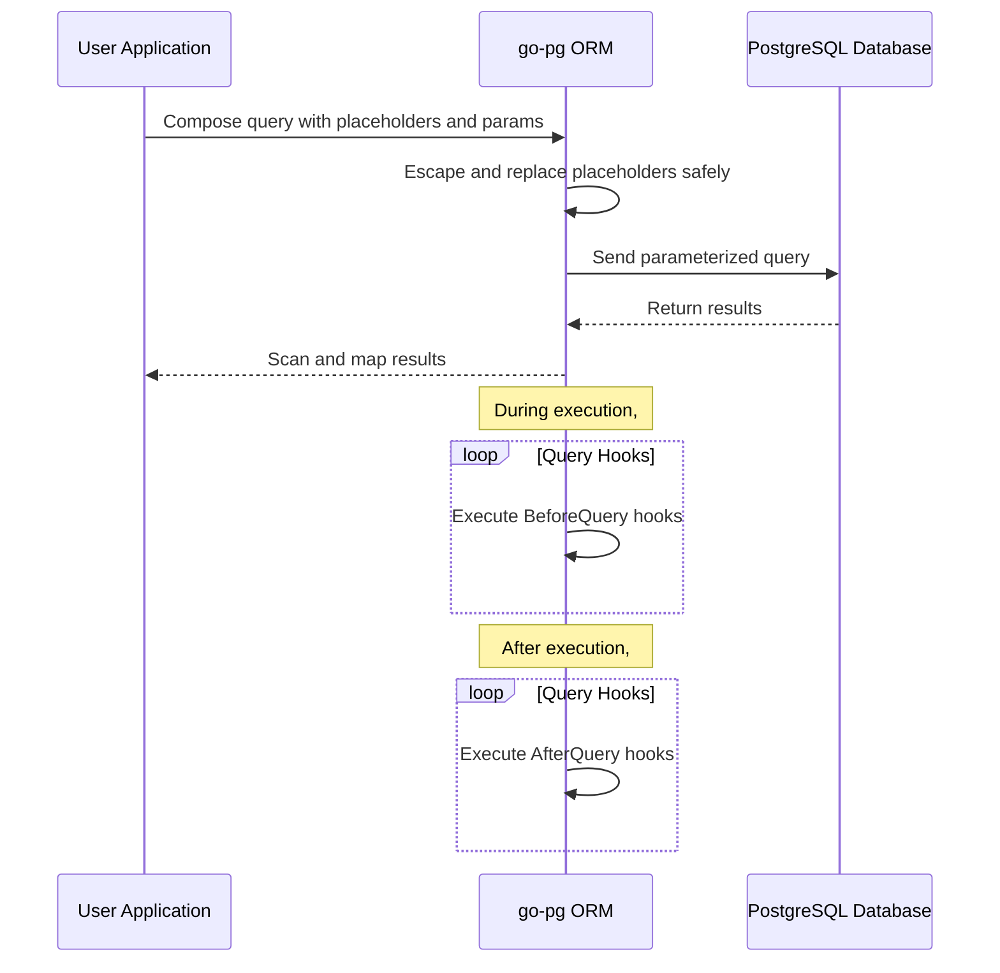

# Security and Safe Query Construction

Go-pg provides robust mechanisms to ensure that your SQL queries are safely constructed and resilient against SQL injection attacks. This guide explains how go-pg handles parameter binding, the formatting APIs it exposes for safe SQL construction, and how context usage improves query management with cancellations and timeouts.

---

## Understanding User Intent in Safe Querying

Your primary goal when writing queries with go-pg is to execute SQL commands safely without exposing your application to injection vulnerabilities. Go-pg accomplishes this by:

- Using placeholder syntax for parameters, preventing manual concatenation of user input into SQL strings.
- Thoroughly escaping and quoting all parameters according to PostgreSQL rules before substitution.
- Enabling expressive and reusable query construction with parameter binding (named, indexed, global, and model-based).
- Supporting query cancellation and timeouts via Go’s `context.Context`, ensuring controlled query execution lifecycles.

Let’s walk through each of these concepts.

---

## Parameter Binding and Placeholders

Instead of directly interpolating values into query strings, go-pg uses placeholders (`?`) within the query text. These placeholders are then replaced with the corresponding parameters passed in a safe, sanitized manner.

### Placeholder Syntax

- `?` — Basic positional placeholder replaced by arguments in order.
- `?N` — Indexed placeholder where `N` is zero-based index in parameters.
- `?name` — Named parameter referencing fields or methods by name in a struct or map.
- Escaping `?` — Use backslash to escape if you want a literal question mark in SQL.

### Example of Placeholders in Use

```go
// Simple positional parameters
_, err := db.Query(pg.Scan(&num), "SELECT ?", 42)

// Indexed parameters
_, err = db.Query(pg.Scan(&num), "SELECT ?0 + ?0", 1)

// Named parameters (struct fields or methods)
params := &Params{X:1, Y:1}
_, err = db.Query(pg.Scan(&num), "SELECT ?x + ?y + ?Sum", params)

// Global param combined with named params
_, err = db.WithParam("z", 1).Query(pg.Scan(&num), "SELECT ?x + ?y + ?z", params)
```

This approach ensures:

- **Automatic escaping:** Go-pg quotes and escapes parameters to match PostgreSQL’s expectations.
- **Type safety:** Go types are handled correctly without manual string conversions.
- **SQL injection protection:** Direct user input can never break out of the parameter context.

<Note>
Never manually concatenate user input into query strings. Always use placeholders and parameter passing to keep queries safe.
</Note>

---

## The Formatter Interface and Safe Query Construction

Under the hood, go-pg uses the `Formatter` interface to process query templates and inject parameters safely into queries. You typically don't need to interact directly with it, but understanding its role helps appreciate how queries remain secure.

- **Formatter** manages named parameters and struct/model parameter resolution.
- It supports various parameter sources: global, named, indexed, or from model fields.
- When formatting, parameters are serialized with proper quoting and escaping.

### SafeQuery Appender

For situations where you need reusable SQL fragments, `SafeQuery` allows you to compose small query parts safely:

```go
sq := orm.SafeQuery("column = ?", value)
// Can be composed inside larger queries
```

This feature helps build safe dynamic queries without returning to string concatenation.

---

## Query Construction and ORM Integration

Go-pg's core ORM query components (select, insert, update, delete) use the formatter and safe appending strategies to produce fully parameterized SQL queries.

- **InsertQuery**, **UpdateQuery**, and **DeleteQuery** append parameter placeholders (`?`) during formatted query construction.
- They respect placeholders when generating SQL, ensuring input data is never interpolated as raw SQL.
- Model values, map values, and slices are integrated safely via query appenders.

---

## Using Context for Safe Query Cancellation & Timeouts

All database operations in go-pg accept an optional `context.Context` to enable:

- **Query Cancellation:** If the context is canceled, ongoing queries terminate promptly, saving resources.
- **Timeouts:** You can set request deadlines or timeouts to prevent long-running queries.

Example:

```go
ctx, cancel := context.WithTimeout(context.Background(), time.Second*5)
defer cancel()
res, err := db.ModelContext(ctx, &user).Where("id = ?", 1).Select()
```

This approach strengthens your application's control of resource usage and avoids stale or hanging connections.

<Check>
Always use context-aware methods (`ModelContext`, `QueryContext`, etc.) in production code to benefit from graceful cancellation and timeout handling.
</Check>

---

## Best Practices for Safe Query Construction with go-pg

- **Always use placeholders:** Never interpolate strings or variables manually into SQL text.
- **Use named parameters with structs:** This makes queries readable, maintainable, and secure.
- **Escape question marks when needed:** To include literal `?` characters, escape with a backslash.
- **Leverage SafeQuery for reusable fragments:** Compose complex safe queries without losing parameterization.
- **Utilize context for timing control:** Prevent leaks and excessive execution time.

---

## Troubleshooting Common Safe Querying Issues

<AccordionGroup title="Common Challenges">
<Accordion title="Unrecognized Named Parameters">
This happens if your query references a named parameter or method that does not exist in the params struct or map. Ensure your parameters have fields or methods corresponding exactly to the names used in the SQL.
</Accordion>
<Accordion title="Missing Parameter Values">
If you supply fewer params than placeholders or incorrectly index placeholders, the query formatter will leave placeholders unreplaced or panic. Ensure parameters match placeholders in count and order.
</Accordion>
<Accordion title="Literal ? Not Escaped Correctly">
If you want to preserve literal `?` in SQL, escape it with a backslash (`\?`). Forgetting this results in parsing errors.
</Accordion>
<Accordion title="Context Cancellation Not Working">
Verify you are using the `Context`-aware versions of query methods (`SelectContext`, `ExecContext`, `ModelContext`). Plain versions do not respect contexts.
</Accordion>
</AccordionGroup>

---

## Illustrative Flow of Safe Query Execution



This flow demonstrates that user input is never part of raw SQL text sent to PostgreSQL, protecting the application from injection attacks.

---

## Summary

Go-pg enforces safe SQL query construction by:

- Using placeholder parameterization for all user inputs.
- Providing powerful formatting APIs to handle named, indexed, global, and model parameters.
- Supporting flexible safe query composition with appenders.
- Leveraging Go's context package to manage query lifecycle, cancellation, and timeouts.

By following the best practices and leveraging go-pg’s safe querying features, you can build reliable, secure, and performant database applications.

---

## Related Documentation & Next Steps

- [Query Formatting and Parameterization](https://pg.uptrace.dev/api-reference/advanced-types-and-query-features/query-formatting-and-parameters) — Detailed API reference for formatter interface and parameter syntax.
- [Defining and Using Models](https://pg.uptrace.dev/api-reference/orm-model-workflows/defining-and-using-models) — Learn how models integrate with query building.
- [Connection Pooling and Reliability](https://pg.uptrace.dev/guides/performance-best-practices/connection-pooling) — Understand context use in pool management.
- [Error Handling and Context Usage](https://pg.uptrace.dev/guides/performance-best-practices/error-handling-ctx) — Best practices for context and error scenarios.

Continued mastery of these concepts will help you build robust and secure Go applications using go-pg.

---

## Source Code References

You can explore implementation details for query formatting and parameter injection in these key files:

- [`orm/format.go`](https://github.com/go-pg/pg/blob/main/orm/format.go)
- [`example_placeholders_test.go`](https://github.com/go-pg/pg/blob/main/example_placeholders_test.go)
- [`hook.go`](https://github.com/go-pg/pg/blob/main/hook.go)

Explore these to deepen your expertise beyond user-level API usage.

---