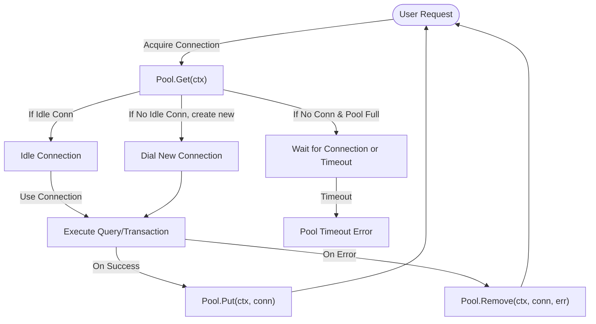

# FAQ: Resolving Connection Pooling and Resource Exhaustion Problems in go-pg

This FAQ page addresses common questions and troubleshooting approaches for connection pooling issues in go-pg, particularly when you encounter connection limits, resource exhaustion, connection leaks, or unexpected slowdowns related to connection management.

---

## 1. Why do connection pool timeouts or exhaustion errors happen?

Connection pool errors usually occur when:

- The maximum pool size configured is too small for application demand, causing requests to wait for free connections.
- Connections are held and not returned promptly due to long-running queries or transactions.
- Connections leak because of missing `Put` calls or improper resource release.
- The PostgreSQL server or network has issues preventing connection reuse or timely establishment.

Go-pg manages a connection pool that limits concurrent open connections. When all connections are busy and new requests exceed the pool's `PoolSize`, your requests wait up to `PoolTimeout` before returning an error.

## 2. How can I check current pool usage and limits?

Use the connection pool's statistics methods to monitor live pool state:

```go
stats := db.Pool().Stats()
log.Printf("Pool Stats: hits=%d, misses=%d, timeouts=%d, totalConns=%d, idleConns=%d", stats.Hits, stats.Misses, stats.Timeouts, stats.TotalConns, stats.IdleConns)
```

- `TotalConns` shows how many connections exist
- `IdleConns` shows how many are currently idle and available
- `Hits`, `Misses`, and `Timeouts` indicate pool efficiency and contention

Tracking these numbers over time helps detect exhaustion or overuse.

## 3. How to configure connection pool size and timeouts appropriately?

Adjust your database options when connecting:

- `PoolSize`: Maximum number of open database connections. Increase this to handle more concurrent transactions.
- `MinIdleConns`: Ensures a minimum number of idle connections are maintained for low latency.
- `PoolTimeout`: Duration to wait before failing when no free connections are available.
- `IdleTimeout` and `MaxConnAge`: Controls recycling of idle or aged connections to prevent stale or broken connections.

Example configuration:

```go
opt := &pg.Options{
    Addr:            "localhost:5432",
    User:            "user",
    Password:        "pass",
    Database:        "mydb",
    PoolSize:        20,             // adjust based on workload
    MinIdleConns:    5,              // keep some connections always ready
    PoolTimeout:     30 * time.Second, // reasonable wait time for a free conn
    IdleTimeout:     time.Minute * 5,  // close idle connections after 5 mins
    MaxConnAge:      time.Hour,        // recycle aged connections
}
db := pg.Connect(opt)
```

## 4. What should I do if connections are leaking or held longer than expected?

Common causes:

- Queries or transactions stay open too long without releasing.
- Forgetting to call `db.Pool().Put(ctx, conn)` or letting a transaction/statement remain uncommitted/closed.
- Long-running locks or network stalls blocking release.

Solutions:

- Review application code paths to ensure every acquired connection or transaction is properly closed or rolled back.
- Use Go's `defer` statements to guarantee cleanup.
- Consider increasing pool size temporarily if load spikes.
- Enable PostgreSQL log tracing to detect slow queries or locks.

## 5. How does go-pg handle stale or aged connections?

Go-pg connection pools automatically reap (close) connections that exceed configured idle or maximum age thresholds (`IdleTimeout`, `MaxConnAge`). This prevents buildup of broken or stale connections that might cause failures or slowdowns.

A background reaper goroutine runs and closes stale connections to maintain pool health.

You can manually trigger stale connection cleanup as well:

```go
n, err := db.Pool().ReapStaleConns()
log.Printf("Closed %d stale connections", n)
```

## 6. What is the typical workflow for connection acquisition and release?

The connection pool provides:

- `Get(ctx) (*Conn, error)`: Acquire a connection from the pool or create a new one if under limit.
- `Put(ctx, *Conn)`: Return a connection back to the pool.
- `Remove(ctx, *Conn, error)`: Remove a connection from the pool, e.g., if it is broken.

**Usage pattern:**

```go
conn, err := db.Pool().Get(ctx)
if err != nil {
    // handle error
}
defer db.Pool().Put(ctx, conn)

// use conn for queries
```

Transactions and listeners internally use this pool mechanism.

## 7. Why do I sometimes see `pg: database is closed` errors?

This error occurs if you attempt to use a `pg.DB` instance after calling `db.Close()`. Closing the DB closes all connections and marks it unusable.

To fix:

- Do not reuse closed `pg.DB` instances.
- Create a new DB connection if needed.

## 8. What if Get calls block or timeout unexpectedly?

Blocking on `Get(ctx)` means all pooled connections are in use.

Steps to address:

- Increase `PoolSize` to handle your concurrent workload.
- Tune `PoolTimeout` to allow more waiting or catch timeouts earlier.
- Ensure your queries are optimized and do not hold connections unnecessarily.
- Confirm your application is returning connections properly.

## 9. How to handle errors related to the connection pool?

Look for specific error types:

- `pg: connection pool timeout` indicates no free connections within `PoolTimeout`.
- `pg: database is closed` means the DB client is closed.

Use logging and metrics to detect high load or leaks.

When a connection is detected as bad, go-pg removes it from the pool automatically to ensure pool integrity.

## 10. Additional tips and best practices

<Tip>
- Always check and handle errors from connection acquisition and queries.
- Use context with sensible timeouts and cancellation to prevent piling up waiters.
- Monitor pool stats in production via `db.Pool().Stats()` periodically.
- Tune pool parameters based on actual application concurrency and query durations.
- Avoid global or long-lived transactions holding connections for long periods.
- Consider read replicas and sharding to spread connection load if needed.
</Tip>

---

## Related Documentation

- [Connection Pooling and Reliability Guide](/guides/performance-best-practices/connection-pooling): Deep dive into pool configuration, tuning, and internals.
- [Basic Connection Setup FAQ](/faq/getting-started-issues/basic-connection-setup): How to configure DB connection safely.
- [Managing Transactions Guide](/guides/application-patterns/transactions): Proper transaction lifecycle management to avoid connection hold.
- [Error Handling and Contexts Guide](/guides/performance-best-practices/error-handling-ctx): Using `context.Context` to avoid stuck requests.

---

## Summary Diagram: Connection Pool Workflow



This flow outlines the lifecycle of acquiring and releasing connections in go-pg's connection pool.

---

## Troubleshooting Checklist

- [ ] Verify your `PoolSize` matches your concurrency requirements.
- [ ] Ensure all database interactions close or return connections properly using `defer`.
- [ ] Monitor `db.Pool().Stats()` for abnormal timeouts or zero idle connections.
- [ ] Check application logs for long-running queries or transactions blocking connections.
- [ ] Increase `PoolTimeout` if necessary to tolerate briefly high load.
- [ ] Restart the DB client to clear leaked or broken connections.
- [ ] Enable PostgreSQL logging to identify long locks or query issues.

---

By following these guidelines, you can confidently troubleshoot, tune, and maintain a healthy connection pool in your go-pg-based application, preventing resource exhaustion and keeping database interactions reliable and performant.
