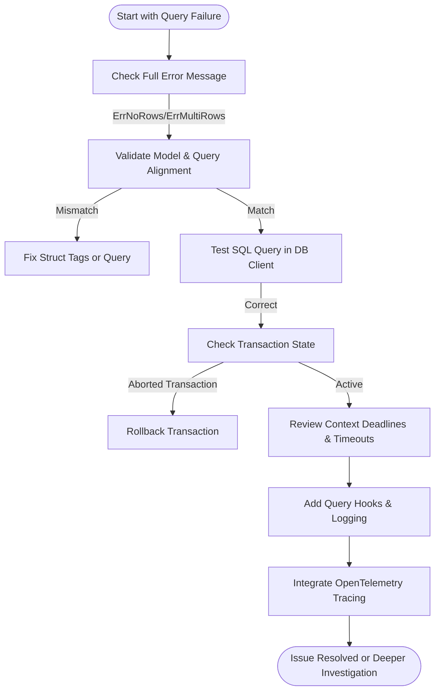

# FAQ: What do I do if my queries are failing or behaving unexpectedly?

This FAQ page equips you with practical strategies to interpret and resolve errors that arise during query execution with go-pg. It focuses specifically on understanding error messages, debugging data mismatches, handling transaction and timeout issues, and effectively using logging for troubleshooting. By following these guidelines, you will be empowered to swiftly identify root causes and apply corrective actions to keep your database interactions reliable and predictable.

---

## 1. Understanding Common Error Messages

When a query fails or produces unexpected results, the first step is to interpret the error message carefully. go-pg surfaces PostgreSQL server errors, Go runtime errors, and network issues distinctly.

### Common PostgreSQL Errors

- **ErrNoRows**: Returned when a query expecting exactly one row finds none. Check if your query filter is correct or if data exists.
- **ErrMultiRows**: Indicates a query expecting one row returned multiple rows. Consider refining WHERE clauses or using query methods designed for multiple rows.
- **IntegrityViolation**: Errors indicating constraint violations such as unique key conflicts or foreign key failures. These are surfaced through the `Error` interface via `IntegrityViolation()`.

```go
if err, ok := err.(pg.Error); ok && err.IntegrityViolation() {
    // Handle constraint violation
}
```

### Network and Timeout Errors

- Network errors including timeouts are detected by inspecting the error type and PostgreSQL error fields.
- go-pg determines if an error signals a bad connection or a recoverable timeout to decide whether to retry or close a connection.

### Tips:
- Always log full error messages including code and detail fields.
- Use type assertions to differentiate error kinds:

```go
switch err {
case pg.ErrNoRows:
    // Handle no rows found
case pg.ErrMultiRows:
    // Handle multiple rows returned error
default:
    if pgErr, ok := err.(pg.Error); ok {
        // Use pgErr.Field('C') for code, 'M' for message
    }
}
```


## 2. Debugging Data Mismatches and Unexpected Results

Unexpected result shapes or data values often stem from mismatches between your Go struct definitions and the query result columns.

- **Field Mapping Issues**: Verify struct tags (`pg:"column_name"`) match database columns.
- **Null Handling**: SQL `NULL`s map to zero values in Go by default unless using pointers or `sql.Null*` types.
- **Embedded and Nested Structs**: Ensure nested structs reflect column naming conventions (like `table__field`) in queries.

Practical example from tests:

```go
// Query partially fills embedded structs
var dst embeddedLoader
_, err := db.QueryOne(&dst, "SELECT ?num AS num, ?num2 AS num2", src)
```

- Enable `BeforeScanHook` and `AfterScanHook` on your model for custom diagnostics during scanning.
- Use the ORM's `QueryOne` or `Query` methods appropriately, aligning model shape to expected row results.


## 3. Handling Transaction and Retry Issues

Transactions introduce complexity where partial failures or timeouts need careful attention.

- Use context-aware methods (`QueryContext`, `ExecContext`) to enforce deadlines and cancellations.
- Detect aborted transactions by inspecting error codes like `25P02` indicating an aborted transaction, which requires rollback.
- go-pg automatically retries queries on transient network errors but not on logical failures.

### Common transaction pitfalls:

- Trying to reuse a transaction after an error without rollback.
- Not handling `ErrNoRows` or `ErrMultiRows` during conditional selects or updates.
- Ignoring context deadlines causing silent query disruptions.

### Best Practice:

Use the built-in transaction methods with proper error checks:

```go
tx, err := db.Begin()
if err != nil {
    return err
}

if _, err := tx.ExecContext(ctx, "UPDATE ..."); err != nil {
    tx.Rollback()
    return err
}

return tx.Commit()
```


## 4. Effective Use of Logging and Diagnostics

go-pg offers hooks and event structures to capture detailed query lifecycle information.

### Using Query Hooks

- Implement `pg.QueryHook` to log query text, parameters, execution duration, and error results.
- Hooks provide `BeforeQuery` and `AfterQuery` callbacks with `QueryEvent` containing:
  - Formatted and raw queries
  - Start time and execution results
  - Error details

Example:

```go
db.AddQueryHook(myCustomLogger)
```

### OpenTelemetry Integration

- Use the `pgotel` extension to get automatic tracing and span recording for all queries to help track problematic queries in distributed tracing systems.

```go
import "github.com/go-pg/pg/extra/pgotel/v10"
db.AddQueryHook(pgotel.NewTracingHook())
```

### Logging Startup and Notice Messages

- go-pg captures and logs warnings and notices from the server startup phase, helping diagnose server-level issues like SSL setup failures or authentication problems.


## 5. Troubleshooting Workflow

When facing query failures or erratic behavior, follow this workflow:

1. **Check the error message fully**: Log error code, message, and context.
2. **Match query parameters and model definitions**: Confirm data types and column names.
3. **Test queries independently**: Run your SQL in a PostgreSQL client.
4. **Inspect transaction state**: Rollback if transactions aborted.
5. **Verify context deadlines and cancelations**: Avoid premature timeouts.
6. **Use debug hooks for query lifecycle insight**
7. **Enable detailed client logging or integrate with tracing**


## 6. Practical Tips & Common Pitfalls

- Avoid assuming queries will always return a row; always handle `pg.ErrNoRows`.
- Use context with timeouts to guard against stalled queries.
- Utilize prepared statements and parameterized queries to prevent injection and improve performance.
- When scanning into custom structs, use hooks and model initialization methods to ensure correctness.
- Pay attention to PostgreSQL error codes for precise handling rather than generic error messages.
- Monitor your connection pool health to avoid unexpected failures due to exhaustion.


## Related Documentation & Resources

- [Error Handling and Status Codes](https://pg.uptrace.dev/api-reference/api-fundamentals-and-best-practices/error-handling-and-status-codes) - Comprehensive error management
- [Connection Pooling and Reliability](https://pg.uptrace.dev/guides/performance-best-practices/connection-pooling) - For pool-related issues
- [Managing Transactions](https://pg.uptrace.dev/guides/application-patterns/transactions) - Transaction best practices
- [OpenTelemetry instrumentation](https://pg.uptrace.dev/tracing/) via `pgotel` - Add tracing observability
- [Defining Models and Basic CRUD](https://pg.uptrace.dev/guides/getting-started/define-models-crud) - Validate model-query mapping

---

### Summary Diagram of Query Troubleshooting Flow



---

By following this FAQ, you will develop confidence in dissecting query failures, diagnosing model-related issues, managing transaction states, and leveraging go-pg's powerful hooks and logging to resolve unexpected behaviors with precision and efficiency.


---

# Code Example: Adding a Custom Query Hook for Detailed Logging

```go
package main

import (
	"context"
	"fmt"
	"time"

	"github.com/go-pg/pg/v10"
)

// LoggerHook implements pg.QueryHook for logging query details
type LoggerHook struct{}

func (h *LoggerHook) BeforeQuery(ctx context.Context, ev *pg.QueryEvent) (context.Context, error) {
	// You can log query start here
	fmt.Printf("Starting query: %s\n", ev.Query)
	return ctx, nil
}

func (h *LoggerHook) AfterQuery(ctx context.Context, ev *pg.QueryEvent) error {
	dur := time.Since(ev.StartTime)
	if ev.Err != nil {
		fmt.Printf("Query failed (%v): %s - %v\n", dur, ev.Query, ev.Err)
	} else {
		fmt.Printf("Query succeeded (%v): rows affected=%d\n", dur, ev.Result.RowsAffected())
	}
	return nil
}

func main() {
	db := pg.Connect(&pg.Options{
		User: "postgres",
		Addr: "localhost:5432",
		Database: "testdb",
	})
	defer db.Close()

	db.AddQueryHook(&LoggerHook{})

	// Run a sample query
	var count int
	_, err := db.QueryOne(pg.Scan(&count), "SELECT COUNT(*) FROM users")
	if err != nil {
		panic(err)
	}

	fmt.Printf("Users count: %d\n", count)
}
```

This example demonstrates adding a logging hook to inspect queries and their outcome, a practical tool during debugging.

---