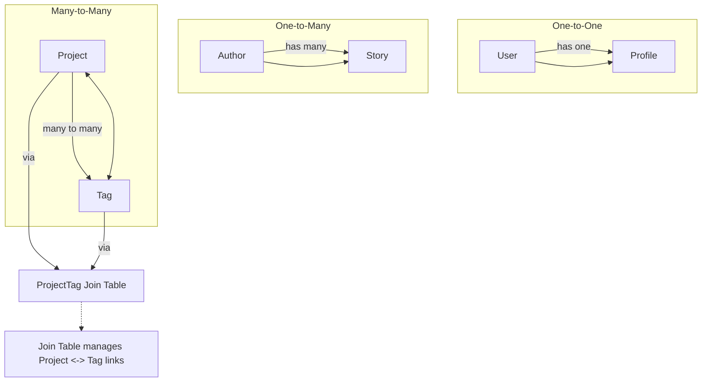

# Associations: HasOne, HasMany, ManyToMany

Master the art of representing and querying relationships between models, including one-to-one, one-to-many, and many-to-many associations using go-pg's ORM. This guide provides detailed, practical examples and tips for both eager and lazy loading of associated data.

---

## 1. Understanding Associations in go-pg

In go-pg, associations define how different Go structs (models) relate to each other in the database. These relationships correspond to common database patterns:

- **HasOne:** One-to-one relationship where a model has exactly one related model.
- **HasMany:** One-to-many relationship where a model has zero or more related models.
- **ManyToMany:** Many-to-many relationship facilitated via a join table.

Mastering these associations lets you model your database intuitively and write queries that naturally handle complex data relationships.

### Prerequisites
- Basic understanding of Go structs.
- A running PostgreSQL database connection with go-pg configured.
- Familiarity with go-pg model declarations and CRUD operations.

### Expected Outcome
By the end of this guide, you will be able to:
- Define associations between models using struct tags.
- Insert, query, and load associated data.
- Use eager loading and lazy loading strategies.

### Time Estimate
20-30 minutes to grasp, implement, and test example code.

### Difficulty Level
Intermediate (familiar with ORM usage and Go).

---

## 2. Defining Associations

Associations in go-pg are declared via Go struct fields with specific `pg` struct tags indicating the type of relation.

### a) HasOne (One-to-One)

- Represented by a pointer to the related model.
- The foreign key is typically stored in the model with the `HasOne` relation.

```go
// User has exactly one Profile
type User struct {
    Id      int64
    Name    string
    Profile *Profile `pg:"rel:has-one"`
}

// Profile belongs to User
type Profile struct {
    Id     int64
    UserId int64
    Bio    string
}
```

The tag `rel:has-one` defines that `Profile` is a HasOne relation of `User`.


### b) HasMany (One-to-Many)

- Represented as a slice of models.
- Indicates that one model owns or is related to many other models.

```go
// Author has many stories
type Author struct {
    Id      int64
    Name    string
    Stories []Story `pg:"rel:has-many"`
}

// Story belongs to Author
type Story struct {
    Id       int64
    Title    string
    AuthorId int64
}
```

The `rel:has-many` indicates the one-to-many nature.

### c) ManyToMany (Many-to-Many)

- Represented as a slice.
- Requires a join table to establish the relationship.
- The `many2many:<join_table_name>` tag specifies the join table.

```go
// Project has many Tags through project_tags join table
type Project struct {
    Id    int64
    Name  string
    Tags  []Tag `pg:",many2many:project_tags"`
}

// Tag represents a tag entity
type Tag struct {
    Id   int64
    Name string
}

// Join table between Project and Tag
// Usually, you don't need to define this explicitly, but can
// register it for better ORM awareness.
// orm.RegisterTable((*ProjectTag)(nil)) // optional

type ProjectTag struct {
    ProjectID int64 `pg:",pk"`
    TagID     int64 `pg:",pk"`
}
```

---

## 3. Querying Associations

go-pg allows you to load associated data either **lazily** (on demand) or **eagerly** (joined with the parent query).

### a) Lazy Loading

Load associations separately after the parent model has been loaded.

```go
var user User
err := db.Model(&user).WherePK().Select() // load user only
if err != nil {
    panic(err)
}

// Lazy load user's profile
err = db.Model(user.Profile).Where("user_id = ?", user.Id).Select()
if err != nil {
    panic(err)
}
```


### b) Eager Loading

Use `Relation()` to load related data in the same query or via additional queries automatically.

```go
var story Story
err := db.Model(&story).
    Relation("Author"). // loads the one-to-one author
    Where("story.id = ?", 1).
    Select()

if err != nil {
    panic(err)
}

fmt.Printf("Story: %v, Author: %v", story.Title, story.Author)
```

For HasMany and ManyToMany relations, eager loading retrieves linked records and populates slices.

```go
var author Author
err := db.Model(&author).
    Relation("Stories").
    WherePK().
    Select()
if err != nil {
    panic(err)
}

fmt.Printf("Author: %v, Stories count: %d", author.Name, len(author.Stories))
```

---

## 4. Practical Examples

### Example 1: HasOne Relationship

```go
import (
    "fmt"
    "github.com/go-pg/pg/v10"
)

type User struct {
    Id      int64
    Name    string
    Profile *Profile `pg:"rel:has-one"`
}

type Profile struct {
    Id     int64
    UserId int64
    Bio    string
}

func ExampleHasOne(db *pg.DB) {
    user := &User{Name: "alice"}
    _, err := db.Model(user).Insert()
    if err != nil {
        panic(err)
    }

    profile := &Profile{UserId: user.Id, Bio: "Developer"}
    _, err = db.Model(profile).Insert()
    if err != nil {
        panic(err)
    }

    loadedUser := new(User)
    err = db.Model(loadedUser).
        Relation("Profile").
        WherePK().
        Select()
    if err != nil {
        panic(err)
    }

    fmt.Printf("User: %s, Profile Bio: %s", loadedUser.Name, loadedUser.Profile.Bio)
}
```

### Example 2: HasMany Relationship

```go
import "github.com/go-pg/pg/v10"

type Author struct {
    Id      int64
    Name    string
    Stories []Story `pg:"rel:has-many"`
}

type Story struct {
    Id       int64
    Title    string
    AuthorId int64
}

func ExampleHasMany(db *pg.DB) {
    author := &Author{Name: "Bob"}
    _, err := db.Model(author).Insert()
    if err != nil {
        panic(err)
    }

    stories := []Story{
        {Title: "Story 1", AuthorId: author.Id},
        {Title: "Story 2", AuthorId: author.Id},
    }

    for i := range stories {
        _, err = db.Model(&stories[i]).Insert()
        if err != nil {
            panic(err)
        }
    }

    loadedAuthor := new(Author)
    err = db.Model(loadedAuthor).
        Relation("Stories").
        WherePK().
        Select()
    if err != nil {
        panic(err)
    }

    fmt.Printf("Author: %s, Number of Stories: %d", loadedAuthor.Name, len(loadedAuthor.Stories))
}
```

### Example 3: ManyToMany Relationship

```go
import (
    "fmt"
    "github.com/go-pg/pg/v10"
    "github.com/go-pg/pg/v10/orm"
)

// Initialize and Register the join table for better ORM support
func init() {
    orm.RegisterTable((*ProjectTag)(nil))
}

type Project struct {
    Id   int64
    Name string
    Tags []Tag `pg:",many2many:project_tags"`
}

type Tag struct {
    Id   int64
    Name string
}

type ProjectTag struct {
    ProjectID int64 `pg:",pk"`
    TagID     int64 `pg:",pk"`
}

func ExampleManyToMany(db *pg.DB) {
    project := &Project{Name: "Project A"}
    _, err := db.Model(project).Insert()
    if err != nil {
        panic(err)
    }

    tag1 := &Tag{Name: "go"}
    tag2 := &Tag{Name: "database"}
    _, err = db.Model(tag1).Insert()
    _, err2 := db.Model(tag2).Insert()
    if err != nil || err2 != nil {
        panic("failed to insert tags")
    }

    project.Tags = []Tag{*tag1, *tag2}
    _, err = db.Model(project).
        Relation("Tags").
        WherePK().
        Select() // To sync tags if needed
    if err != nil {
        panic(err)
    }

    // You may need to insert tags explicitly and manage join table entries
    // either manually or via custom code.

    loadedProject := new(Project)
    err = db.Model(loadedProject).
        Relation("Tags").
        WherePK().
        Select()
    if err != nil {
        panic(err)
    }

    fmt.Printf("Project: %s, Number of tags: %d", loadedProject.Name, len(loadedProject.Tags))
}
```

---

## 5. Tips & Best Practices

- Always register join tables for ManyToMany relations using `orm.RegisterTable` before usage.
- Use `Relation()` to eager load associations and reduce the number of queries.
- Avoid large slices for HasMany relations in performance-sensitive contexts; consider paginating manually.
- For self-referential ManyToMany relations (e.g., graph structures), specify `join_fk` properly.
- Use explicit foreign key tags (`fk` and `join_fk`) in struct tags to resolve ambiguous relationships.

---

## 6. Troubleshooting

<AccordionGroup title="Common Issues with Associations">
<Accordion title="Association Not Loaded or Empty">
Make sure:
- The relation name passed to `.Relation()` exactly matches the struct field name.
- Foreign keys in the database are set correctly.
- The associated table exists with correct schema.
- For ManyToMany, the join table exists and is properly registered if necessary.
</Accordion>

<Accordion title="Foreign Key Conflicts">
Verify your struct tags:
- `fk:<field>` specifies the foreign key field in the parent model.
- `join_fk:<field>` specifies the foreign key field in the child or join model.
If these are incorrect or missing, the ORM may not generate the correct SQL JOIN ON conditions.
</Accordion>

<Accordion title="Panics or Query Errors"> 
Review the error messages:
- Check for mismatched types or missing fields in struct definitions.
- Ensure your primary keys are correctly annotated with `pg:",pk"`.
- Use debugging hooks on the DB instance to see generated SQL queries for further diagnosis.
</Accordion>
</AccordionGroup>

---

## 7. Additional Resources & Next Steps

- Explore the [go-pg ORM model basics documentation](https://pg.uptrace.dev/overview/getting-started/modeling-data-structs) for foundational knowledge on struct mapping.
- Review example tests in the go-pg repository, such as [example_many2many_self_test.go](https://github.com/go-pg/pg/blob/main/example_many2many_self_test.go) for advanced many-to-many usage.
- Learn about eager vs lazy loading strategies to optimize query performance.
- Consult the [go-pg relation.go](https://github.com/go-pg/pg/blob/main/orm/relation.go) source file for advanced customization.
- When working with complex relationship patterns, consider reading about custom join conditions and multi-column keys.

---

This guide equips you with the skills to confidently model and query associations within go-pg, unlocking powerful and natural database interactions with Go.

# Diagram: Relationships Overview



---

# Quick Reference Table

| Association  | Struct Tag              | Field Type    | Description                         |
|--------------|-------------------------|---------------|-----------------------------------|
| HasOne       | `pg:"rel:has-one"`     | Pointer to struct | One-to-one relation               |
| HasMany      | `pg:"rel:has-many"`    | Slice of struct   | One-to-many relation             |
| ManyToMany   | `pg:",many2many:<join_table>"` | Slice of struct   | Many-to-many via join table      |

# Common Struct Tag Attributes

- `fk`: Specifies foreign key in the parent model.
- `join_fk`: Specifies foreign key in the child model or join table.
- `rel`: Defines relation type: has-one, has-many.
- `many2many`: Defines many-to-many and specifies join table.


