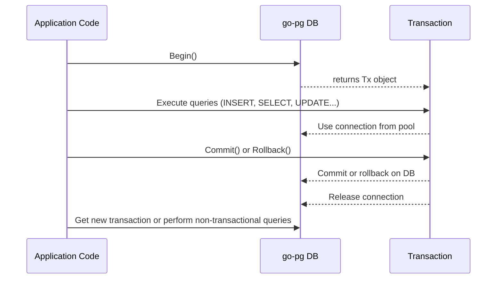

# Managing Transactions with go-pg

Managing transactions effectively is vital for maintaining data consistency and integrity in your PostgreSQL applications. This guide walks you through how to wrap your database operations in transactions using go-pg, covering how to start, commit, rollback, and nest transactions, alongside best practices for error handling.

---

## 1. Why Use Transactions?

A transaction groups multiple database operations into a single unit of work. All operations in a transaction either succeed together or fail together, preserving data consistency:

- **Commit**: Permanently apply changes if all operations succeed.
- **Rollback**: Revert all changes if any operation fails.

In go-pg, transactions help you avoid data anomalies during concurrent writes and provide a mechanism for safe error recovery.

---

## 2. Prerequisites

Before starting:

- Have a working go-pg database connection (`*pg.DB`).
- Understand basic SQL operations.
- Ensure your environment supports context usage for better control and timeout handling.

---

## 3. Expected Outcome

By following this guide, you'll learn to:

- Begin and manage transactions explicitly.
- Use convenience methods for transaction workflows.
- Implement nested transactions safely.
- Handle errors effectively to prevent data inconsistencies.

---

## 4. Step-by-Step Instructions

### Starting a Transaction

You can begin a transaction explicitly:

```go
tx, err := db.Begin()
if err != nil {
    // Handle error
}
```

- This returns a `*pg.Tx` that wraps all operations within the transaction.
- Most users benefit from the `RunInTransaction` method instead for simplicity.

### Committing a Transaction

After completing all operations successfully:

```go
err = tx.Commit()
if err != nil {
    // Handle commit error
}
```

- Commit saves all changes permanently.
- After commit, the transaction is closed and unusable.

### Rolling Back a Transaction

If an operation fails or you need to undo changes:

```go
err = tx.Rollback()
if err != nil {
    // Handle rollback error
}
```

- Rollback cancels all changes made in the transaction.
- It is safe to call rollback multiple times; subsequent calls after commit or rollback return an error.

### Using RunInTransaction to Simplify Flow

`RunInTransaction` wraps your operations in a transaction and automatically commits or rolls back based on errors.

```go
er := db.RunInTransaction(ctx, func(tx *pg.Tx) error {
    // Use tx for all queries

    var count int
    _, err := tx.QueryOne(pg.Scan(&count), `SELECT count FROM my_table WHERE id = ?`, 1)
    if err != nil {
        return err // triggers rollback
    }

    _, err = tx.Exec(`UPDATE my_table SET count = ? WHERE id = ?`, count+1, 1)
    return err // commit if nil
})

if err != nil {
    // Handle transaction error
}
```

- This guarantees rollback on function error or panic.
- It prevents forgetting to commit or rollback.

### Nesting Transactions

- In go-pg, calling `Begin()` on a transaction (`*pg.Tx`) returns the same transaction object instead of creating a new nested transaction.
- Nested transactions are not supported as separate savepoints.
- To simulate nested commits, you must manage savepoints manually at the SQL level (not covered here).

### Preparing Statements Within Transactions

To optimize repeated queries inside transactions, prepare statements explicitly:

```go
stmt, err := tx.Prepare(`SELECT * FROM users WHERE id = ?`)
if err != nil {
    return err
}
defer stmt.Close()

var user User
_, err = stmt.QueryOne(pg.Scan(&user), userId)
if err != nil {
    return err
}
```

- Statements belong to the transaction’s lifecycle and close automatically on commit or rollback.

### Using CopyFrom within Transactions

Transactions support bulk data copying using `CopyFrom`:

```go
r := strings.NewReader("hello\t5\nworld\t5\n")
res, err := tx.CopyFrom(r, "COPY my_table FROM STDIN")
if err != nil {
    return err
}

fmt.Printf("Copied %d rows\n", res.RowsAffected())
```

- Errors during bulk operations trigger rollback upon committing.

---

## 5. Real-World Example

Below is a full example demonstrating transaction usage including error handling:

```go
func incrementCounter(db *pg.DB) error {
    return db.RunInTransaction(context.Background(), func(tx *pg.Tx) error {
        var counter int
        _, err := tx.QueryOne( pg.Scan(&counter), `SELECT counter FROM counters FOR UPDATE`)
        if err != nil {
            return err
        }

        counter++

        _, err = tx.Exec(`UPDATE counters SET counter = ?`, counter)
        if err != nil {
            return err
        }

        return nil // transaction commits here
    })
}
```

- The function increments a counter safely within a transaction.
- The `FOR UPDATE` lock ensures no concurrent modifications occur.
- Errors within the closure cause the transaction to rollback.

---

## 6. Best Practices

- **Prefer `RunInTransaction`**: It abstracts commit/rollback and handles panics.
- **Use context for cancellation and timeouts**: Pass `context.Context` for responsive and controllable transactions.
- **Avoid explicit nesting** since go-pg transactions do not support nested state.
- **Handle transaction errors explicitly**, especially commit errors which might indicate connection problems.
- **Close prepared statements** to free resources, although they auto-close on commit/rollback.

---

## 7. Common Pitfalls

<Tip>
- Forgetting to call `Commit()` or `Rollback()` leaves transactions open and locks held.
- Reusing committed or rolled back transactions causes errors `pg: transaction has already been committed or rolled back`.
- Relying on nested transactions which go-pg doesn’t support natively.
- Ignoring context cancellation can cause transactions to hang.
</Tip>

<Warning>
If a transaction encounters an error during execution, the transaction is considered failed and must be rolled back. Committing a failed transaction will also result in rollback behind the scenes.
</Warning>

---

## 8. Troubleshooting

### Transaction Already Closed Error

Occurs if you try to reuse a transaction after commit or rollback:

- **Fix:** Always create new transactions with `db.Begin()` or use `RunInTransaction`.

### Transactions Not Committing

- Check for errors returned from `Commit()`.
- Verify your context is not cancelled before commit.

### Deadlocks or Long-Running Locks

- Ensure all transactions are properly closed.
- Use shorter transactions and lock rows only when necessary.

### Handling Bulk Copy Errors

- If `CopyFrom` fails, the whole transaction fails. Rollback is automatic with `RunInTransaction`.

---

## 9. Next Steps & Related Content

- Explore [Defining Models and Basic CRUD](/guides/getting-started/define-models-crud) to combine ORM with transactions.
- Learn about connection and pool management for efficient resource use in [Connection Pooling and Reliability](/guides/performance-best-practices/connection-pooling).
- Deepen your understanding of context and timeout management in [Timeouts, Error Handling, and Context Usage](/guides/performance-best-practices/error-handling-ctx).
- For advanced queries, see [Advanced Queries and Model Relationships](/guides/working-with-data/advanced-queries-relations).

---

## 10. Visual Workflow of a Typical Transaction



This sequence illustrates starting a transaction, performing queries using the transaction object, committing or rolling back, and releasing resources.

---

## 11. Reference Examples from go-pg Source

- Begin and Commit:

```go
func ExampleDB_Begin() {
    tx, err := db.Begin()
    if err != nil {
        panic(err)
    }
    defer tx.Rollback() // rollback if not committed

    // transactional work
    err = tx.Commit()
    if err != nil {
        panic(err)
    }
}
```

- RunInTransaction with automatic handling:

```go
err := db.RunInTransaction(ctx, func(tx *pg.Tx) error {
    _, err := tx.Exec("UPDATE ...")
    return err
})

if err != nil {
    // handle rollback
}
```

- Bulk CopyFrom:

```go
r := strings.NewReader("hello\t5\nworld\t5\n")
res, err := tx.CopyFrom(r, "COPY test_table FROM STDIN")
if err != nil {
    return err
}
fmt.Println(res.RowsAffected())
```