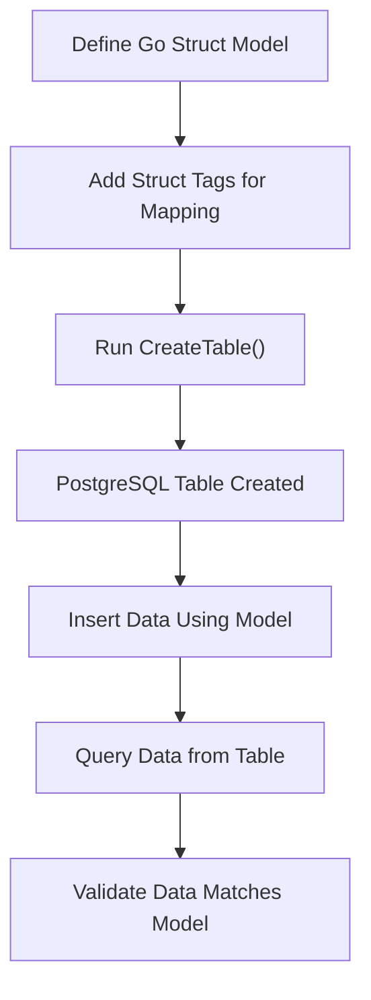

# Defining Models and Mapping to Tables

## Workflow Overview

### What You Will Achieve
This guide helps you define Go structs as models for PostgreSQL tables using go-pg. You will learn how to map struct fields to table columns, customize that mapping with struct tags, handle zero values for nullable and non-nullable fields, and create tables automatically from your Go models.

### Prerequisites
- A working Go project with go-pg integrated (see [Installation and Setup](/guides/getting-started/installation-setup))
- A live connection to your PostgreSQL database
- Basic knowledge of Go structs and PostgreSQL tables

### Outcome
By following this guide, you'll be able to:
- Define Go structs that represent PostgreSQL tables
- Use struct tags to customize field-to-column mappings
- Use go-pg to automatically generate tables matching your models
- Understand zero-value handling for fields mapped to SQL `NULL`

### Estimated Time
Approximately 15-20 minutes

### Difficulty Level
Beginner to Intermediate

---

## Step-by-Step Instructions

### 1. Define a Go Struct as a Model
Start by declaring a Go struct representing your data model. Each struct corresponds to a PostgreSQL table, and each struct field corresponds to a column.

```go
// User represents a database user model mapped to a table.
type User struct {
    Id     int64    // primary key
    Name   string   // simple text column
    Emails []string `pg:",array"` // stored as PostgreSQL array
}
```

#### Action
- Define struct fields with appropriate Go types.
- Use []type with `pg:",array"` tag to represent PostgreSQL arrays.

#### Expected Result
Your struct now models a PostgreSQL table structure.

---

### 2. Customize Field Mapping with Struct Tags
go-pg uses struct tags to control how fields map to columns.

Common tags:
- `pg:"column_name"`: maps a field to a specific column name.
- `pg:",array"`: marks a slice as a PostgreSQL array type.
- `pg:",notnull"`: prevents marshaling Go zero value into SQL NULL
- `pg:",use_zero"`: stores zero values instead of NULL
- `pg:"rel:has-one"` / `pg:"rel:has-many"`: defines relationships

Example:
```go
type Story struct {
    Id       int64
    Title    string
    AuthorId int64               `pg:"author_id,notnull"`
    Author   *User               `pg:"rel:has-one"`
}
```

#### Action
- Add tags to specify key constraints and relationship metadata.
- Use `notnull` to enforce column non-null constraints.

#### Expected Result
The ORM understands special attributes and constraints from your tags.

---

### 3. Handle Zero Values and Nullability
By default, go-pg treats zero values as SQL `NULL`.

Use these tags to adjust this:
- `notnull`: Field must have a value, zero value is NOT accepted.
- `use_zero`: Store Go zero value directly into the database instead of NULL.

Example:
```go
type Product struct {
    Id    int64
    Price float64   `pg:",use_zero"`
}
```

#### Action
- Decide if a field should allow NULL or always store zero values.

#### Potential Pitfall
Without `use_zero`, zero floats/ints/strings become SQL NULL, which may cause unexpected database behavior.

---

### 4. Create Tables from Models
go-pg can automatically create tables from your defined structs.

Use `Model(model).CreateTable()` API with options:
- `Temp`: creates a temporary table
- `FKConstraints`: enables foreign key constraints

Example:
```go
func createSchema(db *pg.DB) error {
    models := []interface{}{(*User)(nil), (*Story)(nil)}
    for _, model := range models {
        err := db.Model(model).CreateTable(&orm.CreateTableOptions{
            Temp:          true,
            FKConstraints: true,
        })
        if err != nil {
            return err
        }
    }
    return nil
}
```

#### Action
- Call `CreateTable` with your model list to generate tables.

#### Expected Result
Your PostgreSQL database now contains tables matching your Go models.

---

### 5. Test Your Model Mapping
Insert and retrieve data to verify your model definitions.

Example:
```go
user := &User{Name: "admin", Emails: []string{"admin1@admin", "admin2@admin"}}
_, err := db.Model(user).Insert()
if err != nil {
    panic(err)
}

retrievedUser := &User{Id: user.Id}
err = db.Model(retrievedUser).WherePK().Select()
if err != nil {
    panic(err)
}
fmt.Println(retrievedUser)
```

#### Action
- Insert sample data using your models.
- Query by primary key to verify data integrity.

#### Expected Outcome
Model-to-table mapping works, and data round-trip is successful.

---

## Practical Examples

### Defining Models with Relationships
```go
type User struct {
    Id    int64
    Name  string
    Emails []string `pg:",array"`
}

type Story struct {
    Id       int64
    Title    string
    AuthorId int64      `pg:"author_id,notnull"`
    Author   *User      `pg:"rel:has-one"`
}
```

### Creating the Schema
```go
err := createSchema(db)
if err != nil {
    panic(err)
}
```

### Inserting and Querying Models
```go
user := &User{Name: "admin", Emails: []string{"admin1@admin"}}
_, err = db.Model(user).Insert()

story := &Story{Title: "Cool story", AuthorId: user.Id}
_, err = db.Model(story).Insert()

var storyWithAuthor Story
err = db.Model(&storyWithAuthor).Relation("Author").Where("story.id = ?", story.Id).Select()
fmt.Println(storyWithAuthor.Author.Name)
```

---

## Troubleshooting & Tips

<AccordionGroup title="Common Issues and Solutions">
<Accordion title="Table Not Created as Expected">
- Ensure `CreateTable` is called with the correct options.
- Verify that your Go structs are properly exported and fields are public.
- Confirm no conflicting database entities exist that prevent table creation.
</Accordion>
<Accordion title="Zero Values Stored as NULL Unexpectedly">
- Add the `pg:",use_zero"` tag to fields to force zero values to be stored.
- Understand the default zero-to-NULL mapping and adjust as per your schema needs.
</Accordion>
<Accordion title="Array Fields Are Not Persisting Correctly">
- Use `pg:",array"` tag on slice fields.
- Confirm the PostgreSQL column type is array (e.g., `text[]`).
</Accordion>
<Accordion title="Foreign Key Constraints Not Applied">
- Pass `FKConstraints: true` in `CreateTableOptions`.
- Make sure related fields use proper tags (e.g., `rel:has-one`).
</Accordion>
</AccordionGroup>

### Best Practices
- Always explicitly tag fields for relationships to enable join queries.
- Use temporary tables (`Temp: true`) only for session-scoped testing.
- Review generated schema for compliance with your database design.
- Leverage primary key and unique constraints through struct tags.

---

## Next Steps & Related Documentation

- [Connecting to PostgreSQL](/getting-started/basic-usage/initial-connection): Establish your database connection
- [Performing Basic Queries (CRUD)](/guides/getting-started/basic-crud-workflows): Learn how to work with your models
- [Working with Associations](/guides/advanced-orm-patterns/working-with-associations): Handle complex relationships
- [Custom Postgres Types](/guides/advanced-orm-patterns/custom-types-arrays-hstore): Extend model support with arrays and composite types

Explore the [Example Workflows](https://github.com/go-pg/pg/blob/main/example_test.go) for hands-on reference.

---

## Summary Diagram: Model to Table Workflow


---

This comprehensive guide empowers you to translate your Go structs into managed database tables with go-pg, streamlining development and ensuring your data Access Layer aligns perfectly with your PostgreSQL schema.