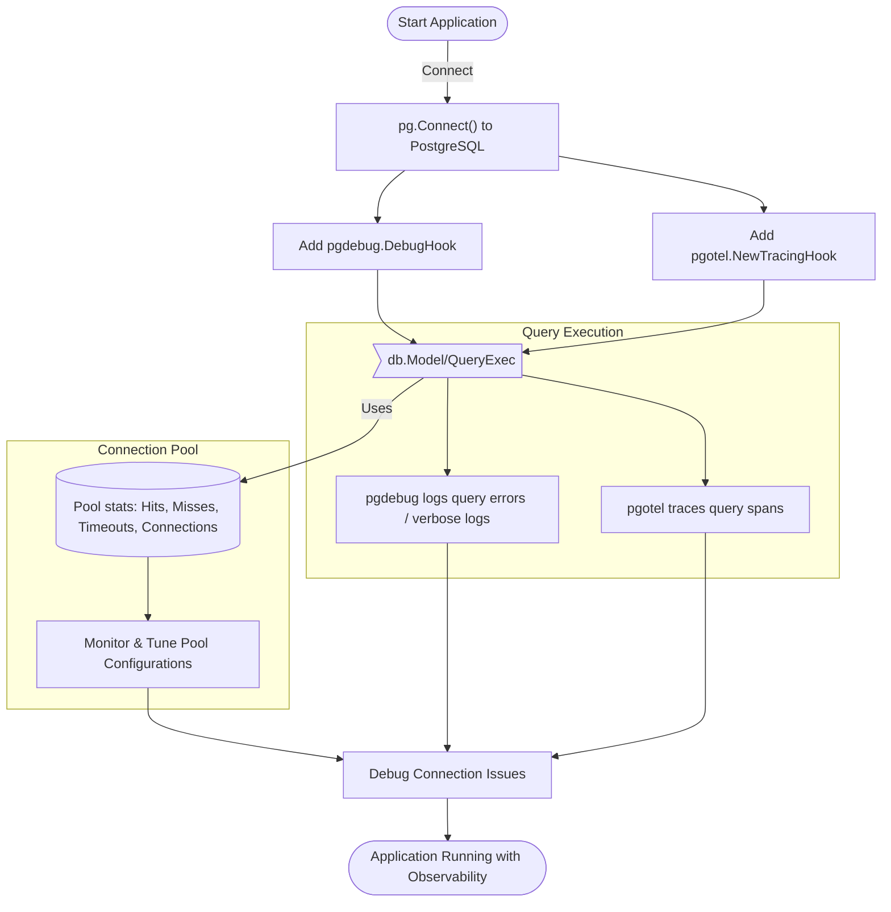

# Debugging and Observability with go-pg

## Overview
This guide helps you leverage built-in and external observability tools to monitor, debug, and trace your go-pg database interactions. You'll learn how to enable query logging, integrate with tracing providers like OpenTelemetry, understand connection pool stats, and apply best practices for diagnosing complex workflows.

By following this guide, you'll improve your visibility into go-pg's operation and be equipped to efficiently troubleshoot and optimize your PostgreSQL usage with go-pg.

---

## Prerequisites
- Familiarity with basic go-pg usage, including connecting to PostgreSQL and executing queries.
- A working Go development environment with go-pg installed.
- Access to your PostgreSQL instance for testing and verifying queries.
- For tracing integration, familiarity with OpenTelemetry and an exporter setup is helpful.

---

## Expected Outcome
- Enable and configure built-in query debugging hooks.
- Integrate OpenTelemetry tracing into go-pg for detailed query spans.
- Understand how to monitor connection pool statistics.
- Gain confidence in identifying and solving common debugging and observability challenges.

---

## Time Estimate
~15-30 minutes to implement basic debugging and observability features.

---

## Difficulty Level
Intermediate – requires some knowledge of Go tooling and PostgreSQL.

---

## 1. Enable Basic Query Debugging with `pgdebug.DebugHook`

### Purpose
Sometimes queries produce errors or unexpected behavior. The `pgdebug.DebugHook` allows you to log SQL statements and associated errors directly to the console.

### Steps
<Steps>
<Step title="Import the DebugHook">
Add the `pgdebug` package to your imports:
```go
import "github.com/go-pg/pg/extra/pgdebug"
```
</Step>
<Step title="Create and add the DebugHook to your DB">
```go
db := pg.Connect(&pg.Options{...})
db.AddQueryHook(pgdebug.NewDebugHook())
```
This hook logs only queries that result in errors by default.
</Step>
<Step title="Enable verbose query logging (optional)">
If you want to log all queries, set the hook's `Verbose` flag:

```go
hook := pgdebug.NewDebugHook()
hook.Verbose = true
hook.EmptyLine = true  // adds spacing between queries

db.AddQueryHook(hook)
```
</Step>
<Step title="Run your application and observe output">
When queries execute, errors and optionally all executed SQL commands will print to stdout.
</Step>
</Steps>

### Results
- Error messages with query context printed.
- Optionally, a full log of queries for troubleshooting.

---

## 2. Integrate OpenTelemetry Tracing with `pgotel`

### Purpose
Gaining full tracing visibility helps understand query performance, latency, and error propagation within distributed systems.

### Setup
1. Install the `pgotel` package:

```bash
go get github.com/go-pg/pg/extra/pgotel/v10
```

2. Add the tracing hook to your database:

```go
import (
	"github.com/go-pg/pg/v10"
	"github.com/go-pg/pg/extra/pgotel/v10"
)

func main() {
	db := pg.Connect(&pg.Options{...})
	defer db.Close()

	db.AddQueryHook(pgotel.NewTracingHook())
	// ... your code
}
```

### Customizing Tracing
The `pgotel` hook automatically captures:
- Query text with reasonable length limits.
- Query operation type (SELECT, INSERT, UPDATE, etc.) as span names.
- Errors during query execution.
- Database connection metadata (host, user, database name).
- Caller function, file, and line for context.

Refer to the [pgotel README](https://github.com/go-pg/pg/blob/main/extra/pgotel/README.md) for advanced setup.

### Example: Tracing with console exporter

See the [`extra/pgotel/example/main.go`](https://github.com/go-pg/pg/blob/main/extra/pgotel/example/main.go) for a complete example that outputs trace spans to stdout.

---

## 3. Inspecting Connection Pool Metrics

Understanding connection pool behavior helps diagnose performance bottlenecks and resource exhaustion.

### Accessing Pool Stats

Use the connection pool's `Stats()` method to view metrics like:
- Hits: successful reuse of idle connections.
- Misses: new connections created due to none idle.
- Timeouts: requests waiting too long for a free connection.
- Total, idle, and stale connection counts.

### Example
```go
stats := db.Pool().Stats()
fmt.Printf("Pool Hits: %d\n", stats.Hits)
fmt.Printf("Pool Misses: %d\n", stats.Misses)
fmt.Printf("Pool Timeouts: %d\n", stats.Timeouts)
fmt.Printf("Total Connections: %d\n", stats.TotalConns)
fmt.Printf("Idle Connections: %d\n", stats.IdleConns)
```

### Best Practices
- Tune pool parameters (e.g., `PoolSize`, `MinIdleConns`, `IdleTimeout`) based on workload.
- Monitor timeouts as signals for pool saturation.
- Use these stats combined with query tracing for full observability.

For detailed pooling configuration, see the [Connection Pooling and Performance Tuning guide](/guides/real-world-integration-patterns/performance-pooling).

---

## 4. Best Practices for Debugging Complex Workflows

### Use Context Cancellation and Timeouts
Leverage `context.Context` when executing queries to control timeouts and cancellations gracefully.

Example:
```go
ctx, cancel := context.WithTimeout(context.Background(), time.Second*2)
defer cancel()
err := db.Ping(ctx)
if err != nil {
    // Handle timeout or errors
}
```

### Add Query Hooks Strategically
Combine `pgdebug` logging and `pgotel` tracing to capture errors and performance data.

### Correlate Logs and Traces
Ensure your application logs include trace IDs or contextual information for easy correlation with observability backends.

### Debugging Common Issues
- Check connection pool stats to identify saturation or leaks.
- Enable verbose query logging on staging environments.
- Use OpenTelemetry spans to track slow queries and visualize dependencies.

<Tip>
When debugging, avoid enabling verbose logging in production due to performance and sensitive data exposure risks. Use tracing to gather lightweight performance metrics instead.
</Tip>

---

## 5. Troubleshooting

<AccordionGroup title="Common Issues and Solutions">
<Accordion title="Queries Not Logging with DebugHook">
- Ensure the DebugHook is added before executing queries.
- Verify `Verbose` is set to `true` if you want all queries.
- Check your standard output or error stream for messages.
</Accordion>
<Accordion title="No Traces Appear When Using pgotel">
- Confirm OpenTelemetry setup in your app includes a tracer provider and exporter.
- Check that `span.IsRecording()` returns true in your context.
- Make sure the QueryHook is properly registered with the database.
- Verify instrumentation context is passed down in your DB calls.
</Accordion>
<Accordion title="Connection Pool Under Pressure or Timeouts">
- Increase `PoolSize` or decrease connection hold time.
- Check for long-running queries or connections not properly released.
- Use `IdleTimeout` and `MaxConnAge` to recycle stale connections.
- Monitor pool stats periodically.
</Accordion>
<Accordion title="Sensitive Data Exposure in Logs">
- Disable verbose logging in production or sanitize sensitive parameters.
- Prefer tracing systems with access controls.
</Accordion>
</AccordionGroup>

---

## 6. Additional Resources

- [pgdebug DebugHook Source and Examples](https://github.com/go-pg/pg/blob/main/extra/pgdebug/pgdebug.go)
- [pgotel OpenTelemetry Hook Repository](https://github.com/go-pg/pg/tree/main/extra/pgotel)
- [OpenTelemetry Instrumentation Guide](https://pg.uptrace.dev/tracing/)
- [Connection Pooling Guide](/guides/real-world-integration-patterns/performance-pooling)
- [Error Handling & Status Codes](/api-reference/common-operations-examples/error-handling-status-codes)

---

## 7. Summary Diagram



---

Feel confident adopting go-pg's observability features to monitor, debug, and trace your database interactions effectively. From simple error logging to full distributed tracing, this guide equips you with actionable tools and workflows to maintain healthy and performant PostgreSQL integrations.
