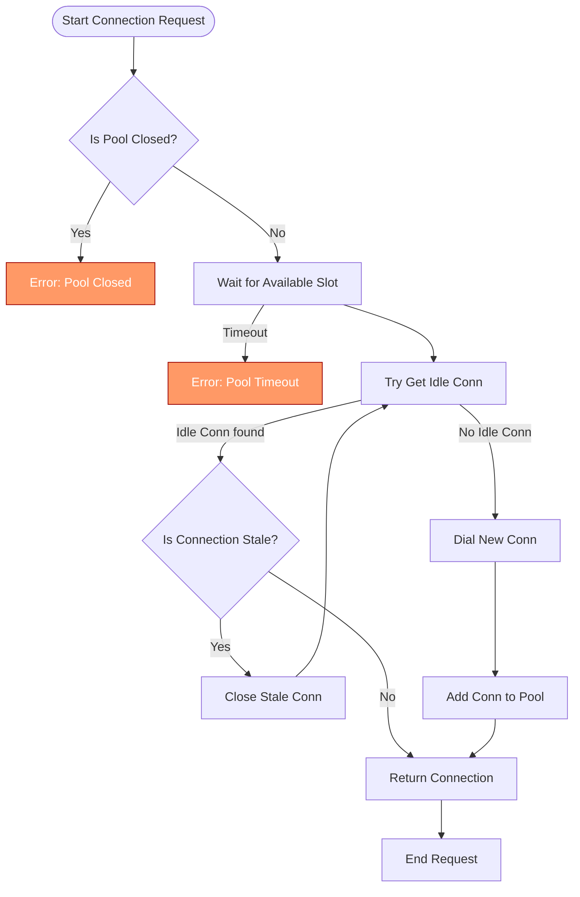

# Connection Pooling and Performance Tuning

Optimize your use of go-pg's connection pooling to achieve efficient, scalable, and reliable database interactions in high-concurrency Go applications. This guide focuses specifically on connection pool configuration, timeout management, and performance best practices within go-pg's pooling subsystem.

---

## 1. Overview of Connection Pooling in go-pg

### Purpose
This guide helps you understand and optimize go-pg's connection pooling mechanisms to improve your application's throughput and stability when accessing PostgreSQL databases.

### What You Will Learn
- How to configure pool size and idle connections for your workload
- Managing connection timeouts and retry behaviors
- Understanding pool lifecycle and stale connection cleanup
- Best practices to prevent resource exhaustion and latency spikes

### Prerequisites
- Familiarity with basic go-pg usage and database connections
- PostgreSQL server accessible and properly configured
- Go development environment setup with go-pg v10 imported

### Estimated Time
10-20 minutes for reading and implementing recommended settings

---

## 2. Core Concepts of go-pg Connection Pooling

The connection pool manages a set of reusable database connections to reduce overhead in establishing connections repeatedly. go-pg offers several pool implementations:

- **ConnPool**: The standard connection pool implementing pooling logic with configurable size limits, idle timeout, and automatic stale connection reaping.
- **StickyConnPool**: Wraps another pool imposing a "sticky" single-connection usage pattern.
- **SingleConnPool**: Wraps a single connection for exclusive use.

### Key Pool Features
- **PoolSize**: Maximum number of concurrent connections allowed.
- **MinIdleConns**: Minimum idle connections maintained to reduce acquisition latency.
- **IdleTimeout**: Duration after which idle connections are considered stale and closed.
- **MaxConnAge**: Maximum age of a connection before it is recycled, even if active.
- **PoolTimeout**: Maximum time to wait for a connection to become available before returning an error.

---

## 3. Step-By-Step Best Practices for Connection Pool Configuration

<Steps>
<Step title="1. Set an Appropriate Pool Size">
Adjust the `PoolSize` option based on your load and PostgreSQL server capabilities:
- Set `PoolSize` to a value balancing concurrency without overwhelming the database.
- Typical values range from 5 to 100 depending on system resources.
- The pool limits simultaneous open connections to avoid saturation.

_Example:_
```go
pool := pool.NewConnPool(&pool.Options{
  Dialer: dummyDialer,
  PoolSize: 20, // max 20 concurrent connections
  PoolTimeout: 30 * time.Second,
})
```
</Step>
<Step title="2. Configure Minimum Idle Connections">
Enable the `MinIdleConns` option to keep a warm pool of idle connections ready:
- Helps reduce latency for connection acquisition.
- Prevents spikes caused by dialing new connections under load.

_Best practice:_
- Set `MinIdleConns` between 10-30% of `PoolSize`.

```go
pool := pool.NewConnPool(&pool.Options{
  
  MinIdleConns: 5, // keep 5 idle connections ready
})
```
</Step>
<Step title="3. Use IdleTimeout to Reap Stale Connections">
Set `IdleTimeout` to automatically close connections idle beyond a certain duration:
- Prevents resource leakage and stale TCP connections.
- Recommended values from 5 minutes to 30 minutes.

```go
pool := pool.NewConnPool(&pool.Options{
  IdleTimeout: 10 * time.Minute,
  IdleCheckFrequency: 1 * time.Minute,
})
```
</Step>
<Step title="4. Limit Connection Lifespan with MaxConnAge">
Use `MaxConnAge` to recycle connections that have been alive for too long:
- Helps avoid issues with long-lived connections (network glitches, server-side closures).

Example:
```go
pool := pool.NewConnPool(&pool.Options{
  MaxConnAge: 1 * time.Hour,
})
```
</Step>
<Step title="5. Set PoolTimeout to Control Client Wait Time">
Define how long your application waits for a connection before timing out:
- Prevents goroutine or request hangups when pool is saturated.
- Use conservative timeout values aligned with HTTP/gRPC request deadlines.

```go
pool := pool.NewConnPool(&pool.Options{
  PoolTimeout: 5 * time.Second,
})
```
</Step>
<Step title="6. Handle Dial Errors with Retry Logic">
Ensure your Dialer function handles errors gracefully and the pool retries connection dials:
- go-pg internally tracks dial errors and retries with backoff.
- Monitor dial error counts to detect persistent connectivity issues.
</Step>
<Step title="7. Properly Close Connections to Return Them to the Pool">
Always return connections back to the pool using `Put` instead of closing:
- Directly closing drops the connection and reduces pool efficiency.
- Use `Remove` to discard a bad connection.
</Step>
</Steps>

---

## 4. Practical Examples

### Creating and Configuring a Connection Pool
```go
ctx := context.Background()
connPool := pool.NewConnPool(&pool.Options{
  Dialer: func(ctx context.Context) (net.Conn, error) {
    // Dial your PostgreSQL server
    return net.Dial("tcp", "localhost:5432")
  },
  PoolSize: 30,
  MinIdleConns: 5,
  PoolTimeout: 10 * time.Second,
  IdleTimeout: 15 * time.Minute,
  IdleCheckFrequency: 1 * time.Minute,
  MaxConnAge: 30 * time.Minute,
})

// Acquire connection
conn, err := connPool.Get(ctx)
if err != nil {
  log.Fatalf("Failed to get connection: %v", err)
}

// Use the connection
// ...

// Return connection to pool
connPool.Put(ctx, conn)
```

### Handling Connection Retrieval Timeout
```go
ctx, cancel := context.WithTimeout(context.Background(), 3*time.Second)
defer cancel()

conn, err := connPool.Get(ctx)
if err != nil {
  if errors.Is(err, pool.ErrPoolTimeout) {
    // Connection pool timeout: handle gracefully
    log.Println("Connection acquisition timed out")
  } else {
    log.Fatalf("Failed to get connection: %v", err)
  }
}
```

---

## 5. Troubleshooting Common Connection Pool Issues

<AccordionGroup title="Troubleshooting Connection Pool Issues">
<Accordion title="Connection Pool Timeout Errors">
**Cause:** All connections in the pool are busy; new connection requests are waiting longer than `PoolTimeout`.

**Solution:**
- Increase `PoolSize` to handle more concurrent requests.
- Optimize queries and transactions to hold connections shorter.
- Use `MinIdleConns` to keep ready connections.
- Check for goroutine leaks or connection leaks.
</Accordion>
<Accordion title="Unexpected Connection Drops or Errors">
**Cause:** Network instability, PostgreSQL server disconnections, or stale connections.

**Solution:**
- Configure `IdleTimeout` and `MaxConnAge` to automatically recycle connections.
- Implement retry logic at query/execution level.
- Monitor dial errors logged by the pool.
</Accordion>
<Accordion title="Connection Leak (Pool Exhaustion) Symptoms">
**Cause:** Connections acquired but never returned to the pool.

**Solution:**
- Ensure every `Get` is matched with a `Put` or `Remove`.
- Use defer to guarantee `Put` in all code paths.
- Audit code to prevent holding connections longer than necessary.
</Accordion>
<Accordion title="Pool Size Not Being Respected">
**Cause:** Concurrent code might be creating new connections outside the pool limits.

**Solution:**
- Verify use of provided `ConnPool` instance.
- Avoid manual dialing outside the pool.
- Confirm pool `PoolSize` configuration.
</Accordion>
</AccordionGroup>

---

## 6. Performance Tips & Optimization

- **Monitor Pool Stats:** Use `Stats()` to track hits, misses, timeouts, idle and total connections.
- **Tune `MinIdleConns`:** Keeping a small number ready reduces latency for burst requests.
- **Shorten `IdleTimeout`** in dynamic environments to free unused connections.
- **Avoid Long-Lived Transactions:** Hold connections shortest possible to improve reuse.
- **Use Connection Reaper:** The pool can automatically reap stale connections using `IdleCheckFrequency`.
- **Profile Pool Usage:** Use benchmarks and stress tests (see internal tests) to profile under production-like load.

---

## 7. Related Topics and Next Steps

- Explore **[Managing Transactions and Prepared Statements](/guides/real-world-integration-patterns/transaction-management)** for tightly controlled connection usage.
- Learn about **[Error Handling & Status Codes](/api-reference/common-operations-examples/error-handling-status-codes)** to better handle connection and query errors.
- Review **Overview: Architecture & Core Concepts** to understand pooling within the overall go-pg architecture.

---

## 8. Connection Pooling Flow Diagram



---

## 9. Additional Notes

<Tip>
Always match each `Get` call on the connection pool with a `Put` or `Remove` to properly manage connection lifecycle.
</Tip>

<Note>
Connection pools improve performance by reusing connections; improper usage can cause resource exhaustion and latency.
</Note>

<Warning>
Avoid setting pool sizes too high, which can overload database and cause connection refusals or latency spikes.
</Warning>

---

## 10. Resources

- go-pg GitHub Repository: [https://github.com/go-pg/pg](https://github.com/go-pg/pg)
- PostgreSQL Connection Pooling Concepts: https://www.postgresql.org/docs/current/runtime-config-connection.html
- Related Documentation:
  - [Architecture Overview](/overview/architecture-and-core-concepts/architecture-overview)
  - [Quickstart & Example Workflows](/overview/feature-preview-quickstart/quickstart-examples)
  - [Transaction Management Guide](/guides/real-world-integration-patterns/transaction-management)
  - [Error Handling & Status Codes](/api-reference/common-operations-examples/error-handling-status-codes)
