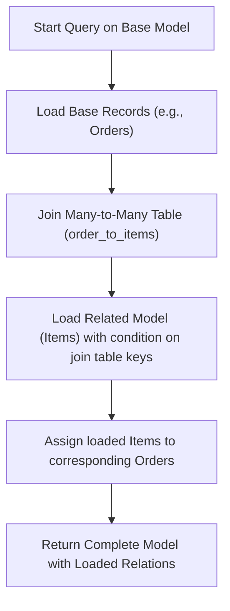

# Advanced Queries and Model Relationships

Explore go-pg’s powerful query builder to perform complex filtering, sorting, and loading of related records using ORM model relationships. This guide focuses on advanced querying techniques and relationship mappings, including one-to-many and many-to-many associations, enabling you to efficiently retrieve and navigate associated data sets.

---

## 1. What You Can Achieve Here

- Construct advanced queries with nested relations and join conditions.
- Load related data for `has one`, `belongs to`, `has many`, and `many to many` ORM associations.
- Sort and filter nested relations for precise data retrieval.
- Understand how go-pg manages joins and relationship navigation internally.


## 2. Prerequisites

- A working go-pg setup connected to a PostgreSQL database (see installation and configuration guides).
- Defined Go struct models with correct ORM tags representing your data schema.
- Familiarity with basic CRUD operations and simple model querying in go-pg.


## 3. Expected Outcome

By following this guide, you will be able to:

- Efficiently query models with complex filters on related entities.
- Navigate and fetch nested related records in one or multiple queries.
- Implement many-to-many relationships with proper join handling.
- Apply custom sorting and filtering on relations.


## 4. Time Estimate

Allow approximately 20-40 minutes to complete this guide and experiment with examples in your environment.


---

## Step-by-Step Guide to Advanced Queries and Model Relationships

### Understanding ORM Relationships in go-pg

go-pg supports several relation types by default:

- **Has One (`has-one`)**: One-to-one relationship. Example: Each Story has one Author.
- **Belongs To (`belongs-to`)**: Inverse of Has One. Example: Each Story belongs to an Author.
- **Has Many (`has-many`)**: One-to-many. Example: A User has many Orders.
- **Many to Many (`many2many`)**: Models linked via a join table. Example: Orders linked to Items via OrderToItem.

Refer to the built-in relation types in the [`Relation` struct](#) which govern these associations.


### 1. Querying Has One and Belongs To Relations

Use `Relation` to load these related records with optional query adjustments.

```go
err := db.Model(story).
    Relation("Author").
    Where("story.id = ?", storyId).
    Select()
```

- This fetches a `Story` and its associated `Author` in one query with a SQL LEFT JOIN.
- Use `Relation(name, applyFunc)` to customize the nested query, e.g., sorting or filtering.


### 2. Querying Has Many Relations

For one-to-many relations, use `Relation` similarly but expect a slice of results.

```go
user := new(User)
err := db.Model(user).
    Relation("Orders", func(q *pg.Query) (*pg.Query, error) {
        q = q.Order("orders.created_at DESC")
        return q, nil
    }).
    First()
```

- Here, `Orders` is a slice field in `User` representing the has-many relation.
- Nested query applies an order by clause on the related orders.


### 3. Querying Many-to-Many Relations

Many-to-many relations require a join table and registration of that join model for optimal ORM behavior.

```go
// Define the join model and register early
orm.RegisterTable((*OrderToItem)(nil))

// Model definitions

type Order struct {
    Id    int
    Items []Item `pg:"many2many:order_to_items"`
}

type Item struct {
    Id int
}

type OrderToItem struct {
    OrderId int
    ItemId  int
}

// Query example
order := new(Order)
err := db.Model(order).
    Relation("Items", func(q *pg.Query) (*pg.Query, error) {
        return q.Order("item.id DESC"), nil
    }).
    First()
```

- go-pg generates the appropriate JOIN between `orders`, `order_to_items`, and `items` tables.
- Sorting is applied on the joined `items`.


### 4. Using Join Conditions and Custom Foreign Keys

You can supply custom join keys and foreign keys via struct tags to define relations precisely.

Example from tests:

```go
type NonPKJoinTest struct {
    // ...
    CustomHasOneKey string       `pg:"custom_has_one_key"`
    CustomHasOne    *HasOneNonPK `pg:"rel:has-one,fk:custom_has_one_key,join_fk:custom_key"`
}
```

The query builder respects these to produce:

```sql
LEFT JOIN "HasOneNonPK" AS "custom_has_one" ON "custom_has_one"."custom_key" = "NonPKJoinTest"."custom_has_one_key"
```


### 5. Filtering and Sorting Nested Relations

Apply filtering or sorting by providing a callback function to `.Relation()`:

```go
err := db.Model(user).
    Relation("Posts", func(q *pg.Query) (*pg.Query, error) {
        return q.Where("posts.published = ?", true).Order("posts.created_at DESC"), nil
    }).
    Select()
```

- This loads only published posts sorted by creation date descending.


### 6. Managing Circular and Nested References

go-pg safely supports models with circular references and multiple-depth nested joins.

Example:

```go
type H struct {
    I *I
}

type I struct {
    H *H
}

// Querying either model is supported without error.
```


### 7. Advanced: Accessing Join Models Internally

While largely internal, understanding go-pg’s join model classes (`manyModel`, `m2mModel`) can help diagnose complex join issues.

- `manyModel` manages has-many relationship scans.
- `m2mModel` manages many-to-many relationship scans with join table handling.


---

## Practical Example: Many-to-Many Queries

```go
package main

import (
    "fmt"
    "github.com/go-pg/pg/v10"
    "github.com/go-pg/pg/v10/orm"
)

type Order struct {
    Id    int
    Items []Item `pg:"many2many:order_to_items"`
}

type Item struct {
    Id int
}

type OrderToItem struct {
    OrderId int
    ItemId  int
}

func main() {
    orm.RegisterTable((*OrderToItem)(nil))

    db := pg.Connect(&pg.Options{
        User: "postgres",
        Addr: "localhost:5432",
    })
    defer db.Close()

    err := createManyToManyTables(db)
    if err != nil {
        panic(err)
    }

    // Insert sample data
    items := []*Item{{Id: 1}, {Id: 2}}
    order := &Order{Id: 1}
    db.Model(items[0]).Insert()
    db.Model(items[1]).Insert()
    db.Model(order).Insert()
    db.Model(&OrderToItem{OrderId: 1, ItemId: 1}).Insert()
    db.Model(&OrderToItem{OrderId: 1, ItemId: 2}).Insert()

    // Query Order with Items
    resultOrder := new(Order)
    err = db.Model(resultOrder).Relation("Items").First()
    if err != nil {
        panic(err)
    }

    fmt.Println("Order ID:", resultOrder.Id)
    fmt.Print("Item IDs:")
    for _, item := range resultOrder.Items {
        fmt.Print(" ", item.Id)
    }
    fmt.Println()
}

func createManyToManyTables(db *pg.DB) error {
    models := []interface{}{(*Order)(nil), (*Item)(nil), (*OrderToItem)(nil)}
    for _, model := range models {
        err := db.Model(model).CreateTable(&orm.CreateTableOptions{Temp: true})
        if err != nil {
            return err
        }
    }
    return nil
}
```

Expected Output:

```
Order ID: 1
Item IDs: 1 2
```

---

## Troubleshooting & Tips

<AccordionGroup title="Common Issues">
<Accordion title="Related Records Not Loading">
Ensure that the relation name passed to `.Relation("name")` matches the struct field’s Go name, respecting case sensitivity. Also verify that the relation is properly defined with relevant ORM tags.
</Accordion>
<Accordion title="Many-to-Many Join Table Not Registered">
Always call `orm.RegisterTable((*YourJoinTable)(nil))` before executing many-to-many queries. Failing to register the join table results in incomplete relation resolution.
</Accordion>
<Accordion title="Sorting on Related Fields Fails">
When sorting on related table columns, specify the correct table alias in the query callback.
Example: `q.OrderExpr("item.id DESC")` for many2many related items.
</Accordion>
</AccordionGroup>

<Tip>
Use the relation callback to apply filters and sorting directly within the nested query rather than post-processing the loaded data.
</Tip>

<Warning>
Be cautious with deeply nested relations as they may result in complex SQL which can impact performance and readability.
</Warning>

---

## Next Steps & Related Guides

- **Defining Models and Basic CRUD:** Learn how to define your data models with ORM tags.
- **Using Arrays, JSONB, and Hstore:** Extend your models to use PostgreSQL advanced data types.
- **Schema Migrations and Table Creation:** Manage tables using go-pg schema tools.
- **Optimizing Queries and Batch Operations:** Tips for improving query performance.
- **Managing Transactions:** Best practices for ensuring data consistency with transactions.

For a thorough understanding of the go-pg ORM system, consider reading the [Core Concepts & Terminology](https://pg.uptrace.dev/overview/product-intro-core-concepts/core-concepts-terminology) and the [Defining Models and Basic CRUD](https://pg.uptrace.dev/guides/getting-started/define-models-crud) guides.

---

## References

- [go-pg ORM Documentation](https://pg.uptrace.dev/)
- [Many-to-Many Relationship Example](https://pkg.go.dev/github.com/go-pg/pg/v10#example-DB_Model_manyToMany)
- [Model Relations and Joins API](https://pkg.go.dev/github.com/go-pg/pg/v10/orm#Relation)

---

## Visual Overview of Many-to-Many Relationship Query Flow



This flow illustrates how go-pg efficiently fetches many-to-many related records by first loading base records, joining through the join table, loading related data, and assembling the result.
