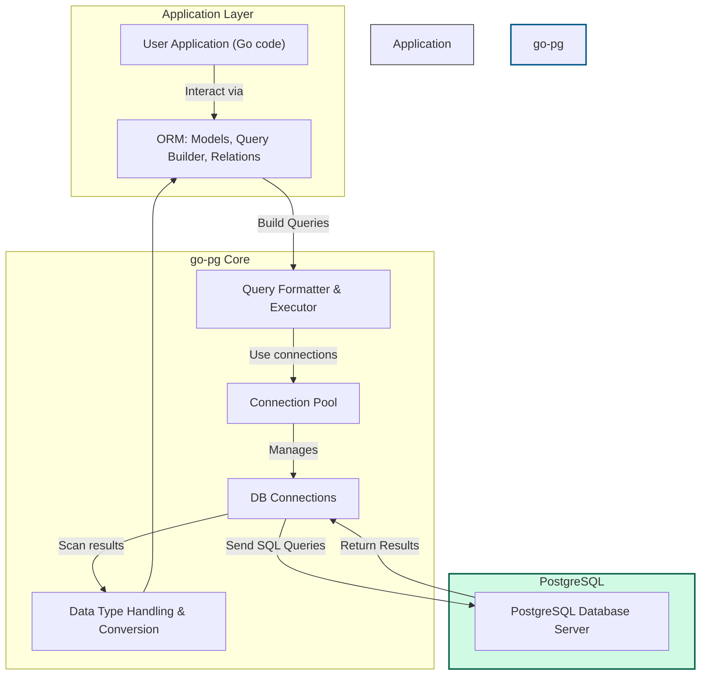

# Architecture Diagram & System Components

Visualize go-pg's high-level architecture and understand how its core components collaborate to deliver a reliable, performant, and flexible PostgreSQL client and ORM for Go applications. This page breaks down the interactions between database connections, connection pooling, ORM layers, and data type handling, providing you clarity about the underlying system to empower your usage and troubleshooting.

---

## Understanding go-pg's Architecture

At its core, go-pg offers an intuitive ORM and SQL interface layered atop a robust PostgreSQL client. The architecture focuses on managing database connections efficiently while enabling powerful model-driven data queries and manipulation.

### Core Components Interaction

- **Database Connections**: go-pg manages a pool of open connections to your PostgreSQL database, ensuring optimal resource usage and minimizing latency.

- **Connection Pooling**: This mechanism automatically controls and reuses active connections, balancing load and retrying queries on network failures to improve reliability.

- **ORM Layer**: Users work primarily with ORM models that abstract SQL tables as Go structs. The ORM handles model definitions, relationships, query building, and result scanning.

- **Data Type Handling**: go-pg supports and translates between PostgreSQL specific types and Go data types, including arrays, JSONB, composite types, and more.

This interplay provides a seamless experience for Go developers, combining power, safety, and efficiency.

## Architecture Workflow: From Query to Result

When you execute a query with go-pg, the sequence is:

1. **Model Query Construction**: You define or chain ORM model queries reflecting the desired data retrieval or manipulation.

2. **Query Formatting**: The ORM assembles the SQL command with appropriate table names, applied filters, joins, and parameters.

3. **Connection Pool Access**: The system fetches an available database connection from the pool. If none are available, it manages wait times and resource allocation.

4. **Query Execution**: The SQL is sent over the connection to the PostgreSQL server.

5. **Result Reading and Scanning**: go-pg reads rows returned from the server and automatically scans them into your Go model structs, including related entities through joins.

6. **Connection Release**: The connection returns to the pool, ready for the next request.

This flow ensures high performance and low latency while hiding complexity.

---

## Key System Components Explained

### 1. Connection Pool

- Manages multiple DB connections for concurrent usage.
- Supports connection reuse, circuit breaking, and retrying queries on failure.
- Ensures a balance between resource limits and application demand.

### 2. ORM Table Models

- Represent Go structs linked with database tables.
- Automatically map Go fields to SQL columns.
- Support primary key detection, including multi-column keys.
- Assist in composing queries and scanning results.

### 3. Relations and Joins

- Supports common ORM relationships: HasOne, BelongsTo, HasMany, Many2Many.
- Join definitions create SQL JOINs automatically to fetch related data.
- Allow more expressive data fetch patterns without writing raw SQL manually.

### 4. Query Builder and Execution

- Fluent API constructs SQL commands,
- Supports prepared statements, bulk operations, and sophisticated filters.
- Manages context-based query timeouts and cancellation.

### 5. Data Type Conversion

- Handles simple and complex PostgreSQL types like arrays, JSONB, hstore, and composite types.
- Provides seamless marshaling and unmarshaling between Go and DB.

---

## Visual Diagram: High-Level Architecture

---

## Real-World Scenario

Imagine you're developing a microservice that manages users and their articles. When requesting an article, go-pg allows you to:

- Define Go structs with relationships (e.g., an Article struct has an Author reference).
- Compose a query that fetches the article AND the author in one go.
- Rely on built-in connection pooling to handle multiple simultaneous requests efficiently.
- Have the result scanned back into the nested Go structs automatically.

This architecture shields you from managing connection details or manually handling SQL joins and scanning, letting you focus solely on business logic.

---

## Practical Tips & Best Practices

- **Define Clear Models and Relations:** Proper relationships (HasOne, BelongsTo, HasMany, Many2Many) allow go-pg to generate precise SQL JOINs and efficient data hydration.

- **Leverage Connection Pooling:** Avoid manual DB connection handling; configure pool size based on your application workload to avoid connection exhaustion.

- **Use Contexts for Query Control:** Provide context with timeouts and cancelation tokens to prevent long-running queries from hanging your app.

- **Be Mindful of Data Types:** Use appropriate Go types and database annotations to leverage go-pg’s advanced type mapping features for arrays, JSONB, composite types, and more.

- **Monitor Your DB Connections:** Use tools or extensions like `go-pg-monitor` for insight into connection pool usage and query performance.

---

## Troubleshooting Common Issues

<AccordionGroup title="Troubleshooting Tips">
<Accordion title="Connections Exhausted or Timeout Errors">
If your application reports connection exhaustion:

- Ensure your connection pool size fits your DB server limits.
- Avoid opening unnecessary parallel queries.
- Use context timeouts to cancel stuck queries.
- Consider increasing pool limit or optimizing queries.
</Accordion>
<Accordion title="Unexpected Nil Model Values After Query">
This usually indicates an issue with model scanning:

- Confirm correct model and relation definitions.
- Check that query SELECTs include required columns.
- Use ORM debug logging to trace SQL and scanned values.
</Accordion>
<Accordion title="Join Not Returning Expected Related Data">
- Verify that relation foreign keys are properly defined.
- Confirm join conditions and aliases are correctly configured.
- Use minimal test cases to isolate relation mapping problems.
</Accordion>
</AccordionGroup>

---

## Next Steps

Explore the following documentation pages to deepen your understanding of go-pg's internals and maximize your effectiveness:

- [Core Components Overview](/overview/architecture-integration/component-overview): Dive deeper into each major system component.
- [Ecosystem & Integration Points](/overview/architecture-integration/integration-ecosystem): Learn about integrating with other tools.
- [Connection Pooling and Query Execution](/concepts/architecture-overview/connection-pooling): Detailed insight on how pooling is handled.
- [Defining and Using Models](/api-reference/orm-model-workflows/defining-and-using-models): Practical ORM modeling.

Continue your journey toward mastering go-pg with layered understanding, from architecture to guides and API reference.

---

## References

- [go-pg GitHub Repository](https://github.com/go-pg/pg)
- [go-pg Official Documentation](https://pg.uptrace.dev)
- Related pages in Documentation Navigation

---

This architecture overview gives you a solid foundation for using go-pg efficiently and troubleshooting effectively as you build powerful Go applications with PostgreSQL.
