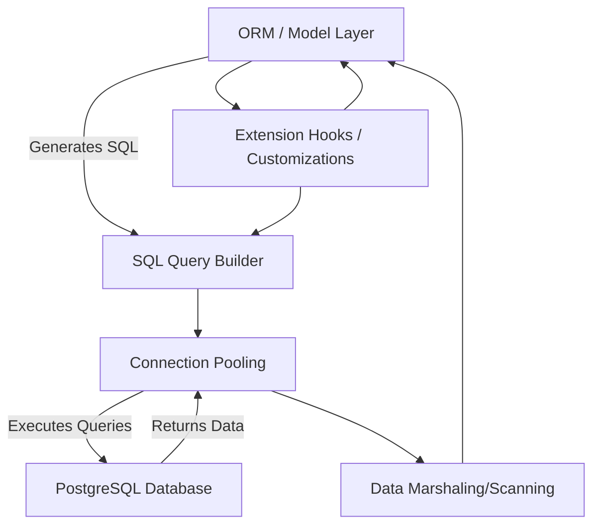

# Core Components Overview

Delve into the foundational subsystems that power go-pg's seamless interaction with PostgreSQL. This page offers an insightful look into its main components: the ORM/model layer, SQL query builder, connection pooler, data type marshaling/scanning, and extension hooks. Gain a clear understanding of each part's role and how they come together, setting you up for effective, hands-on usage.

---

## Why Understanding Core Components Matters

When working with go-pg, experiencing its productivity and performance gains hinges on grasping its internal building blocks. Each core component addresses a critical user need—from defining your data models intuitively, efficiently querying with flexibility, managing database connections reliably, to handling complex PostgreSQL types gracefully. Understanding these components empowers you to write robust, maintainable, and optimized Go applications backed by PostgreSQL.


## The Core Components of go-pg

### 1. ORM / Model Layer

The ORM (Object-Relational Mapping) layer is your gateway to bridging Go structs with PostgreSQL tables. It lets you define models as Go structs and map these models to relational database tables with rich support for relationships (has-one, belongs-to, has-many, many-to-many).

- **Purpose:** Simplifies CRUD operations and complex relational queries without manually writing SQL.
- **What You Can Achieve:** Insert, query, update, delete records with Go structs; navigate relations in one query.
- **Why It Stands Out:** Supports composite and multi-column primary keys, auto-mapping of Go fields, and nullability control.

_Practical example: Define a `User` struct linked to a `Story` struct with an author relation, then write a query to fetch stories including their authors in one call._

### 2. SQL Query Builder

Beyond the ORM, go-pg provides a fluent and powerful SQL query builder. It allows you to construct complex SQL commands programmatically, blending raw SQL flexibility with Go safety.

- **Purpose:** Grant fine-grained control over SQL queries when ORM abstractions aren’t enough.
- **Capabilities:** Building `SELECT`, `INSERT`, `UPDATE`, and `DELETE` queries with conditions, joins, aggregates, CTEs, and bulk operations.
- **Benefits:** Avoid string concatenations or error-prone manual query formatting.

_Example use case: Build a batch insert operation or a query with common table expressions (CTEs) for reporting._

### 3. Connection Pooling

Managing database connections efficiently is crucial for application performance and stability. go-pg embeds an automatic connection pool with advanced reliability features.

- **Purpose:** Ensure optimal reuse of database connections, reducing latency and overhead.
- **Features:** Connection reuse, idle connection management, circuit breaker pattern for resilience, and automatic retries on transient network errors.
- **User Benefit:** Seamless scaling without manual connection handling or performance pitfalls.

### 4. Data Type Marshaling and Scanning

PostgreSQL supports diverse and advanced data types. go-pg expertly marshals Go types to PostgreSQL types and scans query results back, supporting everything from basic types to complex structures.

- **Supported Types:** Integers, floats, strings, arrays (multi-dimensional), JSONB, Hstore, composite types, nullables, IP networks, and more.
- **Purpose:** Guarantee correct, efficient serialization and deserialization of data.
- **Flexibility:** Custom types and zero-value behavior, ensuring your Go structs reflect your database state accurately.

### 5. Extension Hooks and Customization

For advanced customization and extending go-pg’s capabilities, extension hooks allow you to intervene in ORM workflows.

- **Purpose:** Let users inject custom logic during queries, model events, or type handling.
- **Examples:** Intercepting query execution, modifying parameters, adding logging, or integrating with tracing systems.
- **Scope:** Enhances adaptability in complex real-world applications where default behavior needs augmentation.


## How These Components Work Together

Each component in go-pg complements the others, forming a cohesive toolkit:

- The ORM layer leverages the SQL query builder for command generation.
- The query builder sends statements through the connection pooler to the database.
- Data marshaling ensures Go values match PostgreSQL expectations during sends and receives.
- Hooks provide checkpoint mechanisms to extend and customize these interactions.

This modular design means you can start simply with the ORM, then progressively adopt deeper features like raw queries, connection tuning, or custom type handling as your application's complexity grows.

---

## Practical Tips for Using Core Components

- **Start with ORM for Productivity:** Use ORM model definitions and relations for everyday database tasks.
- **Use Query Builder for Complex SQL:** When you need joins or operations beyond ORM’s scope, leverage SQL builder.
- **Trust Connection Pooling Defaults Initially:** Only tweak connection pool settings if you detect bottlenecks or errors.
- **Define Composite and Custom Types Early:** Model complex database types explicitly to avoid runtime bugs.
- **Implement Hooks for Cross-Cutting Concerns:** Add logging, metrics, or tracing without cluttering business code.


## Common Pitfalls and How to Avoid Them

- **Ignoring Primary Key Annotations:** Ensure your Go structs correctly specify primary keys, especially with composite keys.
- **Skipping Relation Definitions:** Missing relation tags can cause queries to fetch incomplete or incorrect data.
- **Overlooking Nullable vs. Zero Values:** Use `pg:",notnull"` or `pg:",use_zero"` tags mindfully to control NULL behavior.
- **Manual Connection Management:** Rely on go-pg’s pool instead of managing connections explicitly.


## Example Workflow: Fetching Related Data

```go
// Define user and story models with relation
user := &User{Id: 1}
story := new(Story)

// Fetch story with related Author loaded
err := db.Model(story).
    Relation("Author").
    Where("story.id = ?", 10).
    Select()
if err != nil {
    panic(err)
}

fmt.Printf("Story titled '%s' authored by %s\n", story.Title, story.Author.Name)
```

This example shows how the ORM component lets you setup relations and efficiently load linked data with a single query.

---

## Diagram: go-pg Core Components Interaction



This visualization illustrates how each component forms part of the request lifecycle, emphasizing clear responsibilities and interaction flow.

---

## Getting Started with Core Components

- Begin by defining your Go structs to model database tables in the ORM layer.
- Use the ORM API to perform CRUD operations and explore relation querying.
- When custom or complex queries are required, switch to the query builder for flexibility.
- Allow go-pg to manage your database connections, tuning pool settings later if needed.
- Explore the supported PostgreSQL types and customize your structs with tags.
- Leverage extension hooks to adapt go-pg behavior for logging, metrics, or other cross-cutting needs.

For detailed guidance, practical examples, and further conceptual insights, consult related sections on [feature overview](/overview/product-intro-core-concepts/feature-overview), [architecture diagram](/overview/architecture-integration/architecture-diagram), and [defining models and CRUD](/guides/getting-started/define-models-crud).


---

## Troubleshooting Common Issues

<AccordionGroup title="Troubleshooting Core Components">
<Accordion title="My ORM model doesn’t map the primary key correctly">
Check that your struct has proper field tags marking primary keys using `pg:",pk"`. If you use composite keys, ensure all participating fields are tagged accordingly.
</Accordion>
<Accordion title="Queries fail due to connection errors or timeouts">
Verify your network connection and database availability. Review connection pool settings and consider enabling retries or increasing pool size via configuration.
</Accordion>
<Accordion title="Data isn’t marshaled/scanned correctly for custom types">
Ensure your types implement the appropriate `Value` and `Scanner` interfaces. Confirm you have registered composite or custom types properly.
</Accordion>
<Accordion title="Hook functions do not impact query execution">
Make sure your hooks are added before query execution and that hook methods properly modify the query or context as intended.
</Accordion>
</AccordionGroup>


---

## Next Steps

- Progress to "[Architecture Diagram & System Components](/overview/architecture-integration/architecture-diagram)" for a visual and conceptual walkthrough of go-pg’s system and workflow.
- Explore "[Defining Models and Basic CRUD](/guides/getting-started/define-models-crud)" to get hands-on with the ORM.
- Dive into advanced querying techniques in "[Advanced Queries and Model Relationships](/guides/working-with-data/advanced-queries-relations)".
- Learn how to optimize connection pooling and reliability in the performance guide.

---

_Empower your Go applications with confidence by mastering these core components, unlocking go-pg's true potential in harnessing PostgreSQL efficiently and elegantly._
