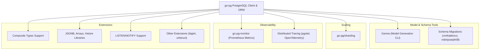

# Ecosystem & Integration Points

Explore how go-pg seamlessly fits into larger Go projects and integrates with a vibrant ecosystem of tools and extensions. This page guides you through the essential external components and integration patterns that enhance go-pg's capabilities—including model generation, schema migrations, sharding strategies, monitoring and metrics, and extending with third-party libraries.

---

## Introduction

As a high-performance PostgreSQL client and ORM for Go, go-pg is designed not only as a standalone library but also as a flexible building block within complex applications. This page helps you navigate its broader ecosystem and discover practical ways to extend its functionality or blend it into your existing workflows.

Whether you want to automate model generation, handle schema migrations gracefully, scale across database shards, or add observability through metrics, this documentation provides actionable insights and references.

---

## How go-pg Fits in Your Project

Integrating go-pg involves more than just database queries. It works best when combined with external tools that handle complementary concerns like schema versioning, database sharding, and monitoring. Your project’s architecture benefits from this modular approach:

- **Model Generation:** Use dedicated CLI tools to generate Go structs from your PostgreSQL schema, accelerating development and reducing boilerplate.
- **Schema Migrations:** Manage database schema changes safely and repeatably using community migration tools compatible with go-pg.
- **Database Sharding:** Distribute your data across multiple databases for horizontal scale, with support for sharding libraries built to integrate with go-pg.
- **Observability:** Collect runtime metrics and traces to monitor database usage and performance using compatible Prometheus exporters and tracing libraries.
- **Extension & Interoperability:** Enhance go-pg via plugins or combine it with third-party Go libraries that extend functionality without sacrificing core performance.

---

## Key Ecosystem Components

### Model Generation

Rapidly generate Go model structs reflecting your PostgreSQL schema to reduce manual syncing and human errors.

- **Genna:** A popular CLI tool that introspects your database and creates Go source files for go-pg models.

**Benefits:**
- Accelerates onboarding with ready-to-use model code.
- Keeps Go structs in sync with evolving database schemas.
- Simplifies initial project setup.

---

### Schema Migrations

Apply iterative database schema changes safely and repeatably with migration tools:

- **vmihailenco/migrations:** A simple migration library supporting version tracking and statements execution.
- **robinjoseph08/go-pg-migrations:** A go-pg-specific migrations package designed to work naturally with the ORM.

**Best Practices:**
- Always back up your database before applying migrations.
- Test migration scripts in staging to avoid runtime failures.
- Keep migration files under version control.

---

### Sharding and Horizontal Scaling

For large-scale data workloads, distributing data across shards reduces load and improves availability.

- **go-pg/sharding:** A community-driven sharding library built as an extension to go-pg, enabling transparent routing of queries to specific shards based on your logic.

**Use Cases:**
- Partitioning user data by region or customer segment.
- Distributing write-heavy workloads.

---

### Metrics, Monitoring & Observability

Gain visibility into your database layer to optimize performance and quickly diagnose issues:

- **go-pg-monitor:** This integration exposes Prometheus metrics derived from go-pg client statistics, including connection pool usage, query durations, and errors.

- **Distributed Tracing:** Compatible with tracing tools that support OpenTelemetry or similar frameworks; some examples include integrating with pgotel for distributed tracing setups.

**Tip:** Deploy Prometheus with go-pg-monitor to collect and visualize enriched metrics in Grafana dashboards.

---

### Extensibility & Third-Party Integrations

go-pg offers extension hooks and supports integrating with a variety of Go libraries:

- **Composite Types Support:** Use advanced PostgreSQL composite types by combining go-pg’s ORM features with custom struct mappings.
  
- **JSON, Arrays, Hstore:** Work seamlessly with PostgreSQL-specific data types together with community packages that enhance JSONB and Hstore usability.

- **Notifications:** Leverage LISTEN/NOTIFY mechanisms supported by go-pg to build reactive, event-driven Go applications.

- **Other Tools:** Leverage packages such as bigint for large integer support or urlstruct for mapping URL query parameters to structs in web APIs.

---

## Practical Example: Adding Metric Monitoring

Below is a brief outline of how you might set up go-pg monitoring using `go-pg-monitor` and Prometheus.

```go
import (
	"github.com/go-pg/pg/v10"
	"github.com/hypnoglow/go-pg-monitor/collector"
	"github.com/prometheus/client_golang/prometheus/promhttp"
	"net/http"
)

func main() {
	db := pg.Connect(&pg.Options{
		User: "postgres",
		// other options
	})
	defer db.Close()

	// Register go-pg metrics collector
	col := collector.NewCollector(db)
	col.Register()

	// Serve metrics endpoint
	http.Handle("/metrics", promhttp.Handler())
	http.ListenAndServe(":8080", nil)
}
```

With this setup, Prometheus can scrape detailed metrics about connection usage and query performance automatically.

---

## Summary Diagram: Ecosystem & Integration Landscape



---

## Common Pitfalls & Tips

- **Stay Updated:** Remember that go-pg is currently in maintenance mode, so for new serious projects consider the complementary Bun ORM.
- **Test Integrations:** Always validate compatibility between go-pg and external tools, especially for migrations and sharding.
- **Backup Before Migrations:** Prevent data loss by backing up before applying schema changes.
- **Use Community Resources:** Leverage GitHub repos, issues, and Discord channels for support with integration challenges.

---

## Next Steps

- Explore [Genna](https://github.com/dizzyfool/genna) for model code generation.
- Read guides on [Schema Migrations and Tooling](/guides/application-patterns/schema-migrations).
- Integrate monitoring by reviewing the [go-pg-monitor](https://github.com/hypnoglow/go-pg-monitor) repository.
- Consider sharding approaches with [go-pg/sharding](https://github.com/go-pg/sharding).
- Dive deeper into go-pg features with the [Key Features at a Glance](/overview/product-intro-core-concepts/feature-overview) page.


---

## References

- [Official go-pg GitHub Repository](https://github.com/go-pg/pg)
- [Genna Model Generator](https://github.com/dizzyfool/genna)
- [vmihailenco Migrations](https://github.com/go-pg/migrations)
- [robinjoseph08 go-pg-migrations](https://github.com/robinjoseph08/go-pg-migrations)
- [go-pg/sharding](https://github.com/go-pg/sharding)
- [go-pg-monitor](https://github.com/hypnoglow/go-pg-monitor)

---

Back to [Architecture & Integration Overview](/overview/architecture-integration/component-overview) for deeper architectural understanding.

---

<Info>
Using these integration points unlocks the full potential of go-pg within your Go projects—helping you build scalable, maintainable, and observable backend applications with confidence.
</Info>
